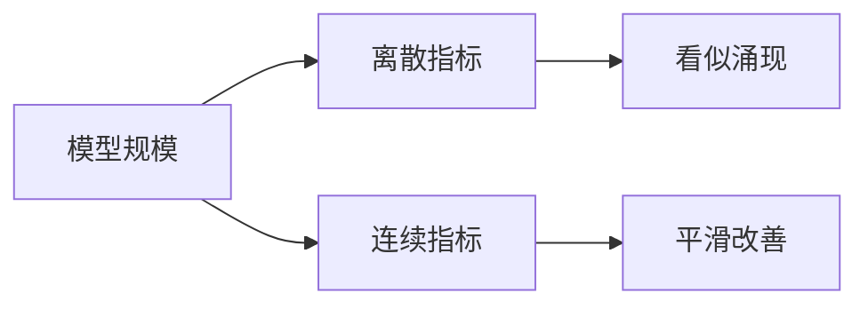

# 3.4.5 涌现能力（Emergent Abilities）的争议

## 要解决的问题

部分论文与宣传称：模型规模跨过阈值后，**算术、多步推理、指令遵循**等能力会突然「涌现」，仿佛相变。工程上这影响「是否必须堆到万亿参数」的决策；学术上则争论这是真实现象还是 **评测指标非线性** 造成的测量假象。

## 核心概念

**涌现（狭义）**：在模型规模 $N$ 或数据 $D$ 轴上，下游指标 $M$ 随 scale 平坦，随后在窄区间内陡升。

Schaeffer et al.（2023）论点：若 $M$ 对 **per-token 准确率** 呈尖锐非线性（如多选题需全部 token 正确），则平滑的底层能力可表现为「涌现曲线」。

| 立场 | 要点 |
| --- | --- |
| **涌现支持者** | BIG-bench 子任务显示阶梯状改善 |
| **质疑者** | 换连续指标（Brier、编辑距离）后曲线更平滑 |
| **工程折中** | 规模仍重要，但阈值不可精确外推 |

与 [Scaling Laws](./01-kaplan-scaling-laws.md) 关系：训练 loss 幂律平滑，**benchmark 指标不必平滑**。

## 方法/算法

评估涌现时的规范做法：

1. 报告 **多个指标**（离散 acc + 连续 score）；
2. 扫描足够密的 scale 点（0.5B、1B、3B、7B…）；
3. 控制 **数据与 tokenizer** 一致，仅改 $N$；
4. 检查 **评测污染** 与提示词敏感性；
5. 区分 **后训练**（SFT/RLHF）与纯预训练涌现。

## 工程实践

- **产品**：不宜押注「过 100B 必涌现推理」；应投资数据、对齐、[测试时计算](../../06-reasoning-test-time-compute/02-test-time-compute/01-o1-o3-paradigm.md)。
- **研发**：小模型 + 强数据 + 工具链可能逼近大模型部分能力。
- **宣传**：对「涌现」一词保持审慎，避免 marketing 误导预算委员会。
- **本仓库**：[什么是 LLM](../../01-foundations/01-introduction/01-what-is-llm.md) 已链到本节。

## 代表工作

- Wei et al. Emergent abilities：https://arxiv.org/abs/2206.07682
- Schaeffer et al. Are emergent abilities a mirage?：https://arxiv.org/abs/2304.15004
- Ganguli et al. 能力预测：https://arxiv.org/abs/2212.09251

## 局限与注意点

- **定义不统一**：「能力」与「规模」轴选择影响曲线形状。
- **SFT 混淆**：用户可见的「GPT-4 级推理」大量来自后训练，非纯 scale。
- **多模态**：视觉能力涌现另一维度，文本定律不完全适用。
- **个人理解**：规模仍是必要条件之一，但阈值高度不确定，不宜作为唯一投资依据。

## 延伸说明
同时报告离散 acc 与连续 score，避免单一「阶梯曲线」叙事。
## 实践检查清单
- [ ] BIG-bench
- [ ] mirage
- [ ] 污染

## 小结

本节核心：BIG-bench 与全链路 mirage 协同；上线前用检查清单做回归。

## 连续指标示例

| 任务 | 离散指标 | 更平滑的替代 |
| --- | --- | --- |
| 多选 | accuracy | Brier score / 负对数似然 |
| 算术 | exact match | 编辑距离到正确答案 |
| 生成 | pass@1 | 平均 log-prob（需谨慎解释） |

## 相关章节

- [3.4.1 Kaplan](./01-kaplan-scaling-laws.md) · [3.4.4 数据-参数](./04-data-parameter-tradeoff.md)
- 评测：[7.2.4 可靠性](../../07-evaluation/02-evaluation-methods/04-reliability-contamination.md)
- 推理扩展：[6.2.5 推理 Scaling](../../06-reasoning-test-time-compute/02-test-time-compute/05-inference-scaling-laws.md)
- RL 推理：[6.3 GRPO](../../06-reasoning-test-time-compute/03-rl-reasoning/01-grpo-rloo.md)
