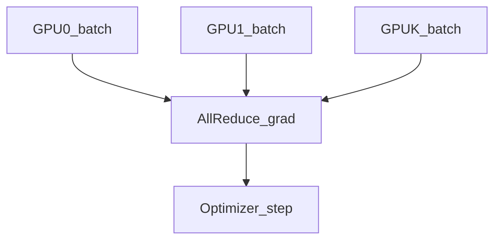

# 数据并行（DP、DDP）

## 要解决的问题

单卡显存无法放下 billion 级参数，但**同一份模型权重**可在多卡上处理不同 micro-batch，通过同步梯度等价于更大 batch 训练。数据并行（Data Parallelism, DP）是最基础的分布式维度，理解它是掌握 DDP、ZeRO、FSDP 的前提。

## 核心概念

设 $K$ 个 GPU，每卡样本 batch $B_{\text{local}}$，全局 batch：

$$
B_{\text{global}} = K \cdot B_{\text{local}} \cdot G_{\text{acc}}
$$

$G_{\text{acc}}$ 为 [梯度累积](../06-training-stability/02-gradient-accumulation-clipping.md) 步数。

**DDP（DistributedDataParallel）**：每卡前向/反向，**AllReduce** 平均梯度 $\bar{g} = \frac{1}{K}\sum_k g_k$，各卡同步更新相同权重。

| 方式 | 通信量/步 | 显存/卡 |
| --- | --- | --- |
| DP（朴素） | 低 | 全参数+优化器 |
| DDP | $2\times$ 参数量梯度 | 全参数+优化器 |
| ZeRO/FSDP | 分片后更低 | 见 3.5.4/3.5.6 |

## 方法/算法

训练一步：

1. 各卡 `backward()` 得本地梯度 $g_k$；
2. `torch.distributed.all_reduce` 对 $g_k$ 求和并除以 $K$；
3. 优化器 step 更新 $\theta$（各卡 $\theta$ 保持一致）；
4. **梯度累积**：前 $G_{\text{acc}}-1$ 步可不同步或局部累积，最后一步再 AllReduce。

注意 **BatchNorm**（若存在）需 SyncBN；LLM 多用 LayerNorm/RMSNorm 无此问题。

## 工程实践

- **启动**：`torchrun --nproc_per_node=K train.py`；环境变量 `MASTER_ADDR/PORT`。
- **数据**：`DistributedSampler` 保证 epoch 内样本不重复。
- **性能**：通信与计算重叠（`gradient_as_bucket_view=True`、bucket 大小调优）。
- **瓶颈**：当模型极大，**显存**先于通信成为瓶颈 → [ZeRO](./04-zero-deepspeed.md)、[FSDP](./06-fsdp.md)。
- **与 TP/PP**：[3.5.5 3D 并行](./05-three-d-sequence-parallelism.md) 组合使用。

## 代表工作

- Li et al. PyTorch DDP 设计（官方文档与教程）
- Rajbhandari et al. ZeRO：https://arxiv.org/abs/1910.02054

## 局限与注意点

- **线性扩展上限**：$K$ 过大时通信占比上升，见 [3.5.7](./07-communication-optimization.md)。
- **有效 batch**：过大 $B_{\text{global}}$ 可能需调学习率（线性缩放规则 $\eta \propto B$ 仅近似成立）。
- **随机性**：不同 $K$ 下 RNG 与 sampler 需固定以复现。
- **单卡调试**：先在 1 GPU 跑通再开 DDP，避免 NCCL 错误难排查。

## 延伸说明
增大 $B_{global}$ 时尝试线性缩放 LR，并用 warmup 验证稳定性。
## 实践检查清单
- [ ] AllReduce
- [ ] DistributedSampler
- [ ] no_sync

## 小结

本节核心：AllReduce 与全链路 DistributedSampler 协同；上线前用检查清单做回归。

## 相关章节

- 下一节：[3.5.2 张量并行](./02-tensor-parallelism.md)
- [3.5.4 ZeRO](./04-zero-deepspeed.md) · [3.5.6 FSDP](./06-fsdp.md)
- 梯度累积：[3.6.2](../06-training-stability/02-gradient-accumulation-clipping.md)
- 混合精度：[3.6.1](../06-training-stability/01-mixed-precision.md)
