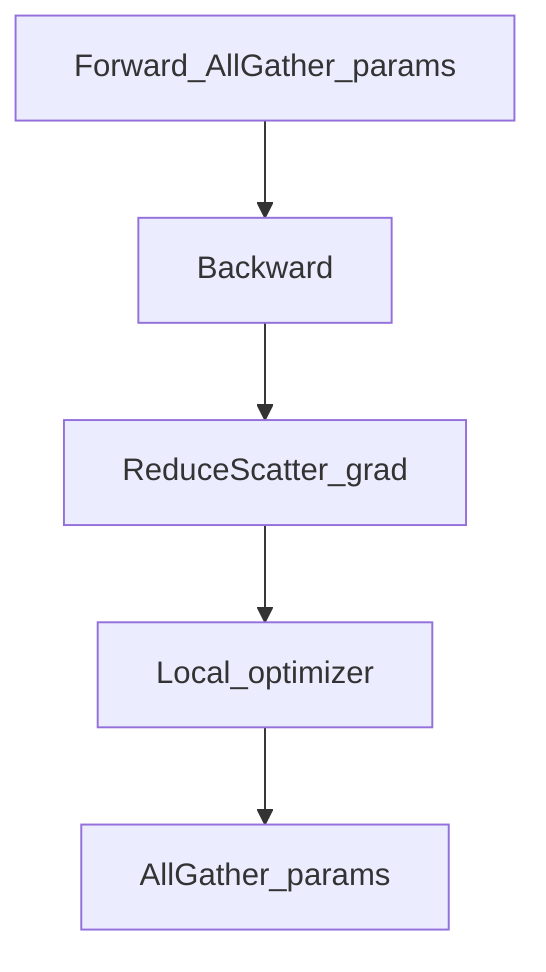

# ZeRO 优化（DeepSpeed）

## 要解决的问题

朴素 DDP 每卡保存**完整参数、梯度、优化器状态**（Adam 需 $2\times$ 参数量 FP32 动量），7B 模型训练尚可，70B+ 在 80GB 卡上无法放下。ZeRO（Zero Redundancy Optimizer）按 stage 分片状态，在保持数据并行语义下将显存摊到多卡。

## 核心概念

| Stage | 分片内容 | 每卡显存（相对） |
| --- | --- | --- |
| ZeRO-1 | 优化器状态 | $\downarrow$ |
| ZeRO-2 | + 梯度 | $\downarrow\downarrow$ |
| ZeRO-3 | + 参数 | $\downarrow\downarrow\downarrow$ |

ZeRO-3 前向时 **AllGather** 临时凑齐参数，算完释放；反向类似。通信增加，显存大幅下降。

与 [FSDP](./06-fsdp.md) 思想接近：PyTorch 原生 FSDP ≈ ZeRO-3 类实现。

## 方法/算法

ZeRO-2 训练步（简化）：

1. 各卡本地 forward/backward，梯度分片存储 $g^{(k)}$；
2. ReduceScatter 梯度到负责该分片的 rank；
3. 本地 optimizer 更新分片参数；
4. AllGather 广播更新后参数供下一步 forward。

**Offload**：优化器状态到 CPU/NVMe，进一步省 HBM，带宽成为瓶颈。



## 工程实践

- **DeepSpeed**：`deepspeed.init_distributed`，`ds_config.json` 设 `zero_optimization.stage`。
- **与 Megatron**：ZeRO + TP/PP 需版本匹配（Megatron-DeepSpeed 集成）。
- **调参**：`stage3_prefetch_bucket_size`、`overlap_comm` 影响吞吐。
- **对比 FSDP**：新 PyTorch 项目可优先 FSDP；遗留集群 DeepSpeed 生态成熟。
- **参考**：[预训练](../../../../docs/01-llm-intro/05-training/02-pre-training) 分布式小节。

## 代表工作

- Rajbhandari et al. ZeRO：https://arxiv.org/abs/1910.02054
- Rajbhandari et al. ZeRO-Infinity：https://arxiv.org/abs/2104.04473
- DeepSpeed 文档：https://www.deepspeed.ai/

## 局限与注意点

- **通信开销**：ZeRO-3 大集群需 [拓扑优化](./07-communication-optimization.md)。
- **Checkpoint**：需 `zero_to_fp32.py` 合并分片权重。
- **调试**：stage3 错误栈更深；先用 stage1/2 验证 loss。
- **推理**：训练用 ZeRO，推理常合并为单份 HF 权重。


## 延伸说明
显存紧张用 stage3；通信敏感集群可试 stage2 + 更大 batch。
## 实践检查清单
- [ ] Offload
- [ ] 合并权重
- [ ] prefetch

## 小结

本节核心：Offload 与全链路 合并权重 协同；上线前用检查清单做回归。


## ds_config 片段（示意）

```json
"zero_optimization": {
  "stage": 3,
  "overlap_comm": true,
  "contiguous_gradients": true
}
```

与 Megatron 集成时查阅对应版本矩阵，避免 ZeRO+TP 通信死锁。

## 相关章节

- [3.5.1 DP](./01-data-parallelism.md)
- [3.5.6 FSDP](./06-fsdp.md)
- [3.5.5 3D 并行](./05-three-d-sequence-parallelism.md)
- 混合精度：[3.6.1](../06-training-stability/01-mixed-precision.md)
