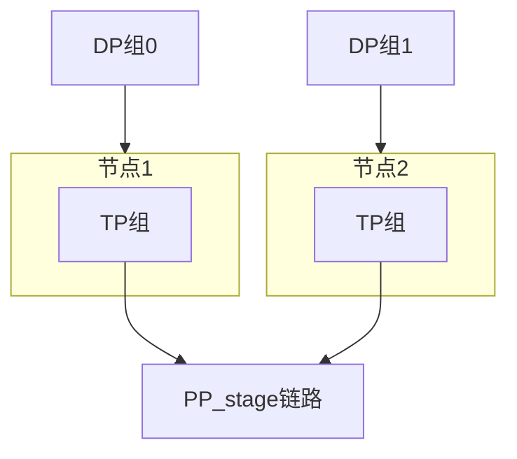

# 3.5.5 3D 并行与序列并行

## 要解决的问题

万亿 token 级预训练需同时解决：**样本并行（DP）、层内切分（TP）、层间流水（PP）**，并进一步处理**超长序列**导致的激活显存爆炸。3D 并行（DP+TP+PP）是 Megatron 系标配；**序列并行（SP）/ Context Parallel（CP）** 在序列维切分 attention 计算与激活。

## 核心概念

全局进程网格（示意）：

$$
\text{World} = \text{DP} \times \text{TP} \times \text{PP}
$$

可选第四维 **CP**（Context Parallel）：序列长度 $S$ 切为 $S / C$  per rank，Attention 需跨 rank 交换 KV（Ring Attention、DeepSpeed Ulysses 等）。

| 并行 | 解决瓶颈 |
| --- | --- |
| DP | 吞吐、batch size |
| TP | 单层参数/激活 |
| PP | 层数深度 |
| SP/CP | 序列长度 $S$ |

激活显存（Attention，粗略）：

$$
M_{\text{act}} \propto S \cdot h \quad \Rightarrow \quad \text{CP 后每卡 } \propto S/C
$$

## 方法/算法

配置流程：

1. 定模型规模与目标 $S$（如 32k）；
2. 选 TP 组大小（常 ≤8，同机）；
3. 若仍 OOM → 开 CP 或 activation checkpoint；
4. PP stage 数 $S_{\text{pp}}$ 使每 stage 层数均衡；
5. 剩余 GPU 划为 DP 组数。

Ring Attention：KV 块在 CP rank 间环形传递，完成全局 attention，通信与计算重叠。

## 工程实践

- **Megatron-Core**：`tensor_model_parallel_size`、`pipeline_model_parallel_size`、`context_parallel_size`。
- **DeepSpeed Ulysses**：序列维 all-to-all 重排 QKV。
- **长上下文**：与 [RoPE 扩展](../../02-transformer/02-transformer-details/04-pre-ln-post-ln.md)、[FlashAttention](../../05-inference-deployment/02-kv-cache-attention-optimization/03-flash-attention.md) 联调。
- **profiling**：Nsight、PyTorch profiler 看 bubble 与 comm 占比。

## 代表工作

- Shoeybi et al. Megatron-LM：https://arxiv.org/abs/1909.08053
- Korthikanti et al. 序列并行：https://arxiv.org/abs/2205.05198
- Liu et al. Ring Attention：https://arxiv.org/abs/2310.01889
- DeepSeek-V3 训练系统（EP+TP+PP）：https://arxiv.org/abs/2412.19437

## 局限与注意点

- **配置组合爆炸**：错误 `WORLD_SIZE` 整除关系导致启动失败。
- **Checkpoint 复杂**：需按 TP/PP/EP 切分规则转换 HF 格式。
- **小集群**：3D 过度切分反而降效；7B/13B 常 FSDP 即可。
- **MoE EP**：专家并行是第五维，与 3D 正交，文档见技术报告。

## 相关章节

- [3.5.1](./01-data-parallelism.md) · [3.5.2](./02-tensor-parallelism.md) · [3.5.3](./03-pipeline-parallelism.md)
- [3.5.7 通信优化](./07-communication-optimization.md)
- 重计算：[3.6.3](../06-training-stability/03-checkpointing-recomputation.md)
- Scaling：[3.4.2 Chinchilla](../04-scaling-laws/02-chinchilla-scaling-laws.md)
