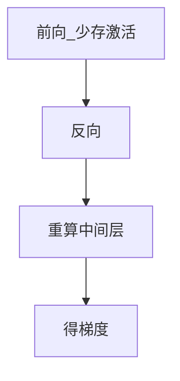

# 3.6.3 检查点（Checkpointing）与激活重计算

## 要解决的问题

反向传播需保存前向**中间激活**以计算梯度，长序列、宽 hidden、大 batch 时激活显存常超过参数显存。**激活检查点（Activation Checkpointing）** 只存少量边界激活，反向时重算中间层，以算力换显存；与 **流水线并行**、**重计算策略** 共同决定能否训练 32k+ 上下文。

## 核心概念

无检查点时，$L$ 层存储约 $O(L \cdot S \cdot h)$ 激活。

**Selective checkpoint**：每 $k$ 层存一次激活，其余重算，显存约降为 $1/k$，计算增约 $<k$ 倍（非线性，融合 kernel 有节省）。

**Full checkpoint**：仅存输入嵌入，每层重算，显存最小、最慢。

| 类型 | 显存 | 计算 |
| --- | --- | --- |
| 无 CKPT | 高 | 低 |
| Selective | 中 | 中 |
| Full | 低 | 高 |

训练 **checkpoint（断点续训）** 另指保存 $\theta$、优化器、数据迭代器状态，与 activation checkpoint 中文易混。

## 方法/算法

PyTorch：

```python
from torch.utils.checkpoint import checkpoint
out = checkpoint(layer, hidden, use_reentrant=False)
```

`use_reentrant=False` 推荐（PyTorch 2.1+），与 FSDP 兼容更好。

与 [PP](../05-distributed-training/03-pipeline-parallelism.md)：每 stage 内 checkpoint 降低 bubble 期间峰值显存。

**重计算 + FlashAttention**：FA 本身已融合，checkpoint 粒度通常在 Transformer block 级。



## 工程实践

- **Transformers**：`gradient_checkpointing_enable()`。
- **调优**：先开 block-level；仍 OOM 再减 batch 或开 [序列并行](../05-distributed-training/05-three-d-sequence-parallelism.md)。
- **断点续训**：每 N 步存 `save_pretrained` + DeepSpeed/FSDP shard + `rng` + `data_state`。
- **恢复**：校验 global step 与 loss 连续，见 [3.6.4](./04-divergence-diagnosis.md)。

## 代表工作

- Chen et al. Checkpointing：https://arxiv.org/abs/1604.06922
- Korthikanti 序列并行 + checkpoint：https://arxiv.org/abs/2205.05198

## 局限与注意点

- **吞吐下降**：10～30% 常见，profile 后抉择。
- **RNG**：重计算 dropout 需确定性 seed，否则不可复现。
- **自定义算子**：未注册 backward 的算子 checkpoint 会失败。
- **推理**：仅训练技巧；推理用 KV cache 无此问题。


## 延伸说明
区分 activation checkpoint 与训练断点；两者命名勿混。
## 实践检查清单
- [ ] use_reentrant
- [ ] block
- [ ] RNG

## 小结

本节核心：use_reentrant 与全链路 block 协同；上线前用检查清单做回归。

## 相关章节

- [3.5.3 PP](../05-distributed-training/03-pipeline-parallelism.md)
- [3.5.5 3D/CP](../05-distributed-training/05-three-d-sequence-parallelism.md)
- [3.6.2 梯度裁剪](./02-gradient-accumulation-clipping.md)
- FlashAttention：[5.2.3](../../05-inference-deployment/02-kv-cache-attention-optimization/03-flash-attention.md)
