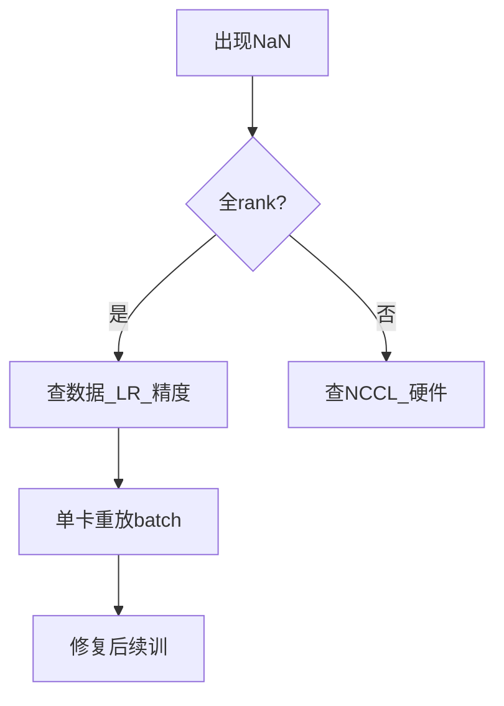

# 3.6.4 训练发散问题的诊断与处理

## 要解决的问题

预训练跑数周后若 loss 变 NaN、Inf 或陡升至平台以上，整批算力作废。**发散**可能来自数值精度、学习率、数据异常、并行配置或硬件故障。系统化诊断可缩短 MTTR，避免盲目降 LR 重跑。

## 核心概念

| 症状 | 可能原因 |
| --- | --- |
| 突然 NaN | FP16 溢出、坏数据 batch、除零 |
| loss 缓慢上升 | LR 过大、权重衰减错误、数据分布漂移 |
| 阶梯后平台 | 正常收敛或欠容量 |
| 仅部分 rank 异常 | NCCL、硬件坏卡 |

诊断顺序（建议）：

1. 检查 **是否所有 rank 一致** NaN；
2. 回滚最近 checkpoint 是否复现；
3. 降 LR / 关 FP16 试 100 step；
4. 锁定 **问题 batch**（记录 hash）；
5. 查 **grad_norm** 与最大 logits。

## 方法/算法

处理手段：

- **回退**：从最近稳定 checkpoint 重启，LR ×0.5～0.1，warmup 1～2k step；
- **跳过 batch**：记录异常样本 ID，临时 blacklist（慎用，改变数据分布）；
- **精度**：改 BF16、提高 loss scaling（FP16）；
- **裁剪**：加强 [grad clip](./02-gradient-accumulation-clipping.md)；
- **架构**：检查 Pre-LN、初始化 scale（$\sigma=0.02/\sqrt{2L}$ 等经验）。

## 工程实践

- **日志**：每步 `loss`、`grad_norm`、`lr`、`max_logit`、吞吐；TensorBoard/W&B。
- **断言**：`torch.distributed` 全 reduce 检查 `torch.isfinite(loss)`。
- **硬件**：`nvidia-smi`、ECC 错误、InfiniBand 重传率。
- **数据**：见 [3.1.3 质量过滤](../01-pretraining-data/03-quality-filtering.md) 与去重；毒 batch 常含极端长序列或 UTF-8 损坏。
- **对比**：[3.6.5 Loss Spike](./05-loss-spike.md) 为短期尖刺，发散为持续性恶化。

## 代表工作

- Zhang et al. 理解训练不稳定：https://arxiv.org/abs/2310.06113（背景）
- PyTorch 自动混合精度故障排除（官方文档）

## 局限与注意点

- **多因素叠加**：同时改 LR+精度+数据难以归因，应一次只改一项。
- **MoE 负载不均**：专家崩溃表现为部分层梯度异常。
- **无法 100% 复现**：分布式非确定性偶发。
- **法律**：日志勿记录用户 PII 明文。

## 延伸说明
单卡重放可疑 batch；若单卡也 NaN 则优先查数据与 LR。
## 实践检查清单
- [ ] NCCL
- [ ] replay
- [ ] finite

## 小结

本节核心：NCCL 与全链路 replay 协同；上线前用检查清单做回归。

## 相关章节

- [3.6.1 混合精度](./01-mixed-precision.md)
- [3.6.2 梯度裁剪](./02-gradient-accumulation-clipping.md)
- [3.6.5 Loss Spike](./05-loss-spike.md)
- [3.5.7 通信](../05-distributed-training/07-communication-optimization.md)
- Pre-LN：[2.2.4](../../02-transformer/02-transformer-details/04-pre-ln-post-ln.md)
