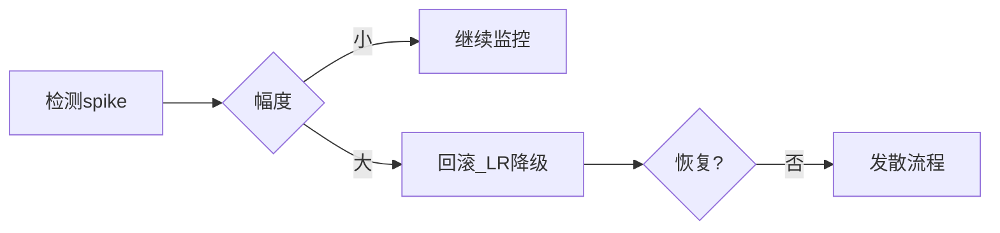

# Loss Spike 与稳定性技巧

## 要解决的问题

大规模预训练中 loss 曲线常出现**短暂尖刺（spike）**后回落，或尖刺后永久抬高。区分可自愈 spike 与灾难性发散，决定是继续训练、回滚 checkpoint 还是调参。工业界积累了 skip batch、LR 衰减、Muon/AdamW 调参、数据去重等「稳定性技巧」。

## 核心概念

**Loss spike**：单步或数步内 $\mathcal{L}$ 上升数倍至数十倍，$\text{grad\_norm}$ 同步飙升。

常见诱因：

| 诱因 | 机制 |
| --- | --- |
| 重复/异常长样本 | 梯度方差大 |
| LR warmup 结束 | 有效步长突变 |
| FP16 溢出 | 权重污染 |
| 并行同步 bug | 梯度不一致 |
| MoE 路由坍塌 | 部分专家过载 |

自愈判据（启发式）：spike 后 100～500 step 内 loss 回落至 spike 前移动平均的 1.1× 内。

## 方法/算法

应对 playbook：

1. **监控**：记录 spike 时 `global_step`、batch hash、最大 token id；
2. **Grad clip**：已开则临时收紧 $\tau$；
3. **Skip step**：若框架支持且 spike 极端，跳过 optimizer step（研究向，改变训练轨迹）；
4. **Rollback**：回退 100～1000 step 的 checkpoint，以 0.7× LR 重启（GPT-3 类实践）；
5. **数据**：加强 [去重](../01-pretraining-data/02-cleaning-deduplication.md)、过滤超长 outliers；
6. **精度**：切换 [BF16](./01-mixed-precision.md)；
7. **优化器**：AdamW $\beta_2=0.95$、$\epsilon=1e-8$；部分新训练用 Muon 等（待验证泛化）。

与 [发散](./04-divergence-diagnosis.md) 区别：spike 后若 loss 不恢复则升级为发散处理。

## 工程实践

- **告警**：W&B 规则 `loss > 3 * rolling_median` 推送。
- **自动回滚**：部分内部训练平台绑定 object storage 多版本 checkpoint。
- **实验**：小模型复现 spike batch，再决定是否全局过滤。
- **不要过度反应**：Chinchilla 规模训练中偶发 spike 正常，频繁 spike 才查数据管线。
- **Scaling**：更大 $N$ 有时 spike 更敏感，见 [3.4](../04-scaling-laws/02-chinchilla-scaling-laws.md)。

## 代表工作

- Chowdhery et al. PaLM（训练稳定性讨论）：https://arxiv.org/abs/2204.02311
- Touvron LLaMA 2 训练报告：https://arxiv.org/abs/2307.09288
- Batch size warmup 与 spike（多篇实证博客，非单一论文）

## 局限与注意点

- **Skip batch 伦理**：改变有效 $D$，对比实验需声明。
- **回滚成本**：存储多版本 checkpoint 占 TB 级空间。
- **误判**：验证集 loss 波动与 train spike 不同因。
- **后训练**：SFT/RLHF spike 机制另异（KL 爆炸等），见第四部分。

## 延伸说明
建议 `loss > 3×` 七日滑动中位数触发人工复核，而非自动无限回滚。
## 实践检查清单
- [ ] rollback
- [ ] skip
- [ ] batch hash

## 小结

本节核心：rollback 与全链路 skip 协同；上线前用检查清单做回归。

## 相关章节

- [3.6.4 发散诊断](./04-divergence-diagnosis.md)
- [3.6.2 梯度裁剪](./02-gradient-accumulation-clipping.md)
- [3.6.1 混合精度](./01-mixed-precision.md)
- 数据：[3.1.2 去重](../01-pretraining-data/02-cleaning-deduplication.md)
- 优化器基础：[3.1.4 优化器](../../01-foundations/03-deep-learning/04-optimizers.md)
