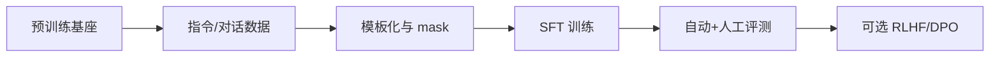

# SFT 的目的与流程

## 要解决的问题

预训练语言模型擅长「续写」，却不天然遵循用户指令、对话格式或安全边界。**监督微调（Supervised Fine-Tuning, SFT）** 用高质量 `(prompt, response)` 对，把通用能力「对齐」到可部署的助手行为：听懂任务、按格式回答、减少明显违规输出。

工程上 SFT 往往是后训练链路的**第一站**：在 RLHF/DPO 之前先建立指令遵循与风格基线；许多开源模型（Alpaca、Vicuna 等）也仅做 SFT 即发布可用版本。

## 核心概念

| 概念 | 含义 |
| --- | --- |
| **SFT 目标** | 在标注回复 $y$ 上最小化负对数似然（因果 LM） |
| **参考策略** | 常保留预训练 checkpoint 作 $\pi_{\text{ref}}$，供后续 KL / DPO 约束 |
| **数据形态** | 单轮指令、多轮对话、CoT（思维链）等，统一序列化为 token |

标准 SFT 损失（对单条样本，对 response 部分 token 求和）：

$$
\mathcal{L}_{\text{SFT}} = - \sum_{t \in \mathcal{R}} \log \pi_\theta(y_t \mid x, y_{<t})
$$

其中 $\mathcal{R}$ 为 assistant 回复区间；prompt 部分通常 **mask 掉 loss**（label = -100）。

## 方法 / 流程

1. **选基座**：与目标语种、上下文长度、许可协议一致。
2. **构造数据**：见 [4.1.2 数据构造](./02-data-construction)；质量优先于盲目扩量（[4.1.3](./03-quality-quantity-tradeoff)）。
3. **模板**：ChatML、Llama-3、Qwen 等官方模板；system / user / assistant 边界必须一致。
4. **超参**：学习率常为预训练的 $1/10 \sim 1/100$；epoch 1–3；注意 [灾难性遗忘](./04-catastrophic-forgetting)。
5. **验收**：held-out loss、MT-Bench / Arena 抽样、安全红队用例。

## 工程实践

| 维度 | 建议 |
| --- | --- |
| **框架** | Hugging Face `trl.SFTTrainer`、`LLaMA-Factory`、`Axolotl` |
| **显存** | 全参 SFT 7B 常需多卡；可用 [LoRA](../06-peft/03-lora-qlora) |
| **可观测** | train/eval loss、回复长度分布、重复率、拒答率 |
| **成本** | 相对 RLHF 低一个数量级；主要成本在 **数据标注与清洗** |

## 代表工作

- **InstructGPT**（Ouyang et al., 2022）：SFT + RM + PPO 经典三段式，奠定工业流程。
- **Stanford Alpaca**：低成本指令数据 + SFT 示范。
- 本仓库领读：[Self-Instruct](/paper-reading/agentic/self-instruct)、[Evol-Instruct](/paper-reading/agentic/evol-instruct)。

技术报告中 SFT 配方可参考 [Qwen2.5 技术报告](../../08-technical-reports/02-qwen/01-qwen2-5) 与 [DeepSeek-R1](../../08-technical-reports/01-deepseek/02-deepseek-r1)（推理模型常在 SFT 后接 RL）。

## 局限与注意点

- SFT **不能**单独保证与人类偏好一致，只能模仿标注分布；有害或偏见样本会被放大。
- 过拟合热门 benchmark 提示词会导致「评测虚高、真实对话差」。
- 与预训练 **分布偏移** 过大时触发能力遗忘，需混合通用文本或降低 LR。

## 常见问题

| 问题 | 可能原因 | 处理 |
| --- | --- | --- |
| SFT 后模型变「复读机」 | 数据重复、LR 过大 | 去重、降 LR、加多样性采样 |
| 拒答一切 | 安全样本过多 | 下调拒答比例，补「正常回答」示范 |
| eval loss 降但聊天差 | 模板错误或 mask 错 | 核对仅 assistant 计 loss |
| 多轮工具调用失败 | 训练无 tool 轨迹 | 增补 function-call 格式数据 |

## 速查：最小可复现 SFT

1. 基座 + 5k–20k 清洗对话 → 1 epoch，cosine LR，bf16。
2. 固定 200 prompt 人工打分 → 与上一 checkpoint 对比。
3. 满意后再接 DPO；不满意先改数据而非盲目加 epoch。

## 相关章节

- 下一节：[4.1.2 数据构造](./02-data-construction)
- 指令数据范式：[4.2 指令微调](../02-instruction-tuning/01-flan-t0-self-instruct)
- 偏好对齐：[4.3 RLHF](../03-rlhf/01-rlhf-pipeline)、[4.4 DPO](../04-preference-optimization/01-dpo)
- 高效微调：[4.6 PEFT](../06-peft/01-adapter)
- 预训练基础：[3.3 预训练目标](../../03-pre-training/03-pretraining-objectives/01-causal-lm)
