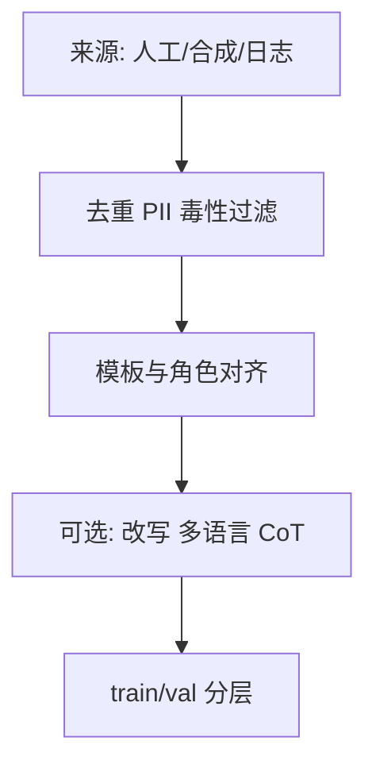

# 数据构造（指令、对话、思维链）

## 要解决的问题

SFT 上限 largely 由 **数据** 决定：同样的 7B 基座，用 5 万条精选对话微调，往往优于 50 万条噪声指令。本节聚焦如何把业务需求转化为可训练的 `(prompt, response)`：**单轮指令、多轮对话、思维链（CoT）** 三类主流形态及其构造管线。

## 核心概念

| 类型 | 结构 | 典型用途 |
| --- | --- | --- |
| **指令（Instruction）** | 单轮 `instruction + optional input → output` | 任务遵循、格式控制 |
| **对话（Dialogue）** | 多轮 `role: content` | 助手人设、工具调用前后文 |
| **思维链（CoT）** | 中间推理 `rationale → answer` | 数学、代码、复杂推理 |

统一序列化示例（概念上）：

```text
<|system|> 你是助手 …
<|user|> 问题 …
<|assistant|> 推理步骤 … 最终答案 …
```

Loss 仅打在 `<|assistant|>` 段；system/user 可全 mask。

## 方法 / 数据管线



### 1. 指令数据

- **人工**：专家标注、众包；质量高、成本高。
- **合成**：Self-Instruct、Evol-Instruct 用强模型扩种子任务（见 [4.2.1](../02-instruction-tuning/01-flan-t0-self-instruct)）。
- **蒸馏**：教师模型生成学生训练集（WizardLM 等）。

### 2. 对话数据

- 从客服/社区日志抽取时需 **脱敏** 与 **同意** 审查。
- 多轮需保证 **角色交替合法**，避免连续两条 assistant。
- 工具调用样本应包含 **tool schema、调用 JSON、工具返回、最终回复** 四段，与推理框架一致。

### 3. 思维链数据

- 显式 `Let's think step by step` 或 `<thinking>` 块；推理模型（R1 类）常用更长 CoT。
- 可只用 **结果正确** 的轨迹（执行反馈、单元测试），见 [Self-Play with Execution Feedback](/paper-reading/agentic/self-play-with-execution-feedback)。

## 工程实践

| 实践 | 说明 |
| --- | --- |
| **去重** | MinHash / 精确重复；避免 benchmark 泄漏进训练集 |
| **长度** | 截断策略与模型 `max_seq_len` 一致；长 CoT 注意 packing |
| **混合** | 通用对话 + 领域 + 安全拒答样本比例需文档化 |
| **版本** | 数据集 hash、模板版本写入 metadata，便于复现 |

工具： `datasketch`、`cleanlab`、自研规则引擎；开源集合 OpenHermes、ShareGPT 风格数据需二次清洗。

## 代表工作

- **Self-Instruct**（Wang et al., 2022）：种子任务 → 模型扩写 → 过滤。
- **FLAN**（Chung et al., 2022）：将 NLP 任务统一为指令格式大规模混合。
- 领读：[Self-Instruct](/paper-reading/agentic/self-instruct)、[Evol-Instruct](/paper-reading/agentic/evol-instruct)。

## 局限与注意点

- 合成数据易 **模式坍塌**（句式单一、过度礼貌）；需多样性采样与人工 spot-check。
- CoT 若仅模仿表面「废话推理」，不一定提升真实推理力（待验证：需配合 RL / 验证器）。
- 多语言场景要检查 **翻译腔** 与代码块语言混用。

## 相关章节

- [4.1.1 SFT 概述](./01-sft-overview)
- [4.1.3 质量与数量权衡](./03-quality-quantity-tradeoff)
- [4.2.3 高质量指令数据](../02-instruction-tuning/03-high-quality-instruction-data)
- [4.1.4 灾难性遗忘](./04-catastrophic-forgetting)
