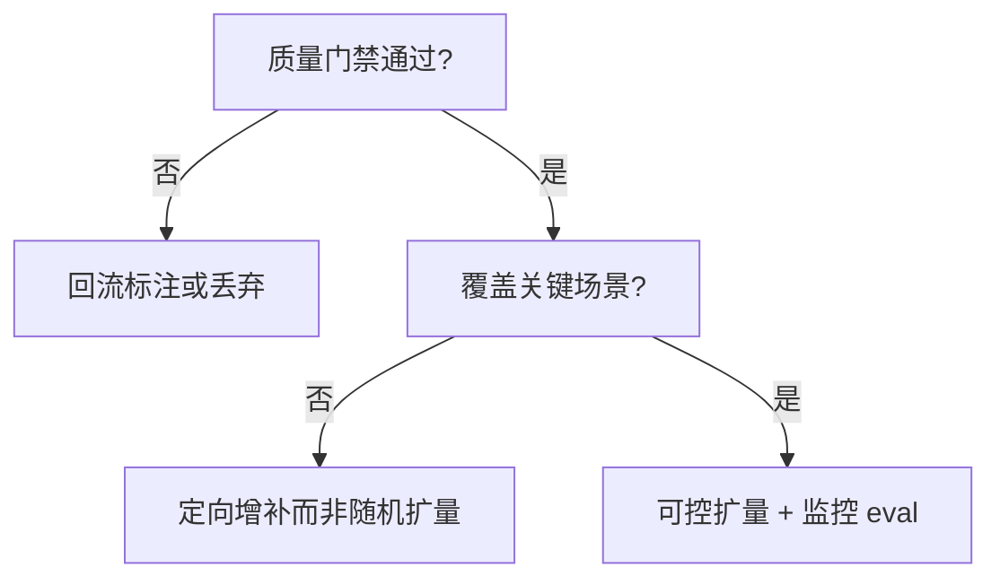

# 4.1.3 数据质量与数量的权衡

## 要解决的问题

团队常面临两难：标注预算是买 **更多条** 还是 **更严质控**？盲目扩量可能引入噪声、重复与偏见；过度精选则覆盖不足、泛化差。本节给出 SFT 场景下 **质量—数量** 的可操作权衡框架与可观测信号。

## 核心概念

| 维度 | 高质量信号 | 低质量风险 |
| --- | --- | --- |
| **正确性** | 事实、代码可运行、数学可验 | 幻觉答案被学进策略 |
| **多样性** | 任务类型、语气、长度分布宽 | 模板化回复、拒答单一 |
| **一致性** | 与产品 policy、模板一致 | 同一问题多种矛盾风格 |
| **难度** | 含边界 case、多步推理 | 仅简单 FAQ，遇难题崩溃 |

经验曲线（非严格定律，供规划参考）：

- 初期：**1k–10k** 精选样本常带来最大边际收益。
- 中期：增至 **50k–100k** 需加强过滤，否则 loss 下降但 Arena 分数停滞。
- 后期：百万级通常依赖 **合成 + 自动过滤**，必须独立验证集监控过拟合。

## 方法 / 决策流程

### 质量门禁示例

1. **规则**：长度、编码、违禁词、JSON 可解析。
2. **模型裁判**：用强 LLM 打 rubric 分（与 [LLM-as-Judge](../../07-evaluation/02-evaluation-methods/02-llm-as-judge) 同源，注意偏见）。
3. **可执行验证**：代码单元测试、数学 sympy、检索命中率。
4. **人工审计**：每层随机 1–5% 复核，估计错误率 $\epsilon$，若 $\epsilon > \tau$ 则整批降级。

### 数量扩量策略

- **课程学习（个人理解）**：先短问答、后长 CoT；先单轮、后多轮工具链。
- **重加权**：对稀缺技能（SQL、合规）过采样，而非均匀加条。
- **与 RL 分工**：SFT 负责「会做」，偏好优化负责「做得更好看、更安全」（[4.3](../03-rlhf/01-rlhf-pipeline)、[4.4](../04-preference-optimization/01-dpo)）。

## 工程实践

| 指标 | 用途 |
| --- | --- |
| **perplexity on val** | 快速发现脏数据；异常尖峰样本追溯 |
| **win-rate vs 上一版** | 小流量 A/B 或 pairwise 评测 |
| **技能分层表** | 按场景 breakdown，防止「平均变好、短板更差」 |
| **数据卡片** | 记录来源、语言比、合成比例、版本号 |

成本上：**人工 1 条高质量 ≈ 过滤 10–50 条合成** 并不少见；应用 ROI 决定拐点。

## 代表工作

- **LIMA**（Zhou et al., 2023）：「Less Is More」— 千级精选对话挑战「越大越好」迷思。
- **Quality over Quantity** 类消融在 Alpaca、WizardLM 技术博客中反复出现。
- 指令进化：[Evol-Instruct](/paper-reading/agentic/evol-instruct) 强调 **难度递进** 而非纯数量。

## 局限与注意点

- 评测集 **污染** 会使「少数据高分数」假象；需 held-out 与动态题库。
- 不同基座 **最优数据量** 不可照搬（7B vs 70B、中英 mix 比例不同）。
- 质量定义随产品变：客服要礼貌，编码 Agent 要可执行，指标需分场景。

## 数据规模规划表（示意）

| 阶段 | 样本量 | 目标 |
| --- | --- | --- |
| PoC | 1k–3k | 验证模板与任务覆盖 |
| Alpha | 10k–30k | 主力场景 win-rate 过基线 |
| Beta | 50k+ | 长尾与多语言；必须加强过滤 |
| 生产迭代 | +每周增量 | 监控退化与泄漏 |

## 与标注外包协作

- 提供 **rubric + 正反例** PDF，减少返工。
- 双人标注不一致率 >15% 的批次整批重标，而非混入训练。
- 验收用 **隐藏金标**（标注员不可见）抽检，防敷衍。

## 相关章节

- [4.1.2 数据构造](./02-data-construction)
- [4.2.3 高质量指令数据构造](../02-instruction-tuning/03-high-quality-instruction-data)
- [4.1.4 灾难性遗忘](./04-catastrophic-forgetting)
- 评估：[7.2 评测方法](../../07-evaluation/02-evaluation-methods/03-human-evaluation)
