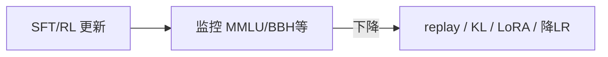

# 4.1.4 灾难性遗忘问题

## 要解决的问题

SFT、指令微调或 RL 会在目标分布上快速拟合，同时 **削弱** 预训练中的通用能力：多语言 fluency 下降、知识问答变差、代码/数学退步。这种现象常称 **灾难性遗忘（Catastrophic Forgetting）**，是后训练阶段必须监控与缓解的系统风险。

## 核心概念

| 机制 | 说明 |
| --- | --- |
| **分布偏移** | 训练几乎只见对话格式，预训练网页/书籍分布被挤出 |
| **参数漂移** | 全参更新幅度大，破坏与无关任务共享的表示 |
| **容量竞争** | 有限参数在「助手风格」与「世界知识」间抢容量 |

与 **对齐税（Alignment Tax）** 相关：RLHF 后 MMLU 等有时下降，即遗忘的一种评测表现。

缓解思路可归纳为：**约束更新**（KL、小 LR）、**混合数据**（replay）、**参数高效**（只改少量权重）。

## 方法 / 缓解策略

### 1. 数据层

- **Replay**：混入 5–20% 预训练风格文本（无指令包装）或通用 QA。
- **多任务 SFT**：保留部分原始 NLP 任务格式（FLAN 思路，见 [4.2.1](../02-instruction-tuning/01-flan-t0-self-instruct)）。

### 2. 优化层

- 降低学习率、减少 epoch；早停依据 **通用 benchmark** 而非仅 SFT loss。
- 后续 RLHF 的 **KL 惩罚** 显式锚定 $\pi_{\text{ref}}$（[4.3.4](../03-rlhf/04-kl-penalty-stability)）：

$$
\mathbb{E}\big[ r(x,y) - \beta \,\mathrm{KL}(\pi_\theta \| \pi_{\text{ref}}) \big]
$$

### 3. 参数层

- [LoRA](../06-peft/03-lora-qlora)、Adapter：大部分权重冻结，遗忘通常更轻（不绝对，见 PEFT 章节）。
- **模型合并**：SFT 后与基座做 SLERP / TIES 合并（开源社区常用，效果待严格 ablation）。

## 工程实践

| 实践 | 说明 |
| --- | --- |
| **双轨 eval** | 对齐指标（Arena）+ 能力指标（MMLU、GSM8K、HumanEval）同步看 |
| **checkpoint 矩阵** | 保存多个 step，选「对齐↑、能力↓最小」的 Pareto 点 |
| **回归门禁** | 发布前能力跌幅超阈值则 block |
| **日志** | 记录数据 mix 比例、$\beta$、可训练参数量 |

DeepSeek-R1、Qwen 等报告常强调 **保留推理与知识** 的混合训练阶段；细节见 [DeepSeek-R1 技术报告](../../08-technical-reports/01-deepseek/02-deepseek-r1)。

## 代表工作

- **InstructGPT**：讨论对齐后部分 NLP 任务性能下降。
- **LIMA / FLAN**：通过数据配方减轻能力损失。
- **Kirk et al., 2023** 等关于 alignment tax 的实证分析（arXiv 检索 "alignment tax LLM"）。

## 局限与注意点

- 并非所有「benchmark 下降」都是遗忘：可能是 **评测分布与 SFT 分布不一致**。
- Replay 过多会 **稀释对齐** 效果，需产品侧权衡。
- 合并权重可能带来 **推理不稳定**（待验证：依赖合并算法与比例）。

## 监控指标示例

| 能力域 | 基准（示例） | 告警阈值（示例） |
| --- | --- | --- |
| 知识 | MMLU 5-shot | 相对基座 −3pt |
| 数学 | GSM8K | −5pt |
| 代码 | HumanEval pass@1 | −5pt |
| 对齐 | 内部 win-rate | 需上升，非下降 |

阈值应随产品定义；上表仅为 **回归门禁** 思路。

## 模型合并注意

- **SLERP / TIES**：在 SFT 权重与预训练（或中间 checkpoint）间插值，可找回部分能力。
- 合并后必须重跑 **安全与对齐** 评测，合并不保证无害性不变。
- 个人理解：合并是「补救」而非首选；首选仍是训练期 replay + KL。

## 相关章节

- [4.1.1 SFT 概述](./01-sft-overview)
- [4.3.4 KL 惩罚与稳定性](../03-rlhf/04-kl-penalty-stability)
- [4.6 PEFT](../06-peft/05-peft-selection-guide)
- 预训练数据混合：[3.1.4 数据配比](../../03-pre-training/01-pretraining-data/04-data-mixture)
