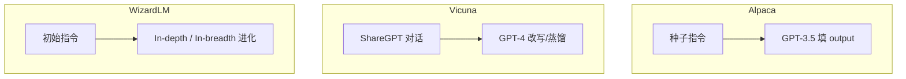

# Alpaca、Vicuna、WizardLM 数据范式

## 要解决的问题

2023 年前后开源社区证明：**强教师 + 低成本合成数据 + 开源基座 SFT** 即可得到可用聊天模型，无需完整 RLHF 栈。Alpaca、Vicuna、WizardLM 代表三种常被复制的 **数据范式**（蒸馏、对话、进化复杂度），影响至今的 LLaMA-Factory 类工具链。

## 核心概念

| 项目 | 基座 | 数据范式 | 关键创新 |
| --- | --- | --- | --- |
| **Alpaca** | LLaMA | `text-davinci-003` 生成 52k 指令 | 证明约 $600 级成本可训助手 |
| **Vicuna** | LLaMA | ShareGPT 风格 **真实多轮对话** 蒸馏 | 偏聊天体验、长度更长 |
| **WizardLM** | LLaMA-2 | **Evol-Instruct** 逐步加深任务难度 | 复杂指令与推理向 |

## 方法 / 范式对比

### Alpaca 范式

- Prompt：`instruction` + 可选 `input` → `output` JSON 行。
- 适合 **快速原型**、教学复现；弱点是分布偏短、偏考试题。

### Vicuna 范式

- 强调 **多轮上下文** 与口语化；数据来自用户分享对话（许可与隐私需自查）。
- 评测常用 **GPT-4 打分**（MT-Bench），引发「评委模型偏见」讨论（见 [7.2 LLM-as-Judge](../../07-evaluation/02-evaluation-methods/02-llm-as-judge)）。

### WizardLM / Evol-Instruct 范式

- **深度进化**：加约束、加推理步骤、嵌套条件。
- **宽度进化**：改领域、改语言、改输入类型。
- 领读：[Evol-Instruct](/paper-reading/agentic/evol-instruct)。

## 工程实践

| 决策 | 建议 |
| --- | --- |
| **教师选择** | 与目标部署能力差距过大时，学生上限明显 |
| **许可** | ShareGPT 衍生数据注意 ToS；商用需法务确认 |
| **模板** | Vicuna v1.5 与 Llama-3 模板不兼容，混用会崩 |
| **后续对齐** | 开源版常再接 [DPO](../04-preference-optimization/01-dpo) 或 [RLHF](../03-rlhf/01-rlhf-pipeline) 一小步 |

训练栈：`LLaMA-Factory`、`Axolotl` 均内置 Alpaca / ShareGPT 格式转换。

## 代表工作

- Taori et al., 2023 — **Stanford Alpaca**.
- Chiang et al., 2023 — **Vicuna**（LMSYS）。
- Xu et al., 2023 — **WizardLM / Evol-Instruct**（[领读](/paper-reading/agentic/evol-instruct)）.

## 局限与注意点

- 三者均为 **英文为主** 的早期配方；多语言需重训数据而非只换 tokenizer。
- GPT 蒸馏会继承 **幻觉与过度自信**；必须用验证集与人工审计。
- 「Alpaca 数据 + 新基座」不一定优于厂商官方 Instruct 权重（个人理解：基座能力差距主导）。

## ShareGPT 清洗要点（Vicuna 范式）

- 去除 **空轮、断裂轮、纯 URL 垃圾** 对话。
- 统一 **角色名** 为模板要求的 `USER`/`ASSISTANT` 或厂商标签。
- 截断超长对话：保留 **首条 system + 最近 N 轮** 常比硬截中间更稳（个人理解，N 依窗口）。
- 记录 **教师模型版本**（GPT-4-0314 vs 0613 风格不同）。

## 许可证与合规

- Alpaca 数据基于 OpenAI 生成，商用需核对 **OpenAI ToS** 与衍生训练条款。
- ShareGPT 用户生成内容：**版权与隐私** 风险高于合成指令；发布权重前建议法务评审。

## 相关章节

- [4.2.1 FLAN、Self-Instruct](./01-flan-t0-self-instruct)
- [4.2.3 高质量指令数据](./03-high-quality-instruction-data)
- [4.1.3 质量与数量权衡](../01-sft/03-quality-quantity-tradeoff)
