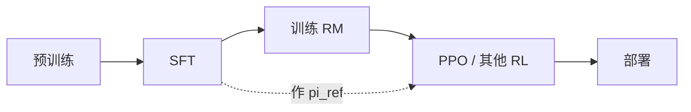

# 4.3.1 RLHF 完整流程

## 要解决的问题

SFT 只能模仿标注员平均行为，无法显式优化 **「哪一个回复更好」** 的排序信号。**基于人类反馈的强化学习（RLHF）** 将偏好转化为可优化目标，使模型在有用性、诚实性、无害性等维度上更符合部署需求。本节给出工业界经典 **三阶段流水线** 及模块边界。

## 核心概念

| 阶段 | 输入 | 输出 | 目标 |
| --- | --- | --- | --- |
| **1. SFT** | 示范 $(x, y)$ | $\pi_{\text{SFT}}$ | 学会对话格式与基础能力 |
| **2. RM** | 偏好 $(x, y_w, y_l)$ | $r_\phi(x,y)$ | 拟合人类排序 |
| **3. RL** | prompt $x$ | $\pi_\theta$ | 最大化奖励且贴近 $\pi_{\text{ref}}$ |

**InstructGPT**（Ouyang et al., 2022）确立该范式；ChatGPT 类产品的对齐栈多为其变体（具体配方未完全公开）。

## 方法 / 各阶段要点

### 阶段 1：SFT

- 见 [4.1 SFT](../01-sft/01-sft-overview)；产出通常同时作为 **RL 的参考策略** $\pi_{\text{ref}}$。

### 阶段 2：奖励模型（RM）

- Bradley-Terry 式偏好概率：

$$
P(y_w \succ y_l \mid x) = \sigma\big(r_\phi(x,y_w) - r_\phi(x,y_l)\big)
$$

- 细节见 [4.3.2 奖励模型](./02-reward-model)。

### 阶段 3：强化学习

- 常用 **PPO** 在 token 或 sentence 级优化期望奖励，并加 KL 约束（[4.3.3](./03-ppo)、[4.3.4](./04-kl-penalty-stability)）。
- 目标示意：

$$
\max_\theta \; \mathbb{E}_{x\sim \mathcal{D},\, y\sim \pi_\theta}\big[r_\phi(x,y) - \beta \,\mathrm{KL}(\pi_\theta(\cdot|x)\|\pi_{\text{ref}}(\cdot|x))\big]
$$

## 工程实践

| 环节 | 实践 |
| --- | --- |
| **系统** | 需 **四模型共存**（policy、ref、RM、critic）或 offload；DeepSpeed、Megatron+RLHF 框架 |
| **数据** | 偏好数据贵；常与 [Constitutional AI](../05-constitutional-ai-rlaif/01-constitutional-ai) / RLAIF 互补 |
| **替代** | [DPO](../04-preference-optimization/01-dpo) 省 RM+RL 工程；大厂仍可能在线 RL |
| **监控** | reward 均值、KL、response 长度、拒答率、毒性分类器 |

训练不稳定与 reward hacking 见 [4.3.5 挑战](./05-rlhf-challenges)。

## 代表工作

- Ouyang et al., 2022 — **Training language models to follow instructions with human feedback**.
- Stiennon et al., 2020 — **Learning to summarize with human feedback**（RLHF 前身之一）。
- 技术报告中的 RL 阶段：[DeepSeek-R1](/paper-reading/tech-report/deepseek/deepseek-r1)、[Qwen3](/paper-reading/tech-report/qwen/qwen3)（以官方描述为准）。

## 局限与注意点

- 全流程 **算力与调试成本** 远高于纯 SFT/DPO。
- RM 偏见直接传导到策略；需多样化标注者与 [red teaming](../05-constitutional-ai-rlaif/01-constitutional-ai)。
- 开源复现常与商用 **数据规模与迭代轮次** 差距巨大，性能不可直接对标。

## 三阶段时间线与人力（示意）

| 阶段 | 典型周期 | 人力侧重 |
| --- | --- | --- |
| SFT | 天–周 | 数据、模板 |
| RM | 周 | 偏好标注、RM 评估 |
| PPO | 周–月 | 系统、调参、红队 |

瓶颈常在 **偏好标注** 而非 GPU；[RLAIF](../05-constitutional-ai-rlaif/02-rlaif) 用 AI 标签换人工，但需质检。

## 最小 RLHF 栈（研究复现）

- 7B：SFT → 7B RM → `trl` PPO，4×A100 级（随实现波动）。
- 可先 **RM + Best-of-N** 验证偏好信号，再开 PPO，降低调试维度。

## 相关章节

- [4.3.2 奖励模型](./02-reward-model)
- [4.3.3 PPO](./03-ppo)
- [4.4.1 DPO](../04-preference-optimization/01-dpo)（无 RL 的偏好优化）
- [4.1.1 SFT](../01-sft/01-sft-overview)
