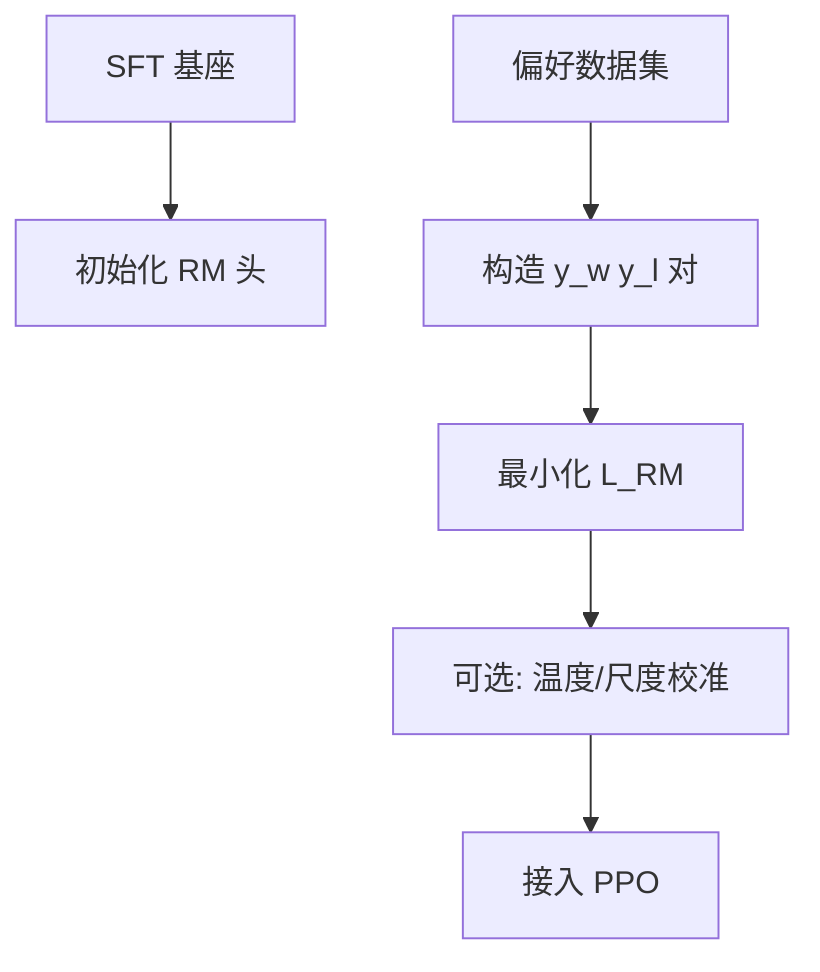
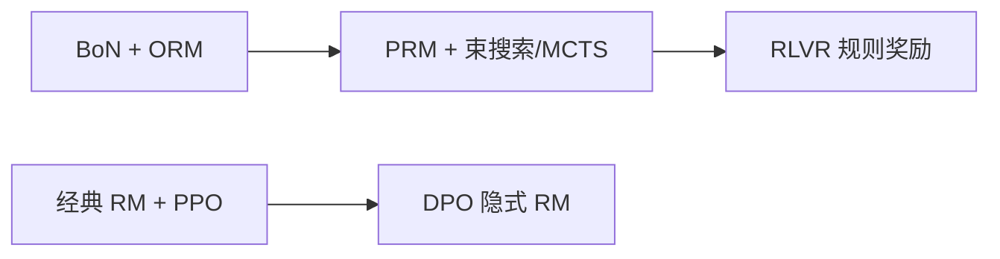

# 奖励模型（Reward Model）训练

强化学习阶段需要 **可微、可批量** 的标量反馈，但真实场景下标注的偏好数据通常是成对数据而非绝对分值数据。**奖励模型（Reward Model, RM）** 学习从 $(x, y)$ 映射到标量 $r_\phi(x,y)$，使排序与标注一致，并作为 PPO 的 reward 信号（或用于 Best-of-N 采样）。

将「有用、无害、诚实」等多维偏好压成 **单一标量** 本身是有损的（信息瓶颈），工业界常用单一 RM 是工程权衡，而非理论最优；多目标 RM 见下文架构类型。

## 核心概念

偏好数据：同一 prompt $x$ 下，标注者认为 $y_w$（winner）优于 $y_l$（loser）。

Bradley-Terry 假设下的 **pairwise loss**（BT 下极大似然估计的自然结果）：

$$
\mathcal{L}_{\text{RM}} = - \mathbb{E}_{(x,y_w,y_l)}\Big[\log \sigma\big(r_\phi(x,y_w) - r_\phi(x,y_l)\big)\Big]
$$

### 偏好模型的理论基础

**Bradley-Terry（BT）为何是 logistic 形式**：设每个回复有潜在效用 $u(y|x)$，RM 学习 $r_\phi(x,y) \approx u(y|x)$。在「奖励差决定胜率」假设下，$y_w$ 优于 $y_l$ 的概率为：

$$
P(y_w \succ y_l \mid x) = \frac{e^{u(y_w|x)}}{e^{u(y_w|x)} + e^{u(y_l|x)}} = \sigma\big(u(y_w|x) - u(y_l|x)\big)
$$

对观测到的成对偏好做 MLE，即得上式 $\mathcal{L}_{\text{RM}}$ — 并非凭空给出的 loss，而是 BT 概率模型的对数似然。

**Plackett-Luce（PL）与 BT 的区分**：

| 模型 | 输入标注 | 适用场景 |
| --- | --- | --- |
| **Bradley-Terry** | 二元偏好 $(y_w, y_l)$ | 最常见；标注员两两比较 |
| **Plackett-Luce** | 同一 $x$ 下 $k$ 个回复的 **全排序** | 多元排序；可展开为多对 pairwise 近似训练 |

实践中 PL 全排序常 **展开为多个 BT pairwise**（如 $k$ 个回复产生 $\binom{k}{2}$ 对），实现简单但丢失排序内的强度信息。

**BT / 标量 RM 的根本局限**：

| 局限 | 说明 |
| --- | --- |
| **传递性假设** | BT 隐含 $A \succ B \land B \succ C \Rightarrow A \succ C$；无法建模循环偏好（$A \succ B \succ C \succ A$） |
| **偏好强度压缩** | 「略好」与「好很多」在 loss 中权重相同，除非额外引入 margin |
| **标量信息瓶颈** | 多维偏好（有用 / 无害 / 诚实）投影到单一 $r$，不同维度冲突时 RM 学出折中而非 Pareto 最优 |
| **分布外外推** | RM 仅在训练分布上可靠；新奇回复常虚高/虚低分 |

### RM 架构类型

| 维度 | 类型 | RM 视角要点 |
| --- | --- | --- |
| **判别式 vs 生成式** | 线性头标量 vs **GenRM / LLM-as-a-Judge** 输出判断或分数 | 判别式是经典 RLHF 默认；生成式可按 rubric 评多维度，但延迟高、需解析输出，见 [7.2.2 LLM-as-a-Judge](../../07-evaluation/02-evaluation-methods/02-llm-as-judge) |
| **ORM vs PRM** | 对完整回复打分 vs 对推理链 **逐步** 打分 | 本章经典 RM 即 **ORM**（Outcome RM）；**PRM**（Process RM）用于 CoT 信用分配、MCTS，见 [6.2.3 PRM vs ORM](../../06-reasoning-test-time-compute/02-test-time-compute/03-prm-vs-orm) |
| **单目标 vs 多目标** | 单一标量 vs 多头 + 门控混合 | **ArmoRM** 等为每个目标（helpfulness、safety 等）设独立 head，再按 prompt 门控加权，缓解标量瓶颈 |
| **Pointwise vs Pairwise** | 单条打分 vs 成对比较 | **训练**几乎总是 pairwise；**推理**时 PPO / BoN 对单条 $y$ 打分，不要求 batch 内同时存在 loser |

**判别式 RM 默认配置**：

| 设计选择 | 常见做法 |
| --- | --- |
| **骨干** | 在 SFT 模型上加 **线性头** 输出标量；或最后一 token hidden |
| **输入格式** | 拼接 prompt+response，仅在 response 末 token 取分 |
| **归一化** | 批内或 running mean 标准化 reward，稳定 PPO |
| **数据** | 每 $x$ 多条回复排序 → 可展开为多对 pairwise |

## 方法 / 训练流程

### 训练技巧与损失变体

**InstructGPT batch 技巧**（Ouyang et al., 2022）：将 **同一 prompt** 下的多条 pairwise **放入同一 batch**，使 RM 在 batch 内做相对比较、学习相对排序而非绝对分数。这是 RM 工程里比 loss 公式更关键的实现细节，可显著减轻 RM 对绝对 reward 尺度的过拟合。

**平局（tie）样本**：BT 默认严格二元（$y_w$ 或 $y_l$）。现实标注中大量「差不多」样本，常见处理：

- **丢弃** tie 对，最简单；
- **降权** tie 样本的 loss；
- **扩展为三分类**（win / lose / tie），需改 loss 形式。

标注指南应明确何时标 tie（如「两者均可用且无明显优劣」）。

**Margin / ranking 变体**：若标注含偏好强度，可在 loss 中加入 margin $m$：

$$
\mathcal{L} = -\log \sigma\big(r_\phi(x,y_w) - r_\phi(x,y_l) - m\big)
$$

$m$ 可来自标注置信度或排序间隔。SimPO 等偏好优化方法中的 margin 概念类似，见 [4.4.2 IPO/KTO/ORPO/SimPO](../04-preference-optimization/02-ipo-kto-orpo-simpo)。

**训练期防漂移正则**：对 reward 绝对值加 L2 约束 $\lambda \|r_\phi\|^2$，防止 RM 输出尺度在训练中无限漂移、导致 PPO 阶段 value network 难学。这与后文 **Platt scaling**（部署前校准）互补：前者在训练期、后者在接入 PPO 前。

### 数据质量

- **标注指南**：定义「更好」维度（有用、无害、诚实），避免标注员各判各的。
- **一致性**：同一 $(x,y_w,y_l)$ 多人标注；低一致样本丢弃或降权。
- **对抗样本**：含诱导有害回复的 prompt，防止 RM 只学「更长=更好」；含 **应纠正用户** 的样本以抑制谄媚（见下文 hacking 形态）。

### 与策略的关系

- RM 常在 **SFT 权重** 上初始化，分布更接近部署模型。
- **过拟合 RM**：训练集 reward 很高但人类观感差 → 需 hold-out prompt 与定期 **人工校准**。

## 工程实践

| 项 | 说明 |
| --- | --- |
| **框架** | `trl.RewardTrainer`、OpenRLHF、DeepSpeed-Chat |
| **显存** | RM 推理与 policy rollout 可分时占卡 |
| **指标** | pairwise **accuracy**、Spearman、**RewardBench** 子集 |
| **BoN** | 推理时 sample N 条，RM 选最高，无需 RL 即可部分受益 |

RM 也可被 **DPO 隐式吸收**（[4.4.1](../04-preference-optimization/01-dpo)），省去显式 RM 训练。

## 代表工作

- Stiennon et al., 2020 — 摘要 RLHF 中的 RM。
- Ouyang et al., 2022 — InstructGPT RM 细节（6B RM、同 prompt batch 等）。
- Gao et al., 2023 — **Scaling laws for reward model overoptimization**（过优化定量规律）。
- Lambert et al., 2024 — **RewardBench**（RM 系统化评测基准）。
- Wang et al. — **ArmoRM**（多目标 RM 架构：多头 + 门控混合）。
- **Skywork-Reward** 等开源 RM（2024–2026）供社区 PPO/DPO 复用。
- GenRM / LLM-as-a-Judge 作 RM：见 [7.2.2 LLM-as-a-Judge](../../07-evaluation/02-evaluation-methods/02-llm-as-judge)。

## 局限与注意点

- RM 对 **分布外** 回复常给出虚高/虚低分（extrapolation error）。
- **Goodhart 定律**：优化 RM 分数 ≠ 优化真实人类满意度（[4.3.5 RLHF 挑战](./05-rlhf-challenges)）。
- 多目标（安全 vs 有用）可能需要 **多个 RM**、多头 RM（ArmoRM）或约束优化（Pareto RL，工程较少见）。

### 常见 hacking 形态（RM 视角）

以下现象在 RM 侧有明确成因；PPO 侧监测与流程缓解见 [4.3.5](./05-rlhf-challenges)。

| 形态 | 机制 | RM 侧缓解方向 |
| --- | --- | --- |
| **长度 / verbosity bias** | RM 训练数据中 $|y|$ 与质量隐式相关，学出「更长 ≈ 更高分」；PPO 推策略输出冗长回复 | 长度分层均衡采样、reward 加长度惩罚 $-\lambda|y|$、长度解耦特征 |
| **Sycophancy（谄媚）** | RM 偏好迎合用户立场而非事实正确性 | 偏好数据含「应礼貌纠正用户错误」的 winner；对抗性 prompt |
| **过优化（over-optimization）** | 策略偏离 $\pi_{\text{ref}}$ 越远，训练 RM 分越高，但 gold RM / 人类 win-rate 先升后降 | 见 Gao et al. 规律；以 KL 与 gold RM 曲线拐点作 PPO early-stop 信号 |
| **单 RM exploit** | 策略专门钻某一 RM 的漏洞 | **RM ensemble**（多 RM 投票）或分歧大时降权 rollout；不确定性估计抑制 exploit |

**Gao et al. 2023 过优化规律（定性）**：随 PPO 训练中 KL$(\pi_\theta \| \pi_{\text{ref}})$ 增大，**训练 RM 给出的 reward** 持续上升，但 **gold RM**（人类标注上训练的 held-out RM）或 **人类 win-rate** 先升后降，形成「过优化拐点」。该拐点可作为停止 RL 或回退 checkpoint 的参考，比单纯盯训练 RM 分更可靠。

## 前沿与替代范式

**RLVR / 规则奖励**：数学、代码等 **可验证** 域可用 Verify（单元测试、答案匹配）替代学习型 RM，零标注成本、无 hacking 空间。通用对话仍依赖 RM；推理/代码路线见 [6.3.2 RLVR](../../06-reasoning-test-time-compute/03-rl-reasoning/02-rlvr)。

**RM 与 DPO 的理论联系**：在 BT 假设下，RL 最优策略对应隐式奖励 $\hat{r}(x,y) = \beta \log \frac{\pi_\theta(y|x)}{\pi_{\text{ref}}(y|x)}$（详见 [4.4.1 DPO](../04-preference-optimization/01-dpo)）。DPO 将 **RM 训练 + RL** 合成一步偏好微调；RM+PPO 则保留 **在线探索** 与 **RM 可独立迭代** 的灵活性。

**RLAIF / Constitutional AI**：用 AI（强模型 + 原则）生成偏好对训练 RM，降低人类标注成本；质检与偏见审计不能省，见 [4.5.2 RLAIF](../05-constitutional-ai-rlaif/02-rlaif)。

**推理期扩展（beyond BoN）**：

- **Best-of-N（ORM）**：sample $N$ 条，RM 选最高 — 最简单，本章已述。
- **加权投票**：按 RM 置信度（如 $r_w - r_l$ 的 sigmoid）加权，而非硬 argmax。
- **PRM + 搜索**：PRM 对中间步打分，引导束搜索或 MCTS 剪枝低分分支，见 [6.2.4 MCTS](../../06-reasoning-test-time-compute/02-test-time-compute/04-mcts)。

## 评估、校准与 PPO 衔接

### RM 评测

| 指标 / 基准 | 说明 |
| --- | --- |
| **Pairwise accuracy** | 在 hold-out 偏好对上，$\mathbb{1}[r(y_w) > r(y_l)]$ 的比例 |
| **Spearman** | RM 排序与人工排序的相关 |
| **RewardBench** | 社区标准化 RM 对比：Chat / Chat Hard / Safety / Reasoning 子集（Lambert et al., 2024） |

### 校准方法

**Platt scaling**（3 步）：

1. 在 hold-out 偏好集上收集 RM raw score $r_\phi(x,y_w), r_\phi(x,y_l)$；
2. 拟合 sigmoid 映射 $r' = \sigma(a \cdot r + b)$（或对 $r_w - r_l$ 做 logistic 回归）；亦可用 isotonic regression；
3. 固定 $a, b$ 后接入 PPO，使 RM 输出概率与真实胜率对齐。

**分位数归一**：用验证集分位数将 $r$ 映射到固定区间（如 $[0,1]$ 或标准正态），缓解不同 batch / 不同训练阶段的尺度漂移。

### 校准度量与 PPO 机制

**ECE（Expected Calibration Error）**：将 RM 预测的 $P(y_w \succ y_l) = \sigma(r_w - r_l)$ 分桶，比较各桶 **预测胜率** 与 **实际胜率** 的偏差。

**为何未校准的 RM 会害 PPO**：RM 分系统性虚高 → GAE 算出的 advantage 被放大 → policy 梯度过度更新、专门 exploit RM 漏洞（长度、谄媚等），形成 [4.3.5](./05-rlhf-challenges) 中的 reward hacking 因果链。

**PPO 衔接实践**：

- PPO 使用的 reward 建议 **批内标准化** $(r - \mu)/\sigma$，避免 value network 难学（与 Platt scaling 可叠加）。
- 若 RM 仅在短回复上训练，长 CoT rollout 会 **外推失败** — 需增补长回复偏好对。

## 开源 RM 使用注意

- 加载社区 RM 时核对 **tokenizer、模板、最大长度** 与 policy 一致。
- 不同 RM 的分数 **不可跨模型比较**；换 RM 需重跑 RL 或重标数据。

## 相关章节

- [4.3.1 RLHF 流程](./01-rlhf-pipeline)
- [4.3.3 PPO](./03-ppo)
- [4.3.5 RLHF 挑战](./05-rlhf-challenges)
- [4.4.1 DPO](../04-preference-optimization/01-dpo)
- [4.5.2 RLAIF](../05-constitutional-ai-rlaif/02-rlaif)
- [4.2.3 高质量数据](../02-instruction-tuning/03-high-quality-instruction-data)
- [6.2.3 PRM vs ORM](../../06-reasoning-test-time-compute/02-test-time-compute/03-prm-vs-orm)
- [6.2.4 MCTS](../../06-reasoning-test-time-compute/02-test-time-compute/04-mcts)
- [6.3.2 RLVR](../../06-reasoning-test-time-compute/03-rl-reasoning/02-rlvr)
- [7.2.2 LLM-as-a-Judge](../../07-evaluation/02-evaluation-methods/02-llm-as-judge)
