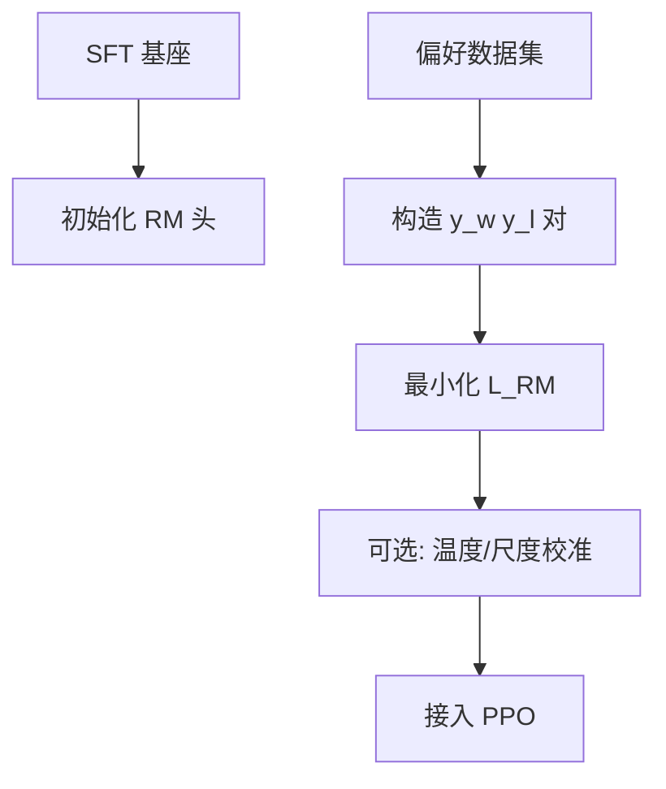

# 4.3.2 奖励模型（Reward Model）训练

## 要解决的问题

强化学习阶段需要 **可微、可批量** 的标量反馈，但人类偏好是成对比较而非绝对分数。**奖励模型（Reward Model, RM）** 学习从 $(x, y)$ 映射到标量 $r_\phi(x,y)$，使排序与标注一致，并作为 PPO 的 reward 信号（或用于 Best-of-N 采样）。

## 核心概念

偏好数据：同一 prompt $x$ 下，标注者认为 $y_w$（winner）优于 $y_l$（loser）。

Bradley-Terry / Plackett-Luce 简化下的 **pairwise loss**：

$$
\mathcal{L}_{\text{RM}} = - \mathbb{E}_{(x,y_w,y_l)}\Big[\log \sigma\big(r_\phi(x,y_w) - r_\phi(x,y_l)\big)\Big]
$$

| 设计选择 | 常见做法 |
| --- | --- |
| **骨干** | 在 SFT 模型上加 **线性头** 输出标量；或最后一 token hidden |
| **输入格式** | 拼接 prompt+response，仅在 response 末 token 取分 |
| **归一化** | 批内或 running mean 标准化 reward，稳定 PPO |
| **数据** | 每 $x$ 多条回复排序 → 可展开为多对 pairwise |

## 方法 / 训练流程

### 数据质量

- **标注指南**：定义「更好」维度（有用、无害、诚实），避免标注员各判各的。
- **一致性**：同一 $(x,y_w,y_l)$ 多人标注；低一致样本丢弃或降权。
- **对抗样本**：含诱导有害回复的 prompt，防止 RM 只学「更长=更好」。

### 与策略的关系

- RM 常在 **SFT 权重** 上初始化，分布更接近部署模型。
- **过拟合 RM**：训练集 reward 很高但人类观感差 → 需 hold-out prompt 与定期 **人工校准**。

## 工程实践

| 项 | 说明 |
| --- | --- |
| **框架** | `trl.RewardTrainer`、OpenRLHF、DeepSpeed-Chat |
| **显存** | RM 推理与 policy rollout 可分时占卡 |
| **指标** | pairwise **accuracy**、Spearman 与人工子集相关 |
| **BoN** | 推理时 sample N 条，RM 选最高，无需 RL 即可部分受益 |

RM 也可被 **DPO 隐式吸收**（[4.4.1](../04-preference-optimization/01-dpo)），省去显式 RM 训练。

## 代表工作

- Stiennon et al., 2020 — 摘要 RLHF 中的 RM。
- Ouyang et al., 2022 — InstructGPT RM 细节（6B RM 等）。
- **Skywork-Reward**、**ArmoRM** 等开源 RM（2024–2026）供社区 PPO/DPO 复用。

## 局限与注意点

- RM 对 **分布外** 回复常给出虚高/虚低分（extrapolation error）。
- **Goodhart 定律**：优化 RM 分数 ≠ 优化真实人类满意度（[4.3.5](./05-rlhf-challenges)）。
- 多目标（安全 vs 有用）可能需要 **多个 RM** 或约束优化（Pareto RL，工程较少见）。

## RM 标度与 PPO 衔接

- RM 输出未校准时常 **漂移**；可在验证集上做 Platt scaling 或分位数归一。
- PPO 使用的 reward 建议 **批内标准化** $(r - \mu)/\sigma$，避免 value network 难学。
- 若 RM 仅在短回复上训练，长 CoT rollout 会 **外推失败** — 需增补长回复偏好对。

## 开源 RM 使用注意

- 加载社区 RM 时核对 **tokenizer、模板、最大长度** 与 policy 一致。
- 不同 RM 的分数 **不可跨模型比较**；换 RM 需重跑 RL 或重标数据。

## 相关章节

- [4.3.1 RLHF 流程](./01-rlhf-pipeline)
- [4.3.3 PPO](./03-ppo)
- [4.4.1 DPO](../04-preference-optimization/01-dpo)
- [4.2.3 高质量数据](../02-instruction-tuning/03-high-quality-instruction-data)
