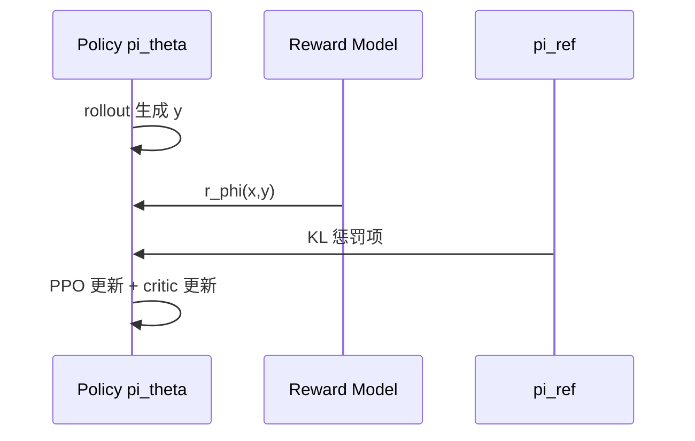

# 4.3.3 PPO 算法在 LLM 中的应用

## 要解决的问题

RM 给出标量奖励后，需在 **离散 token 空间** 上更新策略 $\pi_\theta$，且序列很长、方差大。策略梯度方法不稳定；**近端策略优化（PPO）** 通过 clipped surrogate 限制单步更新幅度，成为 RLHF 阶段的事实标准（与 InstructGPT 同期普及）。

## 核心概念

令 $A_t$ 为 advantage（可用 GAE 估计），$r_t(\theta) = \frac{\pi_\theta(a_t|s_t)}{\pi_{\text{old}}(a_t|s_t)}$ 为重要性采样比。PPO **clipped** 目标：

$$
\mathcal{L}^{\text{CLIP}}(\theta) = \mathbb{E}_t\Big[\min\big(r_t(\theta) A_t,\; \mathrm{clip}(r_t(\theta), 1-\epsilon, 1+\epsilon)\, A_t\big)\Big]
$$

LLM 场景下常见设定：

| 组件 | 说明 |
| --- | --- |
| **状态 $s_t$** | 已生成 token 前缀 |
| **动作 $a_t$** | 下一 token |
| **奖励** | 常在 **序列末** 给 $r_\phi(x,y)$；中间 token $A_t$ 由 GAE 回传 |
| **参考策略** | $\pi_{\text{ref}}$ 多为 SFT；KL 惩罚并入 reward 或 loss |
| **Critic** | 值函数 $V_\psi(s_t)$，常与 policy 共享骨干 |

总目标常写为：

$$
\mathcal{L} = \mathcal{L}^{\text{CLIP}} - c_1 \mathcal{L}^{\text{VF}} + c_2 \mathcal{H}[\pi_\theta]
$$

其中 $\mathcal{L}^{\text{VF}}$ 为 value loss，$\mathcal{H}$ 为熵 bonus（鼓励探索，系数常很小）。

## 方法 / RLHF 中的 PPO 循环

1. 从 prompt 集采样 $x$。
2. $\pi_\theta$ **rollout** 生成 $y$（可 temperature 采样）。
3. 计算 $r = r_\phi(x,y) - \beta \log\frac{\pi_\theta(y|x)}{\pi_{\text{ref}}(y|x)}$（KL 惩罚形式之一，见 [4.3.4](./04-kl-penalty-stability)）。
4. 用 GAE 得 $A_t$，多 epoch mini-batch 更新 $\theta,\psi$。
5. 周期性同步 $\pi_{\text{old}} \leftarrow \pi_\theta$。

## 工程实践

| 挑战 | 缓解 |
| --- | --- |
| **四模型显存** | ZeRO、CPU offload、colocate 推理 |
| **长序列** | 限制 max response len；reward 仅末 token |
| **训练崩溃** | 降 LR、减 $\epsilon$、增 $\beta$、早停 KL 飙升 |
| **实现** | `trl.PPOTrainer`、OpenRLHF、NeMo-Aligner |

可观测：**KL 散度**、平均 reward、clip fraction、entropy、response 长度。

## 代表工作

- Schulman et al., 2017 — **Proximal Policy Optimization Algorithms**（原论文）。
- Ouyang et al., 2022 — LLM RLHF 中的 PPO 配方。
- Zheng et al., 2023 — **RLHF 实践** 类博客与 `rlhf` 开源实现对比（arXiv: "Secrets of RLHF" 等）。

## 局限与注意点

- PPO 超参敏感；**复现困难** 是社区共识。
- 仅末 token reward 使 **信用分配** 粗糙，长 CoT 场景更明显。
- 许多团队改用 **DPO / GRPO** 等绕过 PPO+critic（[4.4](../04-preference-optimization/01-dpo)、[6.3 GRPO](../../06-reasoning-test-time-compute/03-rl-reasoning/01-grpo-rloo)）。

## 相关章节

- [4.3.1 RLHF 流程](./01-rlhf-pipeline)
- [4.3.2 奖励模型](./02-reward-model)
- [4.3.4 KL 惩罚](./04-kl-penalty-stability)
- [4.4.1 DPO](../04-preference-optimization/01-dpo)
