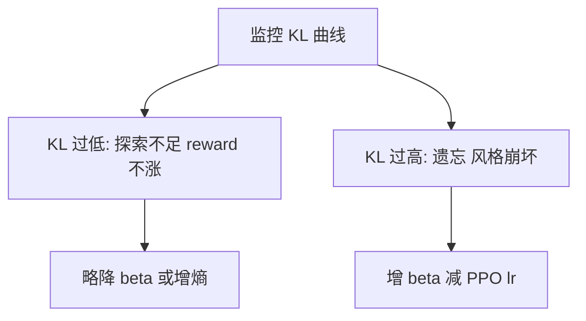

# 4.3.4 KL 惩罚与策略稳定性

## 要解决的问题

RL 阶段若只最大化 RM 分数，策略会 **偏离** SFT 分布：胡言乱语、超长复读、触发 RM 漏洞（reward hacking）。**KL 散度约束** 将 $\pi_\theta$ 锚定在参考策略 $\pi_{\text{ref}}$（通常为 SFT）附近，是对齐稳定性与 [灾难性遗忘](../01-sft/04-catastrophic-forgetting) 缓解的核心杠杆。

## 核心概念

$\mathrm{KL}(\pi_\theta \| \pi_{\text{ref}})$ 衡量新策略相对参考的「走远程度」。RLHF 中常见两种注入方式：

| 方式 | 形式 | 特点 |
| --- | --- | --- |
| **Reward 内惩罚** | $r' = r_\phi - \beta \,\mathrm{KL}$ | InstructGPT 常用；$\beta$ 控制力度 |
| **Loss 内约束** | 显式 KL loss 项 | 与 PPO clip 并列优化 |

对序列 $y=(y_1,\ldots,y_T)$，逐 token KL 可近似为：

$$
\mathrm{KL}(\pi_\theta \| \pi_{\text{ref}}) \approx \sum_{t=1}^{T} \sum_{v \in \mathcal{V}} \pi_\theta(v|s_t) \log \frac{\pi_\theta(v|s_t)}{\pi_{\text{ref}}(v|s_t)}
$$

实践中常用 **单样本路径** 的 log-ratio 估计：

$$
\log \pi_\theta(y|x) - \log \pi_{\text{ref}}(y|x) = \sum_t \log \frac{\pi_\theta(y_t|x,y_{<t})}{\pi_{\text{ref}}(y_t|x,y_{<t})}
$$

## 方法 / 调参与诊断

### $\beta$ 调度

- **固定 $\beta$**：简单；$\beta$ 过大 → 对齐弱，过小 → 不稳定。
- **自适应 KL**（个人理解：部分实现目标 KL $d_{\text{target}}$，动态调 $\beta$）：使 KL 维持在 band 内。
- **初始 SFT 强约束**：前几 k step 高 $\beta$，后期略放以榨 RM 分（recipe 各异，待验证泛化性）。

### 与 PPO clip 的关系

- Clip 限制 **单步策略比** $r_t(\theta)$；KL 限制 **累积分布** 偏离。
- 二者互补：仅 clip 仍可能逐步漂移。

## 工程实践

| 信号 | 解读 |
| --- | --- |
| **KL 持续上升** | 即将模式坍塌或 RM 过优化；增 $\beta$ 或停训 |
| **KL≈0 且 reward 平** | 策略未学习；检查 advantage、RM 尺度 |
| **回复变短/变长** | KL 与长度奖励耦合；RM 需去长度偏见 |
| **日志** | 分 prompt 域记录 KL（代码 vs 闲聊） |

DPO 中 $\beta$ 同样控制对 $\pi_{\text{ref}}$ 的信任（[4.4.1](../04-preference-optimization/01-dpo)），语义与 RLHF KL 相近。

## 代表工作

- Ouyang et al., 2022 — RLHF 中 KL penalty 经验设置。
- **PPO-Max**、**RLHF 调参** 类技术报告（各厂商博客）。
- Ziegler et al., 2019 — 早期 KL 约束微调语言模型。

## 局限与注意点

- $\pi_{\text{ref}}$ 若本身不安全，KL 会 **锁住** 有害模式。
- 估计 KL 用 **采样路径** 有方差；短回复低估、长回复高估风险并存。
- 推理时用户常要「更有创造力」，与训练时强 KL 保守可能存在 **产品张力**。

## 目标 KL 带宽（工程经验）

许多实现维护 **目标 KL** $d^\* \in [0.01, 0.1]$（依 tokenization 与序列长度而异）：

- 实测 KL **持续低于** $d^\*/10$：策略几乎不动，可略降 $\beta$ 或增大 PPO clip。
- 实测 KL **高于** $2 d^\*$：增 $\beta$、减学习率，或缩短 rollout 长度。

日志建议同时记录 **per-token KL** 与 **sequence-level KL**，二者趋势不一致时优先信 sequence-level（个人理解）。

## 相关章节

- [4.3.3 PPO](./03-ppo)
- [4.3.5 RLHF 挑战](./05-rlhf-challenges)
- [4.4.1 DPO](../04-preference-optimization/01-dpo)
- [4.1.4 灾难性遗忘](../01-sft/04-catastrophic-forgetting)
