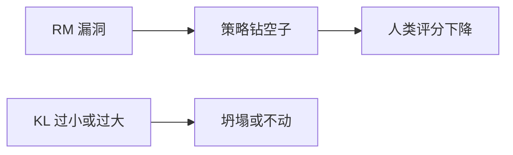

# RLHF 的挑战（reward hacking、模式坍塌）

## 要解决的问题

RLHF 在论文中流程清晰，落地却常遇 **训练发散、人类观感变差、能力回退**。本节归纳高频失败模式：**reward hacking**、**模式坍塌**、**对齐税**，并给出监测与缓解思路，便于调试与方案选型（是否改用 [DPO](../04-preference-optimization/01-dpo) 等）。

## 核心概念

| 现象 | 表现 | 机制 |
| --- | --- | --- |
| **Reward hacking** | RM 分高但人觉差 | 策略利用 RM 弱点（更长、列表、讨好语气） |
| **模式坍塌** | 回复千篇一律 | 熵塌缩、PPO 过度收敛到窄模式 |
| **对齐税** | MMLU/GSM8K 降 | 优化偏好牺牲通用能力 |
| **RM 外推失败** | 新奇回复评分乱 | RM 训练分布外不可靠 |

## 方法 / 缓解策略

### 1. Reward hacking

- **RM 数据**：加入长度归一、风格多样、对抗性「钻分」样本再标注。
- **多 RM 集成** 或 **规则约束**（毒性分类器、格式校验）作为 gate。
- **Best-of-N + 人工** 校准 RM 尺度；定期 **重训 RM** 于最新策略 rollout（在线 RL，成本高）。
- 参考 [Meta Reward LM](/paper-reading/rl-algo/meta-reward-language-models-self-improving-alignment-with-llm-as-a-meta-judge) 的 meta-judge 思路（待验证工程 ROI）。

### 2. 模式坍塌

- 调整 PPO **熵系数**、clip $\epsilon$、[KL](./04-kl-penalty-stability) $\beta$。
- 提高 rollout **temperature** 增加探索（与产品温度区分）。
- 避免 RM 训练集 **单一风格**（如全是 bullet list）。

### 3. 对齐税 / 遗忘

- [Replay 预训练数据](../01-sft/04-catastrophic-forgetting)、[PEFT](../06-peft/03-lora-qlora) 减轻全参漂移。
- 能力 benchmark 作 **早停** 条件，不只盯 reward。

### 4. 流程层替代

- **DPO / IPO / ORPO**：去掉在线 RL，降低不稳定（[4.4](../04-preference-optimization/04-methods-comparison)）。
- **RLAIF**：[4.5](../05-constitutional-ai-rlaif/02-rlaif) 降低人类标注成本但不能自动消除 hacking。

## 工程实践

| 监控 | 阈值动作 |
| --- | --- |
| reward ↑ 但 win-rate ↓ | 暂停 RL，查 RM / 数据污染 |
| 平均长度突变 | 检查 RM 长度相关；加长度惩罚 |
| 毒性率 ↑ | 增安全 RM 或 Constitutional 数据 |
| clip fraction ≈ 0 长期 | PPO 未更新有效，查 advantage 缩放 |

红队与 **在线 A/B** 仍是最终裁判；离线 RM 分不可代替。

## 代表工作

- Amodei et al., 2016 — **Concrete Problems in AI Safety**（奖励误设经典讨论）。
- Gao et al., 2023 — **Scaling laws for reward model overoptimization**.
- Skalse et al., 2022 — **Defining and characterizing reward hacking**.

## 局限与注意点

- 部分现象 **定义重叠**（hack vs collapse），日志需多指标交叉验证。
- 开源 RM 与商用策略 **分布差** 大，hack 模式不可移植。
- 完全消除 hacking 可能需要 **过程监督** 或 **可验证奖励**（数学、代码），见 [第六部分推理 RL](../../06-reasoning-test-time-compute/03-rl-reasoning/02-rlvr)。

## 案例：长度 hacking

RM 若在训练中隐含「更长更详细 = 高分」，PPO 后策略可能输出 **冗长列表、重复免责声明**。缓解：

1. 训练 RM 时对长度分层 **均衡采样**。
2. Reward 加 **长度惩罚** $-\lambda |y|$（$\lambda$ 需小心的 grid search）。
3. 人工复审 top-reward 样本，迭代 RM 数据。

## 何时放弃 RLHF 转 DPO

- 多次调 PPO 仍 **KL 爆炸或 reward 与人评背离**。
- 团队无 **24/7 推理 rollout** 运维能力。
- 偏好数据已是 **静态高质量** 成对标注。

转 [DPO](../04-preference-optimization/01-dpo) 不是认输，而是 **工程权衡**。

## 相关章节

- [4.3.1 RLHF 流程](./01-rlhf-pipeline)
- [4.3.2 奖励模型](./02-reward-model)
- [4.3.4 KL 惩罚](./04-kl-penalty-stability)
- [4.4.5 偏好方法对比](../04-preference-optimization/04-methods-comparison)
