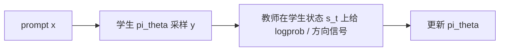
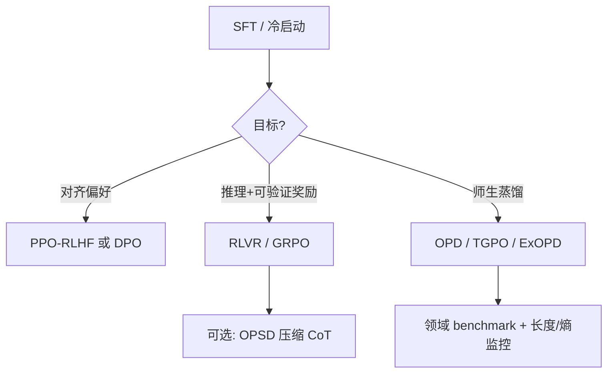
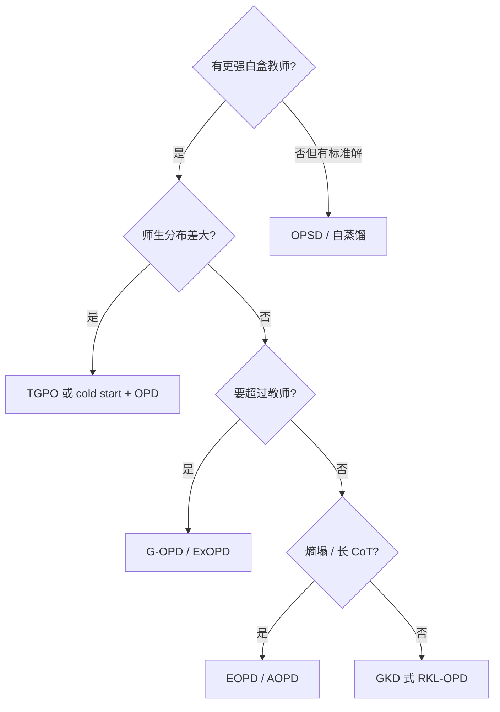

# On-Policy Distillation（OPD）

## 要解决的问题

**知识蒸馏**常用做法是：用教师生成静态轨迹，学生做 off-policy 的下一 token 模仿（见 [5.4.2 知识蒸馏](../../05-inference-deployment/04-model-compression/02-knowledge-distillation)）。训练时前缀来自 **完美教师上下文**，推理时却是 **学生自己生成的状态**——这是交互模仿学习里的 **exposure bias（暴露偏差）**；长链推理下错误会沿序列复合，文献中复合误差量级可接近 $O(\epsilon T^2)$（$T$ 为序列长度），而 on-policy 纠错可降至 $O(\epsilon T)$ 量级（DAgger 类结论在 LLM 场景的类比，见综述）。

**On-Policy Distillation（OPD，on-policy 蒸馏）** 把学生 **当前策略** 采样的轨迹当作训练状态，再在该状态上接收教师（或自教师）的 **稠密 token 级** 反馈，使训练分布与部署分布对齐。它常作为 **RLHF / RLVR 的互补或替代**：用教师 logprob 替代稀疏 outcome 奖励，或与 KL 约束 RL 在数学上等价（G-OPD，见下文）。

## 核心概念

### 形式化

设 prompt $x \sim p_{\text{data}}$，学生 rollout $y \sim \pi_\theta(\cdot \mid x)$，状态 $s_t = (x, y_{<t})$。on-policy 训练优化：

$$
\min_{\theta}\; \mathbb{E}_{x,y\sim \pi_\theta}\left[\sum_{t} \mathcal{L}\big(s_t;\, \pi_\theta,\, \mathcal{T}\big)\right]
$$

其中 $\mathcal{T}$ 为教师（白盒 logit、黑盒分数、或自蒸馏的 privileged context）。常见 $\mathcal{L}$ 为 **reverse KL** $D_{\mathrm{KL}}(\pi_\theta \| \pi_{\mathcal{T}})$ 在 $s_t$ 上的 token 级期望，等价于最大化教师 logprob 奖励并加 KL 锚定（与 [4.3.4 KL 惩罚](./04-kl-penalty-stability) 同族）。

### 与相邻范式对比

| 维度 | Off-policy 蒸馏（SFT on teacher） | RLVR（GRPO/PPO + 稀疏奖励） | OPD |
| --- | --- | --- | --- |
| **训练状态** | 教师前缀 | 学生 rollout | 学生 rollout |
| **监督** | 硬标签 / 可选 KL | 整条对/错 | 每 token 教师分布 |
| **需 RM** | 否 | 常需或可验证奖励 | 否（白盒教师时） |
| **主要痛点** | 分布错位、长 CoT 复合错 | 奖励稀疏、方差大 | 教师算力、师生分布需接近 |
| **工程栈** | SFT / TRL | verl、OpenRLHF | 常与 RL **共用 rollout**（如 [verl OPD](https://verl.readthedocs.io/en/latest/algo/opd.html)） |

与 [4.4.3 离线 vs 在线偏好学习](../04-preference-optimization/03-offline-vs-online) 的关系：OPD 本质是 **在线** 的（每步需学生新 rollout），但监督来自 **蒸馏损失** 而非人类偏好对。

### 综述三维分类（选型用）

> **外部补充**（检索于 2026-06-04）：[A Survey of On-Policy Distillation for LLMs](https://arxiv.org/abs/2604.00626) 将 OPD 统一为 **学生轨迹上的 $f$-散度最小化**，并按下列轴组织文献；维护列表见 [Awesome-LLM-On-Policy-Distillation](https://github.com/nick7nlp/Awesome-LLM-On-Policy-Distillation)。

| 设计轴 | 含义 | 例子 |
| --- | --- | --- |
| **优化什么** | 固定/自适应散度、是否叠加 RL | GKD、DistiLLM、EOPD、G-OPD、TGPO、OPD+ |
| **信号从哪来** | 白盒教师、黑盒 API、自蒸馏 | 强→弱蒸馏、OPSD、CREDIT |
| **如何训稳** | cold start、混合 rollout、过滤 | off-policy warmup、token 可靠性过滤 |

## 方法 / 经典与近期工作

### 奠基：白盒 on-policy KL

| 方法 | 要点 |
| --- | --- |
| **GKD**（Agarwal et al., 2024） | 混合策略 $\pi_{\text{mix}} = \lambda \pi_\theta + (1-\lambda)\pi_{\text{data}}$ 上采样，F-KL / R-KL / JSD；$\lambda$ 控制 on-policy 程度 |
| **MiniLLM**（Gu et al., 2024） | 序列级 reverse KL + REINFORCE，教师作 reward |
| **DistiLLM**（Ko et al., 2024） | Skew KL 缓解 on-policy 探索时数值不稳定 |

工业博客实践：[Thinking Machines — On-Policy Distillation](https://thinkingmachines.ai/blog/on-policy-distillation/) 在带 KL 的 RL 实现上 **将 regularizer 换为教师** 即可得到 OPD 式稠密奖励（个人理解：实现细节因框架而异）。

### 2025–2026：自蒸馏与超越教师

| 方法 | 核心思想 | 适用 |
| --- | --- | --- |
| **OPSD**（Zhao et al., 2026） | 单模型双角色：学生只见 $x$，教师见 **标准解/验证推理** $y^*$；在学生 rollout 上对齐 token 分布；数学推理上报告相对 GRPO 更高 **token 效率** | 有可验证解的推理集，无需更大教师 |
| **OPSD 作 RL 后阶段**（2026） | 在 **thinking 开启** 的长 CoT 上，OPSD 更可靠地 **压缩长度** 而非修复错误轨迹；推荐 **SFT → RLVR → OPSD（偏 correct rollout）** | 已有 RLVR 强模型，要降推理成本 |
| **G-OPD / ExOPD**（Yang et al., 2026） | 证明标准 OPD ≈ **稠密 KL 约束 RL**；引入 reward scaling $\alpha$ 与灵活 $\pi_{\text{ref}}$；$\alpha>1$ 时 **Reward Extrapolation**，学生可 **超过教师**（含多领域专家合并） | 教师为 RL 后专家、多教师合并 |
| **TGPO**（2026） | 师生 **策略差大** 时纯 RKL 负反馈信息量低；教师在学生上下文上给 **方向性 token 指导**，可与 RLVR 轨迹奖励结合 | 大策略差 + 推理蒸馏 |
| **EOPD**（2026） | 低熵 token 用 reverse KL，高熵 token 用 forward KL，缓解 **多样性塌缩** | 小模型数学推理蒸馏 |
| **AOPD**（2026） | 非正 advantage 处改用教师 top-$K$ 上 forward KL，缓解「探索黑洞」 | 弱初始化学生 |
| **OPD+**（2026） | 质疑 reward 上 **stop-gradient**；给出无偏 $f$-散度梯度形式 | 数学 / 工具调用 |
| **机制与 recipe**（Li et al., 2026） | 成功需 **thinking pattern 兼容** + 教师真增量；失败签名：overlap/熵差停滞；救场：**off-policy cold start**、teacher-aligned prompt | Qwen3 类 OPD 复现 |

### OPD 与 RL 混合管线（研究活跃）

- **Sparse-to-Dense**：稀疏 RL → 稠密 OPD → 再 RL，按奖励密度分配算力。
- **CoDistill-GRPO / dGRPO**：GRPO 目标 + 教师 dense reward 或长上下文块。
- **KDRL / RLKD / RLAD**：联合 KD+RL、生成式结构奖励、信任域选择性跟教师。

与 [6.3.1 GRPO](../../06-reasoning-test-time-compute/03-rl-reasoning/01-grpo-rloo) 对比：GRPO 用 **可验证 outcome**；OPD 用 **教师 logprob**，二者可串联（先 RLVR 再 OPD/OPSD 压缩）。

## 工业采用（报告级，待随官方更新）

| 模型 / 报告 | OPD 相关表述（以官方为准） |
| --- | --- |
| **Qwen3** | 强弱蒸馏含 off-policy + on-policy（见 [00-intro](../../00-intro)） |
| **DeepSeek-V4** | 后训练采用 on-policy 蒸馏等配方（[精读](/paper-reading/tech-report/deepseek/deepseek-v4)） |
| **MiMo、GLM-5** | 综述引用的后训练管线披露 OPD |
| **DeepSeek-R1 蒸馏版** | 主要为 **off-policy** CoT 蒸馏到小模型（[6.3.2 R1](../../06-reasoning-test-time-compute/02-test-time-compute/02-deepseek-r1)），与 OPD 不同 |

## 工程实践

### 典型 pipeline

| 场景 | 建议（经验性，需 ablation） |
| --- | --- |
| 开源 7B 数学 | 有标准解：**OPSD**；有强白盒教师：**OPD + EOPD**；预算紧：**SFT → 小规模 OPD** |
| 旗舰 → 小模型 | **Cold start（教师轨迹 SFT）→ OPD**；教师为 RL 专家时试 **ExOPD**（$\alpha>1$） |
| 已有 GRPO 强模型 | **RLVR → OPSD** 压长度；勿指望 OPSD 单独修好错误 rollout |
| 师生分布差大 | **TGPO** 或提高 cold start 比例 |
| 与 RLHF 栈共存 | verl 等：**rollout 一次**，切换 reward 为 RM 分或教师 logprob |

### 监控与失败模式

| 信号 | 可能原因 |
| --- | --- |
| **overlap ratio / 熵差长期不变** | thinking pattern 不匹配；教师无增量能力 |
| **回复暴涨** | RKL 长度偏见；加 ref KL 或长度惩罚 |
| **熵塌缩、多样性下降** | 纯 reverse KL；试 **EOPD** 或混 OOD prompt |
| **KL 对 ref 飙升** | 同 [4.3.4](./04-kl-penalty-stability)；增 $\beta$ 或减 OPD 步长 |

算力：OPD 每步需 **学生生成 + 教师前向**（白盒教师大时瓶颈在教师推理）；OPSD 可省外部教师但需 **privileged 标注**。

## 方法选型（简图）

## 局限与注意点

- **不等于免费午餐**：稠密 token 奖励仍受 **教师能力上限** 约束；除非 ExOPD 等刻意 extrapolation。
- **教师推理成本** 可高于学生训练；需 batch、缓存 prompt、多教师分域。
- **与 DPO 选型**：偏好数据足、无教师时仍优先 [4.4 DPO](../04-preference-optimization/01-dpo)；有强教师 + 长推理链时 OPD 优势更明显（个人理解）。
- 综述指出 **Agent 多轮轨迹**、**黑盒教师**、**蒸馏 scaling law** 仍为开放问题。

## 代表工作与延伸阅读

- Agarwal et al., 2024 — **On-Policy Distillation of Language Models (GKD)**
- Gu et al., 2024 — **MiniLLM**
- Song & Zheng, 2026 — **A Survey of On-Policy Distillation for LLMs**（[arXiv:2604.00626](https://arxiv.org/abs/2604.00626)）
- Li et al., 2026 — **Rethinking OPD: Phenomenology, Mechanism, and Recipe**（[arXiv:2604.13016](https://arxiv.org/abs/2604.13016)）
- Zhao et al., 2026 — **OPSD**（[arXiv:2601.18734](https://arxiv.org/abs/2601.18734)）
- Yang et al., 2026 — **G-OPD / ExOPD**（[arXiv:2602.12125](https://arxiv.org/abs/2602.12125)）
- Lu et al., 2025 — Thinking Machines **On-Policy Distillation** 工程博客

> **外部补充**（检索于 2026-06-04）：上表覆盖社区 2025–2026 主要增量；完整 bib 见 [Awesome 列表](https://github.com/nick7nlp/Awesome-LLM-On-Policy-Distillation)。实现参考 [verl OPD](https://verl.readthedocs.io/en/latest/algo/opd.html)、[G-OPD 代码](https://github.com/RUCBM/G-OPD)、[OPSD 代码](https://github.com/siyan-zhao/OPSD)。

## 相关章节

- [4.3.1 RLHF 流程](./01-rlhf-pipeline)
- [4.3.3 PPO](./03-ppo) · [4.3.4 KL 惩罚](./04-kl-penalty-stability)
- [4.4.3 离线 vs 在线偏好](../04-preference-optimization/03-offline-vs-online) · [4.4.4 On-Policy vs Off-Policy](../04-preference-optimization/03a-on-policy-vs-off-policy) · [4.4.5 方法对比](../04-preference-optimization/04-methods-comparison)
- [5.4.2 知识蒸馏（off-policy）](../../05-inference-deployment/04-model-compression/02-knowledge-distillation)
- [6.3.1 GRPO](../../06-reasoning-test-time-compute/03-rl-reasoning/01-grpo-rloo) · [6.3.2 DeepSeek-R1](../../06-reasoning-test-time-compute/02-test-time-compute/02-deepseek-r1)
