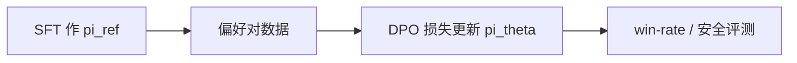

# DPO（Direct Preference Optimization）

## 要解决的问题

经典 RLHF 需独立训练 RM、再跑 PPO+critic，**系统复杂、不稳定、难复现**。**Direct Preference Optimization（DPO）** 在 Bradley-Terry 偏好模型假设下，把 RL 最优解写成 **仅依赖策略与参考策略** 的闭式损失，直接用偏好对 $(x, y_w, y_l)$ 微调 LLM，省去显式 RM 与在线采样。

## 核心概念

设参考策略为 $\pi_{\text{ref}}$（常为 SFT），定义 log-ratio 奖励：

$$
\hat{r}(x,y) = \beta \log \frac{\pi_\theta(y|x)}{\pi_{\text{ref}}(y|x)}
$$

在偏好模型 $P(y_w \succ y_l|x) = \sigma(\hat{r}(x,y_w) - \hat{r}(x,y_l))$ 下，DPO 损失为：

$$
\mathcal{L}_{\text{DPO}} = - \mathbb{E}_{(x,y_w,y_l)}\left[\log \sigma\left(\beta \log \frac{\pi_\theta(y_w|x)}{\pi_{\text{ref}}(y_w|x)} - \beta \log \frac{\pi_\theta(y_l|x)}{\pi_{\text{ref}}(y_l|x)}\right)\right]
$$

| 符号 | 含义 |
| --- | --- |
| $\beta$ | 温度/正则强度；越大越贴近 $\pi_{\text{ref}}$ |
| $\pi_\theta$ | 待训练策略 |
| $\pi_{\text{ref}}$ | 冻结参考，提供 KL 锚定 |

**隐式 RM**：最优 $\pi_\theta$ 与某 $r_\phi$ 等价，但训练无需单独 $r_\phi$ 网络。

## 方法 / 训练要点

1. 准备 **同一 prompt** 的 winner/loser 完整序列（含模板 token）。
2. 前向同时算 $\pi_\theta$ 与 $\pi_{\text{ref}}$ 的 sequence logprob（ref 可缓存）。
3. 典型超参：$\beta \in [0.1, 0.5]$（依模型与数据调节）；LR 低于 SFT。
4. 可与 SFT loss **混合**（$\mathcal{L}_{\text{SFT}} + \lambda \mathcal{L}_{\text{DPO}}$）减轻遗忘。

## 工程实践

| 项 | 说明 |
| --- | --- |
| **实现** | `trl.DPOTrainer`、Axolotl、`alignment-handbook` |
| **显存** | 需存 ref 模型或 LoRA+合并技巧；可用 [QLoRA](../06-peft/03-lora-qlora) |
| **数据** | Anthropic HH、UltraFeedback、ORPO 式混合；注意 $y_w,y_l$ 长度偏见 |
| **对比 RLHF** | 无 rollout；训练稳定、吞吐高；可能欠 **在线探索** |

与 PPO 关系：DPO 解的是 **同一偏好目标** 的不同优化路径（Rafailov et al., 2023 理论推导）。

## 代表工作

- Rafailov et al., 2023 — **Direct Preference Optimization**（arXiv:2305.18290）.
- 后续 **$\beta$-DPO**、length-normalized DPO 等变体（社区实现各异）。
- 技术报告：Qwen、Llama 等常披露「SFT + DPO/RL」组合，见 [Qwen2.5 报告](../../08-technical-reports/02-qwen/01-qwen2-5)。

## 局限与注意点

- 偏好数据 **噪声大** 时，DPO 同样会学偏；不能替代数据工程（[4.2.3](../02-instruction-tuning/03-high-quality-instruction-data)）。
- $\pi_{\text{ref}}$ 落后时，$\beta$ 过大抑制有用更新。
- 多轮对话需整段标注偏好，标注成本仍高。
- 在线迭代（on-policy DPO 变体）见 [4.4.3](./03-offline-vs-online)。

## 超参调试顺序（推荐）

1. 固定数据与 $\beta=0.1$，扫 LR（通常 SFT 的 0.3×–1×）。
2. 固定 LR，扫 $\beta \in \{0.05, 0.1, 0.2, 0.5\}$，看 win-rate vs KL to ref。
3. 检查 **$y_w$ 是否系统性更长**；必要时 length-normalized DPO 或截断。
4. 与纯 SFT checkpoint 做 **并排生成**（同 temperature），人读 50 条比盯 loss 更有效。

## 实现细节

- `reference_free=True` 类选项（部分库）等价于弱化 ref，行为接近 SimPO，需读清文档。
- 多 GPU 时 ref 模型可 **CPU offload** 或 8bit 加载，仅前向不反传。
- 保存 **训练步数最佳** checkpoint，勿默认最后一 step（易过拟合偏好噪声）。

## 相关章节

- [4.3.1 RLHF](../03-rlhf/01-rlhf-pipeline)
- [4.4.2 IPO、KTO、ORPO](./02-ipo-kto-orpo-simpo)
- [4.4.4 On-Policy vs Off-Policy](./03a-on-policy-vs-off-policy) · [4.4.5 方法对比](./04-methods-comparison)
- [4.3.4 KL 与 $\beta$](../03-rlhf/04-kl-penalty-stability)
