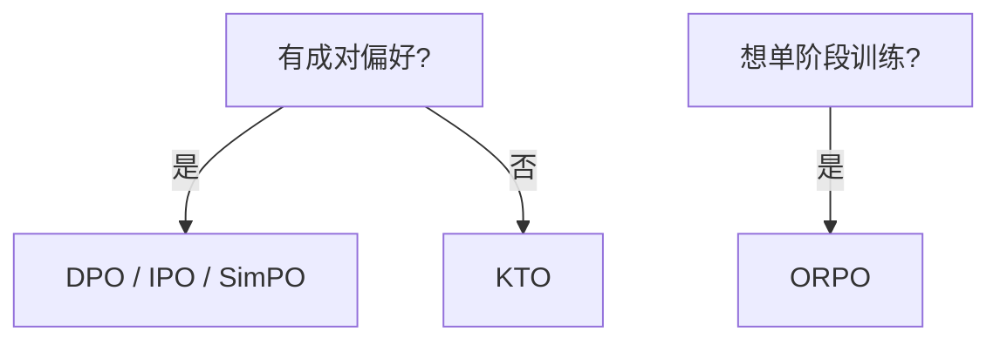

# 4.4.2 IPO、KTO、ORPO、SimPO

## 要解决的问题

DPO 在偏好 **噪声大、非二元、无需参考模型** 等设定下存在理论或实践短板。2023–2025 涌现多种 **DPO 变体**：用不同损失形状、去掉 $\pi_{\text{ref}}$、或把 SFT 与偏好合并。本节对比 **IPO、KTO、ORPO、SimPO** 的动机与适用边界。

## 核心概念

| 方法 | 核心改动 | 是否需要 $\pi_{\text{ref}}$ |
| --- | --- | --- |
| **IPO** | 正则化偏好目标，缓解过拟合极端 logit | 通常需要 |
| **KTO** | 从前景理论出发，用 **单条** 好坏标签 | 可选/弱化 |
| **ORPO** | **Odds Ratio** + 内嵌 SFT，一步训练 | 不强调独立 ref |
| **SimPO** | 用 **平均 logprob** 作隐式奖励，无 ref | 否 |

### IPO（Identity Preference Optimization）

将偏好学习目标改为带 **正则** 的形式，减轻 DPO 对错误偏好对的 **过度置信**（Azar et al., 2023）。损失含 $(\log \frac{\pi_\theta(y_w|x)}{\pi_{\text{ref}}(y_w|x)} - \log \frac{\pi_\theta(y_l|x)}{\pi_{\text{ref}}(y_l|x)})^2$ 等项（具体以论文为准），$\beta$ 解释仍为偏离 ref 的惩罚尺度。

### KTO（Kahneman-Tversky Optimization）

利用 **前景理论**：人类对「损失」更敏感。只需标注「好/坏」单样本 $(x,y,\pm)$，无需成对 $y_w,y_l$，适合 **隐式反馈**（点赞、完成率）。

### ORPO（Odds Ratio Preference Optimization）

在 SFT 损失上增加 **odds ratio** 项，使 winner 相对 loser 的 odds 提升：

$$
\mathcal{L}_{\text{ORPO}} \approx \mathcal{L}_{\text{SFT}} + \lambda \mathcal{L}_{\text{OR}}
$$

领读：[ORPO](/paper-reading/rl-algo/orpo)。适合 **想省阶段** 的团队（SFT+DPO 合一）。

### SimPO（Simple Preference Optimization）

用序列 **平均 log 概率** $\frac{1}{|y|}\log\pi_\theta(y|x)$ 作奖励代理，配合 margin loss：

$$
\mathcal{L}_{\text{SimPO}} \propto -\log\sigma\Big(\gamma \big(\tfrac{\log\pi_\theta(y_w|x)}{|y_w|} - \tfrac{\log\pi_\theta(y_l|x)}{|y_l|}\big) - m\Big)
$$

无 $\pi_{\text{ref}}$，省显存；$m$ 为 margin 超参。

## 方法 / 选型简图

## 工程实践

| 方法 | 实践提示 |
| --- | --- |
| IPO | 噪声标注集可优先试；仍要调 $\beta$ |
| KTO | 清洗单标签偏见（只收集差评会导致悲观策略） |
| ORPO | 注意 $\lambda$ 与 SFT 数据是否同一批 |
| SimPO | 长回复平均 logprob 需 **长度归一** 意识 |

实现：`trl` 部分版本支持 DPO/IPO；ORPO/SimPO 见 Axolotl、社区 recipe。

## 代表工作

- Azar et al., 2023 — **IPO**.
- Ethayarajh et al., 2024 — **KTO**.
- Hong et al., 2024 — **ORPO**（[领读](/paper-reading/rl-algo/orpo)）.
- Meng et al., 2024 — **SimPO**.

## 局限与注意点

- 基准对比论文 **数据集与 $\beta$ 不齐**，社区 leaderboard 需谨慎解读。
- 无 ref 方法在 **强 SFT 基座已很好** 时增益可能有限（个人理解）。
- 尚未完全取代 DPO 成为默认；大厂配方未统一公开。

## 相关章节

- [4.4.1 DPO](./01-dpo)
- [4.4.3 离线 vs 在线](./03-offline-vs-online)
- [4.4.4 On-Policy vs Off-Policy](./03a-on-policy-vs-off-policy) · [4.4.5 方法对比](./04-methods-comparison)
- [4.1.1 SFT](../01-sft/01-sft-overview)
