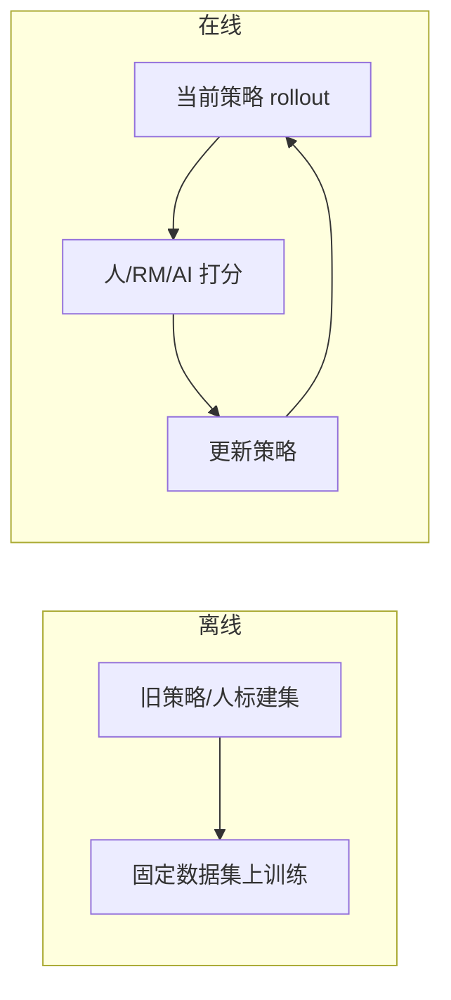

# Online vs Offline RL

后训练对齐需要在 **数据新鲜度、成本、稳定性** 之间取舍：是用固定偏好集一次性训好，还是让当前策略持续采样、再打分更新？本节先厘清经典 RL 中的 **离线 / 在线** 定义，再映射到 LLM 偏好学习中的代表方法与选型。

，原图来自 [Offline RL 项目](https://offline-rl.github.io/)）](https://huggingface.co/datasets/huggingface-deep-rl-course/course-images/resolve/main/en/unit12/offlinevsonlinerl.gif)

> 上侧为 **Online RL**——智能体在环境中交互（trial-and-error），采集到相关经验数据后马上（或经 replay buffer）用于策略更新；下侧为 **Offline RL**——先由行为策略 / 人类示范构建数据集，再在固定日志上训练，无训练期环境交互。

LLM RL 不同范式：
* Online ≈ 当前 $\pi_\theta$ rollout + 人/RM 打分
* Offline ≈ 固定 $(x, y_w, y_l)$ 偏好集上的 DPO 等。

:::tip 核心判据
区分 **Online / Offline** 的**唯一标准**：正在被训练的那个智能体（记为 **B**），在**它自己的训练过程中**，是否与**环境**发生**实时交互**。

- **Offline**：B 只使用事先构建好的固定数据集学习，训练循环内 **不再** 与环境交互。
- **Online**：B 在训练期间 **亲自** 与环境交互、采集经验，并（立即或经 replay buffer）用于更新自身策略。

这与「数据是否由当前策略产生」「是否为 on-policy / off-policy」等维度 **正交**；易混项见 [4.4.4 On-Policy vs Off-Policy](./03a-on-policy-vs-off-policy)。
:::

> **背景问题**：若用模型 **A** 以 Online RL 方式（A 自己 rollout + 拿 RM 分数）采好一批轨迹 / 偏好对，再拿这份数据去训练模型 **B**——对 **B** 而言，算 Online RL 还是 Offline RL？
>
> **答案：Offline**。判据只看 **正在被训练的智能体**（此处为 B）在 **自己的训练循环里** 有没有与环境实时交互。A 在线采数只说明 **数据采集阶段** 是在线的；B 训练时只读 A 留下的固定日志、不再现场生成或打分，**B 仍是 Offline**——与 A 是否在线无关。
>
> **展开：同一任务下的两种训练方式**
>
> 把 **环境** 理解为：prompt 池 + 生成接口 + 评判管线（人类排序或 RM 打分）。
>
> - **Offline（DPO 训 B）**：A 曾用 Online 方式采好 10 万条 $(x, y_w, y_l)$，导出为静态数据集。训练 B 时只在这份数据上算 DPO 损失、更新权重——**训练循环内 B 不再采样新回复**，也不向 RM 发请求。正在被训练的 B **没有** 与环境实时交互。（数据可以「很新鲜、来自在线管线」，但 **B 的训练范式仍是 Offline**。）
> - **Online（PPO-RLHF 训 B）**：每个 step，**当前** B 对一批 prompt **现场生成** $y$，RM 返回分数 $r$，PPO 立刻用这批 $(x, y, r)$ 更新 B；下一轮又是 **新版** B 再 rollout……正在被训练的 B 在训练过程中 **持续** 与环境（生成 → 打分 → 反馈）实时交互。
>
> **小结**：Online/Offline 描述的是 **某个智能体自己的训练过程**，不是整条数据流水线的标签。A 在线采数 → B 离线训，是工业界极常见的 **「在线采集 + 离线训练」** 组合；只有 B 在训练循环里亲自 rollout 并拿反馈，才算 B 的 Online RL。

---

## 1. 什么是离线 RL

**离线强化学习（Offline RL）** 指智能体 **只使用已收集好的经验数据** 学习策略，训练过程中 **不再与环境交互**。

1. 用一个或多个旧策略、或人类示范，**预先构建数据集**（轨迹日志）。
2. 在该固定数据集上运行 **离线 RL 算法**，得到新策略。

数据来自 **行为策略** $\pi_b$（或人类），与正在优化的 **目标策略** $\pi_\theta$ 可以不同；学习完全在「历史日志」上进行。

### 在 LLM 偏好学习中的含义

- **环境**：用户 prompt 及对话上下文。
- **动作**：模型生成的完整回复 $y$。
- **经验**：静态偏好对 $(x, y_w, y_l)$ 或带分数的回复，通常由旧模型、人工或众包预先标注。
- **训练**：在固定集上做 DPO、IPO、ORPO 等，**不在训练循环内** 用当前 $\pi_\theta$ 再 rollout。

---

## 2. 什么是在线 RL

**在线强化学习（Online RL）** 指智能体 **亲自与环境交互** 采集经验批次（batch of experience），并 **立即**（或经 replay buffer）用这批数据更新策略。

要点（[HF 课程](https://huggingface.co/learn/deep-rl-course/unitbonus3/offline-online)）：

- 数据采集与策略更新 **紧耦合**，数据分布随当前策略变化。
- 通常需要 **真实环境或可运行的模拟器**；模拟器若有漏洞，策略会 exploit，获得虚高回报。

### 在 LLM 偏好学习中的含义

- **交互**：当前策略 $\pi_\theta$ 对 prompt **采样回复**。
- **反馈**：人类排序、RM 打分，或 RLAIF 等 AI 评判。
- **更新**：PPO-RLHF、迭代 RM、在线 DPO / SPIN 等，每轮用 **新鲜 rollout** 驱动梯度。
- **依赖**：常驻 **推理集群** + 评判管线，相当于 RL 里的「环境 / 模拟器」；RM 或 AI 评判不准确时，会出现 **reward hacking**（类比 flawed simulator）。

---

## 3. 离线 vs 在线：对比

二者都基于 **经验批次** 学习，差别在于批次 **如何获得**、以及训练时 **是否继续与环境交互**。

| 维度 | 离线（Offline） | 在线（Online） |
| --- | --- | --- |
| **数据从哪来** | 其他策略或人类示范的 **固定日志** | 当前策略 **实时与环境交互** 采集 |
| **训练期是否交互** | 否 | 是 |
| **数据分布** | 固定在 $\pi_b$ / 标注者分布上 | 随 $\pi_\theta$ 更新而刷新 |
| **典型流程** | 建数据集 → 离线训练 | rollout → 打分 → 更新（可循环） |
| **基础设施** | 以 **训练算力** 为主 | **推理 + 训练** 双栈，外加评判服务 |
| **核心风险** | **分布偏移**、反事实无标签 | 方差大、评判器被 exploit |
| **成本特征** | 标注一次、可多次复训 | 每轮生成 + 评判，运维成本高 |

### 反事实查询（Counterfactual Queries）

离线 RL 的经典难点：若策略在某状态选择了 **数据集中从未出现过的动作**，就没有对应轨迹可学（例如日志只有左转，策略却要右转）。

映射到偏好学习：

| 经典 RL | LLM 偏好学习 |
| --- | --- |
| 状态 $s$ | prompt $x$（及上下文） |
| 动作 $a$ | 回复 $y$ |
| 无轨迹的动作 | $\pi_\theta$ 生成了 **从未被标注** 的 $y$，缺少 $y_w/y_l$ 或 RM 分数 |

这即离线方法的 **off-policy / 分布偏移** 问题；在线方法通过持续 rollout + 重新标注缓解，但会引入方差与评判器被 hack 的风险（见 [4.3.5 RLHF 挑战](../03-rlhf/05-rlhf-challenges)）。**On-policy / off-policy** 是另一正交维度，见 [4.4.4 On-Policy vs Off-Policy](./03a-on-policy-vs-off-policy)。

---

## 4. 各范式下的方法

### 4.1 离线偏好学习方法

| 方法 | 简要说明 | 详见 |
| --- | --- | --- |
| **DPO** | 在 Bradley-Terry 假设下，用偏好对直接优化 $\pi_\theta$，无需显式 RM 与 rollout | [4.4.1 DPO](./01-dpo) |
| **IPO** | 对 DPO 的隐式奖励做正则，缓解过拟合与长度偏见 | [4.4.2](./02-ipo-kto-orpo-simpo) |
| **ORPO / SimPO** | 将 SFT 与偏好项合并或简化 ref 依赖 | [4.4.2](./02-ipo-kto-orpo-simpo) |
| **KTO** | 单条回复好坏标签，无需成对偏好 | [4.4.2](./02-ipo-kto-orpo-simpo) |
| **Decision Transformer**（经典 RL） | 在固定轨迹上做条件序列建模，HF 同单元 [Decision Transformers](https://huggingface.co/learn/deep-rl-course/unitbonus3/decision-transformers)；LLM 侧可类比「纯日志监督」 | — |

**数据示例**：HH-RLHF、UltraFeedback 等；由旧模型或人标一次性构建，训练 1–3 epoch 即可。

#### 优势

- **可复现**：固定数据集，实验易对齐。
- **成本低**：无需常驻 rollout 集群，以训练算力为主。
- **稳定**：无 PPO 式多模型联动，调参面相对小。
- **易并行**：适合开源与资源受限团队。

#### 劣势

- **数据滞后**：策略改进后，新回复可能落在日志分布外（反事实查询）。
- **分布偏移**：行为策略 $\pi_b$ ≠ 当前 $\pi_\theta$，易过拟合历史偏好或低估新回复。
- **探索不足**：难以主动发现「更好但未出现在数据中」的回复。

---

### 4.2 在线偏好学习方法

| 方法 | 简要说明 | 详见 |
| --- | --- | --- |
| **PPO-RLHF** | rollout → RM 打分 → PPO 更新策略 | [4.3.3 PPO](../03-rlhf/03-ppo)、[4.3.1 流水线](../03-rlhf/01-rlhf-pipeline) |
| **RLAIF** | 用 AI 评判替代人标，在线扩偏好数据 | [4.5.2 RLAIF](../05-constitutional-ai-rlaif/02-rlaif) |
| **迭代 RM + PPO** | 定期用新 rollout 重训 RM，再跑 RL | [4.3.1](../03-rlhf/01-rlhf-pipeline) |
| **Online DPO / SPIN / Self-play** | 当前模型生成新回复，再构造偏好对做 DPO；介于刷新数据集与原生 PPO 之间 | 研究活跃 |
| **OPD** | 学生 on-policy rollout，教师提供 token 级监督 | [4.3.6 OPD](../03-rlhf/06-on-policy-distillation) |

#### 优势

- **数据新鲜**：分布跟随当前 $\pi_\theta$，更贴近部署行为。
- **缓解 OOD**：新回复可被及时打分、纳入训练。
- **上限更高**：大厂多轮迭代（ChatGPT 类）多依赖在线 RL 或近似在线飞轮。

#### 劣势

- **成本高**：推理、RM、人评与训练需协同，工程复杂度高。
- **不稳定**：PPO + RM 易出现 KL 漂移、reward hacking。
- **评判器风险**：RM / AI 评判有缺陷时，策略会 **更快 exploit**（弱 RM + 在线 ≈ 劣质模拟器）。
- **方差大**：同样超参下，跑次间波动常大于离线 DPO。

---

### 4.3 混合范式（工业常见）

严格来说仍属「周期性刷新数据的离线训练」，但用 **部署日志、隐式偏好、拒绝采样** 不断扩充数据集，介于纯离线与纯在线之间：

1. 离线 DPO / SFT 打底；
2. 收集用户编辑、重试、点赞等信号；
3. 周级 / 月级 **重训** 或轻量在线阶段；
4. 可选：用当前 $\pi_\theta$ 生成候选，再筛成新 $y_w, y_l$。

适合有流量、又无法承担 7×24 纯在线 RL 的产品（**个人理解**，非唯一范式）。

| 优势 | 劣势 |
| --- | --- |
| 兼顾成本与一定数据新鲜度 | 非严格 on-policy，新鲜度低于纯在线 |
| 可渐进引入日志，合规可控 | 管线设计复杂（脱敏、血缘、审核） |

---

## 5. 工程选型

| 场景 | 建议 |
| --- | --- |
| **初创 / 开源** | 优先 **离线 DPO** + 强 SFT |
| **有流量产品** | **混合**：日志脱敏 → 偏好标注 → 周期性重训 |
| **有推理集群、强 RM** | 可考虑 **PPO-RLHF** 或 RLAIF |
| **安全关键** | 在线阶段的新偏好需 **人工审核**，防诱导有害偏好 |

**监控信号**：

| 信号 | 解读 |
| --- | --- |
| 部署后 rewrite 率上升 | 静态数据可能过时 → 增量数据或混合重训 |
| 新场景 win-rate 低 | 定向补数据，而非盲目调大 $\beta$ |
| 在线 reward 涨、人评跌 | 典型 hacking → 暂停在线阶段 |

**合规**：从用户日志构造偏好时，注意脱敏、知情同意与退出训练选项；保留 **数据血缘**（哪版策略生成了哪些 $y$）。

---

## 6. 面试重难点速查

以下按面试常见追问顺序整理，与上文 §1–§5 互补；**On-policy / Off-policy** 的公式与 SARSA 细节见 [4.4.4](./03a-on-policy-vs-off-policy)。

### 6.1 Online vs Offline：第一道门槛

**唯一判据**（见文首「核心判据」）：正在被训练的智能体 B，在其训练过程中 **是否与环境实时交互**（与「数据是否来自当前策略」的 on/off-policy 维度正交）。

| | Online RL | Offline RL（Batch RL） |
| --- | --- | --- |
| **数据** | 交互中 **实时采集**，学习与决策同步 | **固定 dataset**，训练期 **不再交互** |
| **反馈** | 每步奖励后立即（或经 replay）更新 | 只从日志学；数据多由 **别的策略** $\pi_b$ 收集，**不必近似最优** |
| **典型场景** | 机器人控制、游戏 AI、需仿真的系统 | 自动驾驶、医疗等 **高试错成本** 领域 |
| **LLM 类比** | PPO-RLHF、在线 DPO、RLAIF | 固定偏好集上的 DPO / IPO 等 |

**一句话**：Online 问「边干边学」；Offline 问「只读历史日志能学到多好」。

### 6.2 On-policy vs Off-policy：高频陷阱

面试官常故意把 **Online/Offline** 与 **On-policy/Off-policy** 混为一谈——要能立刻拆开：

- **On-policy**：**采样策略 = 目标策略**（含探索）；目标策略更新后，旧数据代表性下降，通常需 **重新采样**。
- **Off-policy**：行为策略 $\pi_b$ ≠ 目标策略 $\pi_\theta$；同一批数据可 **多次复用**（常配合重要性采样修正分布差）。

**算法归类（建议能背）**：

| Off-policy | On-policy |
| --- | --- |
| Q-learning、DQN、DDPG、SAC | REINFORCE、A3C、PPO |

**经典对比题**：Q-learning 是 off-policy，SARSA 是 on-policy——常问「两式差别、为什么 SARSA 没有 $\max$」。SARSA 用 **实际执行的** $a_{t+1}$ bootstrap；Q-learning 用 $\max_{a'} Q(s_{t+1},a')$，评估的是 **贪心目标策略**，与行为策略可不同。详见 [4.4.4 §2](./03a-on-policy-vs-off-policy)。

### 6.3 Offline RL 核心难题（几乎必考）

| 难题 | 含义 | 后果 |
| --- | --- | --- |
| **分布偏移（Distribution Shift）** | 学到的 $\pi_\theta$ 与采集数据的 **行为策略** $\pi_b$ 偏离 | 离线无法交互纠错，是 Offline RL 的根本约束 |
| **OOD（Out-of-Distribution）** | $(s,a)$ 或 LLM 中的 $(x,y)$ **不在 dataset 支撑集内** | 价值估计 / RM 分数 **不可信** |
| **Q 值过估计（Overestimation）** | 对 OOD 动作仍用 bootstrap 抬高 Q | 策略崩溃、性能虚高后骤降 |

映射到 LLM：固定偏好集上 DPO 时，$\pi_\theta$ 生成 **从未被标注** 的回复 → 即 §3 的 **反事实查询** + off-policy 偏移。

### 6.4 Offline RL 主流算法（按「思想流派」记）

| 流派 | 代表 | 核心思想 |
| --- | --- | --- |
| **策略约束（Policy Constraint）** | BCQ、BEAR、BRAC；隐式约束 AWAC、CRR、AWR | 把动作限制在 **数据分布内**，避免 OOD 动作的 Q 被高估 |
| **保守 Q 学习（CQL）** | Kumar et al., 2020 | 在标准 backup 上加 **正则**，学 **低于真实值** 的 Q 下界；多模态数据上常用 |
| **隐式 Q 学习（IQL）** | Kostrikov et al., 2021 | **SARSA 式** 更新，避免查询未见动作；AntMaze 等难任务上常优于 CQL，实现更快 |
| **TD3+BC** | Fujimoto & Gu, 2021 | **行为克隆 + TD3**，实现简单，基线常考 |

面试若能说清「BCQ 限动作 / CQL 压 Q / IQL 不查 unseen action」三条线，通常足够展开。

### 6.5 Offline RL vs 模仿学习（IL）

| 维度 | 模仿学习（IL） | Offline RL |
| --- | --- | --- |
| **数据质量假设** | 常假设 **专家或高性能** 演示 | 可处理 **高度次优** 日志 |
| **奖励** | 多数 **无显式奖励** | 有 $r$，可 **事后重标** 奖励再训 |
| **标注假设** | 有时需区分专家 / 非专家 | **不假设** 此类标签 |

**易错答**：「Offline RL 就是从数据学策略，等于 IL」——要能指出 **奖励利用** 与 **次优数据** 两点差异。

### 6.6 延伸到 LLM / RLHF 的考点

大模型岗常把经典 RL 与对齐 **串问**：

| 考点 | 要点 |
| --- | --- |
| On / Off-policy | 与 Online / Offline **正交**；DPO 在固定集上多为 **off-policy 偏好学习** |
| SARSA vs Q-learning | 见 [4.4.4](./03a-on-policy-vs-off-policy) |
| DQN 离散 vs 连续 | 离散 Q 表 / DQN；连续用 DDPG、SAC 等 actor-critic |
| DPO 概率同时下降 | 正则与 ref 约束下，$y_w$、$y_l$ 的 **绝对概率** 可同降，看 **相对偏好** 与隐式奖励 |
| RLHF vs DPO | 在线 PPO + RM vs 离线偏好对直接优化；见 [4.4.1 DPO](./01-dpo)、[4.4.5 方法对比](./04-methods-comparison) |
| 算法演进（口述链） | MC → TD → Q-Learning → DQN → PG → AC → TRPO → PPO → DPO → GRPO |

:::tip 备考提示
本节框架整理自中文技术社区（CSDN、知乎、博客园等）与面试笔记，便于 **快速建立提纲**；冲刺前建议对照 **CQL、IQL、BCQ** 原文核对损失与 backup 细节。手推 CQL 正则项、PPO clip 与重要性采样可配合 [4.3.3 PPO](../03-rlhf/03-ppo)、[4.4.4](./03a-on-policy-vs-off-policy) 专节复习。
:::

---

## 参考文章

- [4.4.4 On-Policy vs Off-Policy](./03a-on-policy-vs-off-policy)
- [HF Deep RL Course — Offline vs. Online](https://huggingface.co/learn/deep-rl-course/unitbonus3/offline-online)
- [Offline RL 综述](https://arxiv.org/abs/2005.01643)；[Sergei Levine 视频](https://www.youtube.com/watch?v=qgZPZREor5I)
- **Offline RL 算法**：BCQ (Fujimoto et al., 2019)；CQL (Kumar et al., 2020)；IQL (Kostrikov et al., 2021)；TD3+BC (Fujimoto & Gu, 2021)
- **RLHF 在线范式**：Ouyang et al., 2022
- **RLAIF**：Lee et al., 2023
- **Self-Play fine-tuning**：[领读](/paper-reading/agentic/self-play-finetune)
