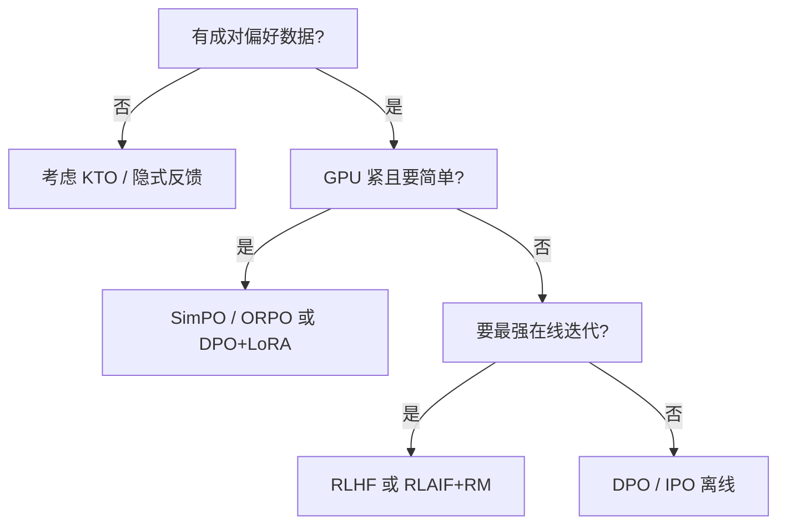

# 4.4.5 方法对比与适用场景

## 要解决的问题

后训练对齐方法激增：**RLHF、DPO、IPO、KTO、ORPO、SimPO、OPD、Constitutional、RLAIF** 等，团队难以选型。本节用 **统一维度** 对比，并给出 **场景化建议**（非绝对排名；实际需 ablation）。

## 核心概念

对比维度：

| 维度 | RLHF (PPO) | DPO / IPO | KTO | ORPO / SimPO | OPD |
| --- | --- | --- | --- | --- | --- |
| **需 RM** | 是 | 否（隐式） | 否 | 否 | 否（需教师或自蒸馏 privileged） |
| **需 $\pi_{\text{ref}}$** | 是 | 是（SimPO 否） | 可选 | ORPO 弱 / SimPO 否 | 常是（ExOPD 可换 ref） |
| **偏好形式** | 排序或分数 | 成对 | 单标签 | 成对 | 教师 logit / 标准解（OPSD） |
| **在线采样** | 原生 | 通常离线 | 离线 | 离线 | 原生 |
| **工程复杂度** | 高 | 中 | 中 | 中低 | 中高（教师推理） |
| **稳定性** | 低–中 | 中–高 | 中 | 中–高 | 中（依赖师生匹配） |

损失速查（详见各节）：

- **PPO**：$\mathcal{L}^{\text{CLIP}}$ + value + 可选熵。
- **DPO**：$\mathcal{L}_{\text{DPO}} = -\mathbb{E}\log\sigma(\beta\Delta\log\pi_w - \beta\Delta\log\pi_l)$。
- **RM**：$-\log\sigma(r(x,y_w)-r(x,y_l))$。

## 方法 / 场景选型

### 推荐场景（经验性）

| 场景 | 倾向方案 |
| --- | --- |
| 开源 7B 聊天 | SFT → DPO（或 ORPO 单阶段） |
| 噪声众包偏好 | IPO 或过滤后 DPO |
| 仅点赞/点踩 | KTO |
| 省显存、无 ref | SimPO（注意长度偏差） |
| 大厂多轮迭代、有推理集群 | RLHF 或 在线 RL + 定期 DPO 重置 |
| 强教师 + 长 CoT / 推理蒸馏 | [OPD](../03-rlhf/06-on-policy-distillation)、OPSD、或 RLVR→OPSD |
| 旗舰→小模型、无偏好对 | OPD / ExOPD；见 [5.4.2 蒸馏](../../05-inference-deployment/04-model-compression/02-knowledge-distillation) |
| 安全+原则驱动 | [Constitutional AI](../05-constitutional-ai-rlaif/01-constitutional-ai) + 可选 DPO |

与 [PEFT](../06-peft/05-peft-selection-guide) 结合：7B 全参 DPO 显存紧，优先 **QLoRA + DPO**。

## 工程实践

选型后 **必做**：

1. 固定 prompt 集（200–500）做 **pairwise win-rate**。
2. 能力集（MMLU 子集、GSM8K）看 [对齐税](../01-sft/04-catastrophic-forgetting)。
3. 安全探针（越狱、偏见）独立于 RM。
4. 记录 $\beta$、数据版本、模板 hash。

避免 **仅看训练 loss** 选方法；DPO loss 降不代表 Arena 升。

## 代表工作

- 综合评测：Intel **Neural Align** 博客、Hugging Face alignment 教程（年份以官方为准）。
- ORPO 领读：[ORPO](/paper-reading/rl-algo/orpo)。
- 厂商披露：DeepSeek、Qwen、Llama 多写「SFT + RL/DPO」组合，见 [第八部分技术报告](../../08-technical-reports/)。

## 局限与注意点

- 表格为 **2024–2026 社区共识的粗粒度** 归纳，新论文月月更新。
- 同一方法不同 **数据与 $\beta$** 可差 10+ Arena 分；不可只凭方法名决策。
- Constitutional / RLAIF 与 DPO **正交**，可串联而非互斥。

## 相关章节

- [4.4.1 DPO](./01-dpo)
- [4.4.2 IPO、KTO、ORPO、SimPO](./02-ipo-kto-orpo-simpo)
- [4.4.3 离线 vs 在线](./03-offline-vs-online) · [4.4.4 On-Policy vs Off-Policy](./03a-on-policy-vs-off-policy)
- [4.3.1 RLHF](../03-rlhf/01-rlhf-pipeline)
- [4.3.6 OPD](../03-rlhf/06-on-policy-distillation)
- [4.5 Constitutional AI](../05-constitutional-ai-rlaif/01-constitutional-ai)
