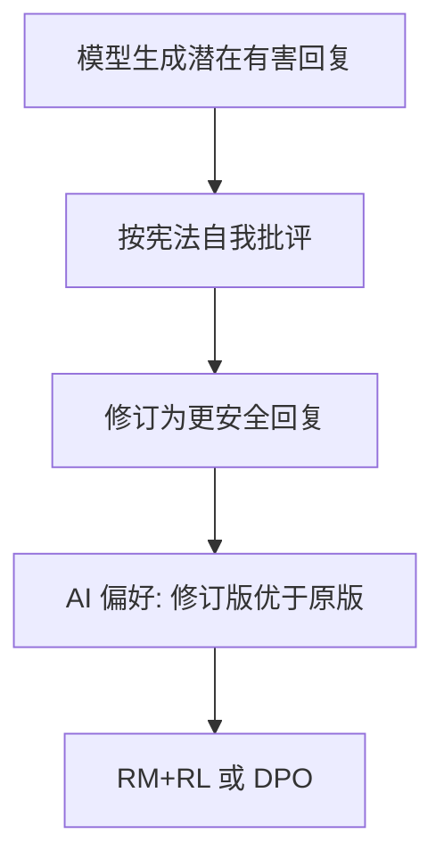

# Constitutional AI 原理（Anthropic）

## 要解决的问题

纯人类偏好标注 **昂贵、慢、不一致**，且难以覆盖长尾有害场景。**Constitutional AI（CAI）** 用书面 **「宪法」原则**（如无害、尊重隐私）指导模型 **自我批评与修订**，再用 AI 偏好训练 RM 或直接 RL，在减少人工的同时强化 **无害与诚实** 行为。

## 核心概念

| 阶段 | 名称 | 作用 |
| --- | --- | --- |
| **监督阶段** | RLAIF-S / 修订数据 | 模型按原则批评并改写有害回复 → SFT 数据 |
| **强化阶段** | RLAIF-R | AI 比较修订前后回复 → 训练 RM → RL（或转 DPO） |

「宪法」示例类型（非完整列表）：

- 选择 **最有帮助且最无害** 的回复。
- 避免鼓励非法、仇恨、医疗误导。
- 承认不确定而非编造。

## 方法 / 流程要点

1. **生成**：对 red-team prompt 采样初始回复（可能含问题内容）。
2. **批评**：用原则链 prompt「指出违反哪条原则」。
3. **修订**：生成符合宪法的 $y'$。
4. **偏好对**：$(y', y)$ 作为 $y_w, y_l$ 进入 [RM](../03-rlhf/02-reward-model) 或 [DPO](../04-preference-optimization/01-dpo)。
5. **迭代**：多轮宪法细化（个人理解：后期原则可更细粒度）。

与标准 RLHF 区别：**反馈主体** 从人变为 **对齐强的 AI 裁判**（仍需人审宪法与抽检）。

## 工程实践

| 实践 | 说明 |
| --- | --- |
| **宪法版本化** | 政策变更时重跑数据管线 |
| **法官模型** | 需强于被训模型或专门 RM；防 judge 偏见 |
| **红队** | 外部攻击 prompt 集与 CAI 训练集分离 |
| **合规** | 生成有害内容用于训练需在隔离环境，有审计日志 |

可与 [SFT](../01-sft/01-sft-overview) 混合：示范「如何拒答」而非仅惩罚有害。

## 代表工作

- Bai et al., 2022 — **Constitutional AI: Harmlessness from AI Feedback**（Anthropic）.
- 后续 **Claude** 技术博客对无害训练的描述（非全部开源）。
- 相关 AI 反馈：[Meta Reward LM 领读](/paper-reading/rl-algo/meta-reward-language-models-self-improving-alignment-with-llm-as-a-meta-judge)。

## 局限与注意点

- AI 法官 **错误对齐** 会把偏见写进策略（「过度拒答」常见）。
- 宪法 **英文中心** 时多语言无害性需单独原则。
- CAI **不替代** 法律合规审查与上线前人工评估。
- 与 [RLAIF](./02-rlaif) 术语常混用：CAI 强调 **原则文本**，RLAIF 强调 **反馈来源**。

## 宪法撰写建议

- **可执行**：避免「要善良」类空话，改为可检查行为（如不输出具体入侵步骤）。
- **分层**：核心红线（违法、自伤）与风格偏好（简洁、礼貌）分开，避免训练信号冲突。
- **多语言**：中文部署需中文原则与中文 red-team，直接翻译英文宪法常漏文化语境。
- **版本 diff**：政策变更时记录 diff，触发 **受影响 prompt 子集** 重训而非全量重跑（成本优化，待验证自动化覆盖率）。

## 与 DPO 的衔接

修订得到的 $(y_w, y_l)$ 可直接写入偏好 JSONL，用 [4.4.1 DPO](../04-preference-optimization/01-dpo) 训练，无需完整 PPO 栈；适合 **先 CAI 生成数据、再离线对齐** 的中小团队路径。

上线前仍建议保留 **人工红队周检**，宪法无法覆盖对抗性越狱的全部变体。

## 相关章节

- [4.5.2 RLAIF](./02-rlaif)
- [4.5.3 自我改进与批评](./03-self-improvement-critique)
- [4.3.1 RLHF](../03-rlhf/01-rlhf-pipeline)
- [4.4.1 DPO](../04-preference-optimization/01-dpo)
