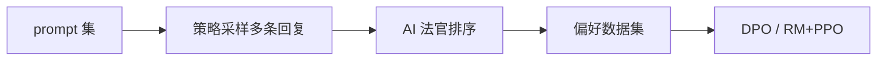

# RLAIF：用 AI 反馈替代人类反馈

## 要解决的问题

RLHF 瓶颈常在 **人类排序** 的规模与一致性。**Reinforcement Learning from AI Feedback（RLAIF）** 用强模型（或专用 RM）生成偏好标签，训练策略或 RM，再可选少量人类校准。与 [Constitutional AI](./01-constitutional-ai) 结合时，AI 按原则产生 $(y_w, y_l)$，形成 **可扩展对齐飞轮**。

## 核心概念

| 对比 | RLHF | RLAIF |
| --- | --- | --- |
| **偏好来源** | 人类标注员 | LLM / RM 评判 |
| **成本** | 高、慢 | 推理成本换标注成本 |
| **风险** | 标注不一致 | 法官偏见、自我强化 |
| **典型用途** | 黄金标准 | 扩覆盖、迭代 red-team |

RLAIF **不是新损失函数**：下游仍是 [DPO](../04-preference-optimization/01-dpo) 或 [PPO](../03-rlhf/03-ppo)，变的是 **标签生成器**。

## 方法 / 实践配方

### 1. AI  pairwise 标注

- Prompt 模板：展示原则 + $y_a, y_b$ → 输出 `A` 或 `B`。
- **多数投票**：多温度、多法官模型投票降方差。
- 过滤：法官与人类 **不一致率** 过高样本人工复核。

### 2. 与 Constitutional 结合

- 原则来自 [宪法](./01-constitutional-ai)；修订前后自动构成偏好对。
- 适合 **无害、诚实** 维度；**专业领域** 仍建议人类专家。

### 3. 迭代 RLAIF

1. 训练 v1 策略。
2. v1 rollout → AI 标注 → 训练 v2。
3. 监控 **能力遗忘** 与 **过度拒答**（[4.1.4](../01-sft/04-catastrophic-forgetting)）。

## 工程实践

| 项 | 建议 |
| --- | --- |
| **法官选型** | 商用 API 或开源 RM（Skywork-Reward 等） |
| **去偏** | 交换 A/B 位置、匿名模型名 |
| **缓存** | 相同 $(x,y_a,y_b)$ 判决缓存降成本 |
| **人机混合** | 5–10% 人类金标校准 AI 标签误差 |

Lee et al., 2023 **RLAIF** 论文显示 AI 标签可与人类标签训练出相近偏好（任务依赖，待在自己域复现）。

## 代表工作

- Bai et al., 2022 — CAI 中的 AI feedback。
- Lee et al., 2023 — **RLAIF vs. RLHF** 系统比较。
- [Meta Reward LM](/paper-reading/rl-algo/meta-reward-language-models-self-improving-alignment-with-llm-as-a-meta-judge) — meta-judge 改进对齐。

## 局限与注意点

- **模型坍塌**：法官与被训模型同源时，偏好趋同于已有偏见。
- **安全假象**：AI 认为「无害」的回复仍可能违规（法律/文化差异）。
- 监管场景可能要求 **披露** 自动化标注比例。
- RLAIF 不能省掉 [评测](../../07-evaluation/02-evaluation-methods/03-human-evaluation)。

## 法官模型偏见清单

| 偏见 | 表现 | 缓解 |
| --- | --- | --- |
| 长度 | 更长 = 更好 | 判决前 strip 或归一长度 |
| 位置 | 先出现选项占优 | A/B 交换增强 |
| 自信语气 | 武断优于谦逊 | rubric 强调校准与诚实 |
| 同源 | 与被训模型同族 | 换家族法官或加人类金标 |

## 成本估算（粗算）

设每偏好对需法官 1 次前向，序列长 2k token，$N$ 万对 ≈ $2N$ 万条前向；**RLAIF 主要成本在推理而非梯度**。可先对 1k 子集试点再扩。

## 相关章节

- [4.5.1 Constitutional AI](./01-constitutional-ai)
- [4.5.3 自我改进与批评](./03-self-improvement-critique)
- [4.4.3 在线偏好学习](../04-preference-optimization/03-offline-vs-online)
- [4.3.2 奖励模型](../03-rlhf/02-reward-model)
