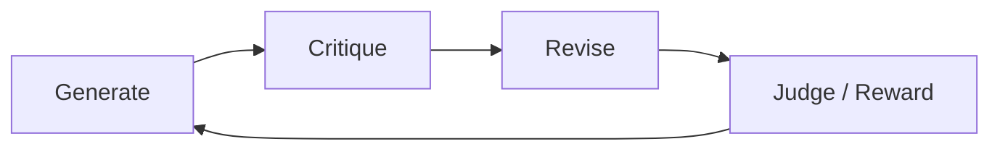

# 4.5.3 自我改进与自我批评

## 要解决的问题

对齐不仅是「拟合外部标签」，还可让模型 **生成 → 批评 → 修订** 自身输出，把错误消灭在训练数据或迭代环内。该范式支撑 [Constitutional AI](./01-constitutional-ai)、[RLAIF](./02-rlaif)、以及研究界的 **self-rewarding / self-play** 对齐。本节梳理机制、与 Agent 自我进化的边界，及工程风险。

## 核心概念

| 环节 | 输入/输出 | 作用 |
| --- | --- | --- |
| **Generate** | $x \rightarrow y$ | 初始候选 |
| **Critique** | $(x, y) \rightarrow$ 批评文本 | 定位违规/逻辑漏洞 |
| **Revise** | $(x, y, \text{critique}) \rightarrow y'$ | 产出改进回复 |
| **Judge** | 比较 $y, y'$ | 构造偏好或 SFT 目标 |

与 **推理时 self-refine** 区别：训练期把修订轨迹 **写入参数**；推理期仅 prompt 链式反思不更新权重。

## 方法 / 典型管线

### 1. Constitutional 式自我修订

- 批评 prompt 嵌入 **原则列表**（见 [4.5.1](./01-constitutional-ai)）。
- 偏好：$y' \succ y$，进入 [DPO](../04-preference-optimization/01-dpo)。

### 2. 自我奖励（Self-Rewarding）

- 模型为自己回复打分 → 构造偏好（Yuan et al., 2024 等）。
- 风险：**分数膨胀**、风格自恋；需外部 anchor（小人类集或规则）。

### 3. 与 Agent 自我对弈

- 代码/工具任务用 **执行反馈** 验证（非纯语言 judge）。
- 领读：[Self-Play with Execution Feedback](/paper-reading/agentic/self-play-with-execution-feedback)、[Self-Play Finetune](/paper-reading/agentic/self-play-finetune)。
- 与对齐交叉：成功轨迹 → SFT，失败 → 负例或 DPO $y_l$。

### 4. 多轮批评深度

- 单轮批评可能浅；**多轮** 增成本但减漏网有害内容。
- 个人理解：收益递减点约在 2–3 轮，需任务级 ablation。

## 工程实践

| 实践 | 说明 |
| --- | --- |
| **隔离环境** | 生成有害/漏洞代码用于训练时沙箱执行 |
| **法官独立** | 批评模型与策略模型 **不同 checkpoint** 减同源偏见 |
| **数据去重** | 修订前后 n-gram 过近则丢弃（无信息增益） |
| **监控** | 修订率、平均改动长度、人工抽检修订质量 |

成本：≈ **3× 推理 token**（生成+批评+修订）每样本；适合 **高价值** 安全与推理数据。

## 代表工作

- Bai et al., 2022 — CAI 修订链。
- Yuan et al., 2024 — **Self-Rewarding Language Models**.
- Chen et al., 2024 — **Self-Play fine-tuning**（[领读](/paper-reading/agentic/self-play-finetune)）.

## 局限与注意点

- **错误批评** 会教模型学会「表面道歉仍有害」或「过度拒绝」。
- 自我循环 without 人类锚定 → **偏好漂移**（与 [4.3.5 reward hacking](../03-rlhf/05-rlhf-challenges) 同源）。
- 评测应用 **held-out 人类** 与 **外部红队**，不能只看 AI judge 一致率。
- 法规与伦理：自动生成有害内容用于训练需 **审批流程**（组织级）。

## 批评 prompt 结构（模板要素）

1. **角色**：中立审计员，非对话助手。
2. **原则**：逐条列出宪法编号，要求引用违反条款。
3. **输出格式**：`违规条款: …` / `建议修订: …`，便于解析。
4. **禁止**：批评环节生成全新长篇替代答案（避免任务漂移）。

修订 prompt 再基于批评 **只改必要句**，降低过度改写带来的信息损失。

## 质量门禁

- 若 $y'$ 与 $y$ 的 ROUGE-L $>0.95$，丢弃（修订无效）。
- 若修订后仍触发 **毒性分类器**，降权或人工复核。
- 记录 **批评 token 长度**；过长批评常带跑题。

## 相关章节

- [4.5.1 Constitutional AI](./01-constitutional-ai)
- [4.5.2 RLAIF](./02-rlaif)
- [4.2.3 高质量指令数据](../02-instruction-tuning/03-high-quality-instruction-data)
- [6.3 推理 RL](../../06-reasoning-test-time-compute/03-rl-reasoning/04-self-play)
