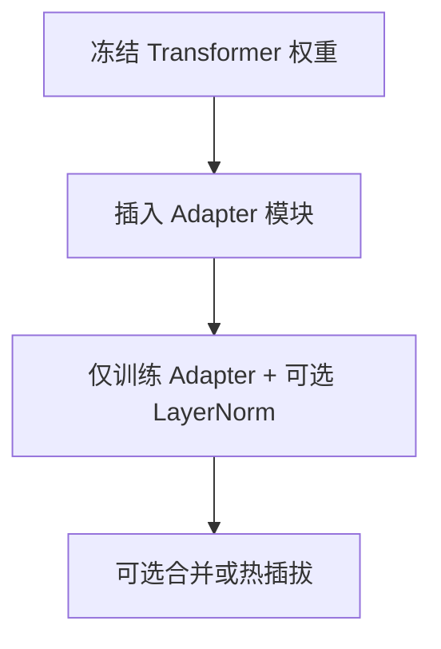

# Adapter

## 要解决的问题

全参 [SFT](../01-sft/01-sft-overview) 或 [RLHF](../03-rlhf/01-rlhf-pipeline) 对 7B+ 模型显存与存储压力大；多下游任务若各存一份全量权重 **不经济**。**Adapter（适配器）** 在冻结预训练权重旁插入 **小模块**，只训练适配参数，实现参数高效微调（PEFT）的早期主流方案。

## 核心概念

**Adapter 层** 常插入 Transformer 子层之间（FFN 后或注意力后）：

$$
h' = h + f_{\text{adapter}}(h), \quad f_{\text{adapter}}(h) = W_{\text{up}}\,\sigma(W_{\text{down}}\, h)
$$

| 属性 | 典型值 |
| --- | --- |
| **可训练参数量** | 原模型 0.1%–5% |
| **推理** | 可合并或并行旁路；早期实现略增延迟 |
| **任务切换** | 换 adapter 权重、共享基座 |

与 [LoRA](./03-lora-qlora) 对比：Adapter 改 **激活路径**；LoRA 改 **权重低秩分解**。

## 方法 / 结构与训练

### 变体

- **Houlsby Adapter**：每层两处 adapter（Attention + FFN）。
- **Pfeiffer / LoRA 前身类**：仅在 FFN 一侧，减参数量。
- **AdaMix / 多 adapter 混合**：多专家 adapter 加权（研究向）。

训练 recipe 与全参 SFT 相同（因果 LM loss），优化器只含 adapter 参数组。

## 工程实践

| 项 | 说明 |
| --- | --- |
| **框架** | `peft` 库 `AdaLora`/`Adapter` 配置；Hugging Face 生态 |
| **显存** | 显著低于全参；仍须加载完整基座前向 |
| **部署** | 服务多租户时 **adapter 热加载** 有运维优势 |
| **对齐** | RM/PPO 阶段也可用 adapter（较少见，多直接用 LoRA） |

2024–2026 社区 **LoRA 更流行**，但 adapter 概念仍见于多任务平台与 **模块化合规**（不同地区不同 adapter）。

## 代表工作

- Houlsby et al., 2019 — **Parameter-Efficient Transfer Learning for NLP**.
- Pfeiffer et al., 2020 — **AdapterHub** 生态。
- He et al., 2022 — **Unified View of PEFT** 综述。

## 局限与注意点

- 极深或极长训练时，adapter 容量可能 **不足** 拟合复杂对齐（个人理解：大偏好集更倾向 LoRA rank↑ 或全参）。
- 推理若未 **融合 kernel**，额外分支有 latency。
- 与 [灾难性遗忘](../01-sft/04-catastrophic-forgetting) 关系：冻结骨干通常减轻遗忘，但极强 adapter 仍会扰动表示。

## 部署模式对比

| 模式 | 优点 | 缺点 |
| --- | --- | --- |
| **热插拔 adapter** | 多租户共享 GPU、快速切换 | 需推理框架支持多 adapter |
| **合并进基座** | 部署简单、无额外分支 | 失去「一基座多任务」灵活性 |
| **仅训练 FFN adapter** | 参数更少 | 复杂生成任务可能欠拟合 |

## 何时仍选 Adapter（2025–2026）

- 平台型产品：**数百个小技能** 各 10MB adapter，比数百份 LoRA 更易运维（组织偏好，非技术必然）。
- 研究 **模块化安全**：地区合规 adapter 与通用对话 adapter 分离。
- 若团队已标准化 `peft` + LoRA，无强制理由迁移，除非 benchmark 显示明显差距。

## 相关章节

- [4.6.2 Prefix / Prompt Tuning](./02-prefix-prompt-p-tuning)
- [4.6.3 LoRA 与 QLoRA](./03-lora-qlora)
- [4.6.5 PEFT 选择指南](./05-peft-selection-guide)
