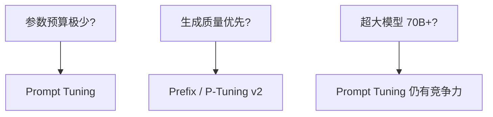

# 4.6.2 Prefix Tuning、Prompt Tuning、P-Tuning

## 要解决的问题

Adapter 修改层内计算图；另一类 PEFT 选择 **不改权重**，而在输入或激活前加 **可学习连续向量**，用极少参数 steer 模型行为。适合 **快速试验**、**多任务切换** 或超大模型上仅训 prompt 参数的场景。

## 核心概念

| 方法 | 注入位置 | 可训练量 |
| --- | --- | --- |
| **Prompt Tuning** | 输入 embedding 序列前端 | 软 prompt 向量（常 $<$1M） |
| **Prefix Tuning** | 每层 K/V（或更广）前缀 | 多于 prompt tuning |
| **P-Tuning v2** | 深层连续 prompt（类 prefix） | 接近 prefix，性能更稳 |

软 prompt 向量 $P \in \mathbb{R}^{l \times d}$ 与真实 token embedding 拼接后进入 Transformer：

$$
\text{Input} = [\underbrace{P}_{\text{learnable}};\; E(x)]
$$

**Prefix Tuning** 将前缀经小 MLP 映射为各层 past_key_values，影响 **注意力记忆** 而非仅输入语义。

## 方法 / 选型

### 训练注意

- 仅优化 $P$（及 prefix MLP）；基座 **完全冻结**。
- 学习率可略高于 LoRA（参数量极小）；防 **过拟合** 小数据集。
- 必须与官方 **chat template** 对齐，否则软 prompt 与硬模板冲突。

### 与指令微调关系

- 对 **强 instruct 基座**，软 prompt 单独可能不如 [LoRA](./03-lora-qlora) + SFT（待验证：依赖任务复杂度）。
- 适合 **分类、抽取** 等判别任务；开放生成对话较少作为主方案。

## 工程实践

| 项 | 说明 |
| --- | --- |
| **库** | `peft`：`PromptTuningConfig`、`PrefixTuningConfig` |
| **推理** | 前缀可缓存进 KV，重复 prompt 省算 |
| **多任务** | 每任务一套 $P$，切换轻量 |
| **局限** | 极长上下文时前缀占窗口比例需规划 |

## 代表工作

- Lester et al., 2021 — **Prompt Tuning**.
- Li & Liang, 2021 — **Prefix-Tuning**.
- Liu et al., 2022 — **P-Tuning v2**.

## 局限与注意点

- 开放域 **聊天对齐** 主流 recipe 仍以 LoRA/全参为主。
- Prefix 对 **多模态** 模型需重新设计注入点。
- 软 prompt **不可读**，调试不如 LoRA 权重分析直观。
- 与 [DPO](../04-preference-optimization/01-dpo) 结合时，确保 ref 与 policy 的 prefix 处理一致。

## 窗口与长度

软 prompt 长度 $l$ 占用上下文：**有效用户上下文 = max_len − l**。长文档 RAG 场景下，$l=20$ 也可能占 1–2% 窗口，需在服务 SLA 中写明。

Prefix 在各层注入时，**KV cache 尺寸**随 prefix 增长；部署时要与 [KV Cache 优化](../../05-inference-deployment/02-kv-cache-attention-optimization/01-kv-cache) 一并评估。

## 实验建议

1. 固定基座，比较 Prompt Tuning vs LoRA rank=8 在 **同一小数据集** 上的 dev 指标。
2. 若 Prompt Tuning 差距不足 3% 且仅需极少参数，可保留；否则切 LoRA。
3. 勿与硬编码 system prompt **语义重复**，否则梯度竞争、收敛慢。

## 相关章节

- [4.6.1 Adapter](./01-adapter)
- [4.6.3 LoRA 与 QLoRA](./03-lora-qlora)
- [4.6.5 PEFT 选择指南](./05-peft-selection-guide)
