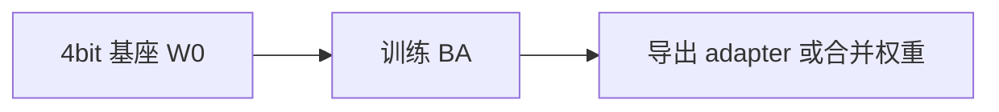

# 4.6.3 LoRA 与 QLoRA

## 要解决的问题

后训练（SFT、DPO）若 **全参更新** 7B/70B 模型，常需多卡与高带宽存储。**LoRA（Low-Rank Adaptation）** 用低秩矩阵近似权重增量；**QLoRA** 将基座 **4-bit 量化** 加载、LoRA 在 FP16/BF16 训练，使单卡 24–48GB 可微调 7B–13B，成为开源对齐的事实标准。

## 核心概念

对线性层 $W_0 \in \mathbb{R}^{d \times k}$，LoRA 注入：

$$
W = W_0 + \Delta W, \quad \Delta W = B A,\; B \in \mathbb{R}^{d \times r},\; A \in \mathbb{R}^{r \times k},\; r \ll \min(d,k)
$$

前向：

$$
h = W_0 x + B A x
$$

训练时 **$W_0$ 冻结**，只更新 $A,B$。缩放常乘 $\alpha/r$。

| 超参 | 典型范围 | 影响 |
| --- | --- | --- |
| **rank $r$** | 8–128 | 越大容量越高、显存略增 |
| **$\alpha$** | 16–64 | 有效学习率缩放 |
| **target modules** | `q_proj,v_proj` 或全部线性 | 全覆盖通常更好 |
| **dropout** | 0–0.1 | 小数据防过拟合 |

**QLoRA**：$W_0$ 以 NF4 存储；用 **双量化** 与 **分页优化器** 降峰值显存；LoRA 适配器保持高精度。

## 方法 / 训练与合并

1. 选 rank 与 target modules（`LLaMA-Factory` 一键配置）。
2. SFT 或 [DPO](../04-preference-optimization/01-dpo)：`trl` + `peft` 传入 `LoraConfig`。
3. **合并**：`merge_and_unload()` 得到单文件 HF 权重便于 vLLM 部署；或 **分开** 存 adapter 便于多租户。
4. **DPO 注意**：$\pi_{\text{ref}}$ 可用 **同一 LoRA 基座无 adapter** 或冻结 adapter 的 ref 副本。

## 工程实践

| 场景 | 建议 |
| --- | --- |
| 7B SFT | QLoRA rank 64，bf16，seq 4k |
| 13B 单卡 24G | QLoRA + grad checkpoint |
| 70B | 多卡 QLoRA 或 FSDP+LoRA |
| 推理 | 合并后 latency 与全参无异；未合并需 PEFT 加载 |

工具：`peft`、`bitsandbytes`、`Axolotl`、`unsloth`（加速 kernel）。

与 [灾难性遗忘](../01-sft/04-catastrophic-forgetting)：LoRA 通常减轻通用能力跌幅，但 **强对齐数据** 仍可能改变风格。

## 代表工作

- Hu et al., 2021 — **LoRA: Low-Rank Adaptation of Large Language Models**.
- Dettmers et al., 2023 — **QLoRA: Efficient Finetuning of Quantized LLMs**.

## 局限与注意点

- 极低 rank 对 **复杂偏好对齐** 可能欠拟合；可增 $r$ 或扩 target modules。
- 量化基座 **数值误差** 偶发影响训练稳定性；优先 bf16 compute。
- 合并权重后 **无法再拆** adapter；备份 adapter  checkpoint。
- RM+PPO 全链路 LoRA 较少文档化，调试难度高于 DPO+QLoRA。

## rank 与 target 模块经验

| 模型规模 | 起步 rank | target |
| --- | --- | --- |
| 7B SFT | 32–64 | `q_proj,v_proj,o_proj,gate_proj,up_proj,down_proj` |
| 13B QLoRA | 64 | 同上 |
| 70B | 16–32 或 DoRA | 常仅 attention + FFN 部分层 |

对齐数据 **复杂度高** 时可先增 rank 再增数据量。

## 故障排查

- **loss NaN**：降 LR；检查 4bit 与 compute dtype；关闭异常样本。
- **生成乱码**：合并权重后 tokenizer 未同步；或 adapter 未加载。
- **DPO 不收敛**：确认 ref logprob 用 **无 adapter 基座** 计算一致。

## 相关章节

- [4.6.4 DoRA、LoRA+](./04-dora-lora-plus)
- [4.6.5 PEFT 选择指南](./05-peft-selection-guide)
- [4.4.1 DPO](../04-preference-optimization/01-dpo)
- [3.5 ZeRO/FSDP](../../03-pre-training/05-distributed-training/06-fsdp)
