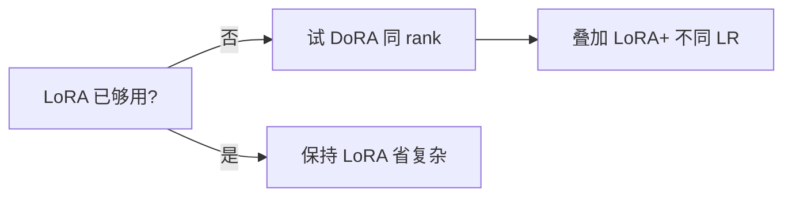

# 4.6.4 DoRA、LoRA+ 等改进

## 要解决的问题

标准 [LoRA](./03-lora-qlora) 将 $\Delta W$ 约束为低秩，与全参微调相比仍存在 **容量与幅度（magnitude）** 差距：部分工作观察到 LoRA 学不好 **方向与范数解耦** 的更新。**DoRA**、**LoRA+** 等改进在几乎不增加推理成本的前提下，缩小与全参的差距。

## 核心概念

### DoRA（Weight-Decomposed Low-Rank Adaptation）

将权重分解为 **幅度** $m$ 与 **方向** $V$：

$$
W = m \cdot \frac{V}{\|V\|_c}, \quad V = W_0 + B A
$$

| 组件 | 是否训练 | 作用 |
| --- | --- | --- |
| $A, B$ | 是 | 调整方向（类 LoRA） |
| $m$ | 是（逐通道或逐层） | 恢复幅度自由度 |

直觉：LoRA 低秩乘积 **同时限制方向和尺度**；DoRA 显式学 $m$ 补偿。

### LoRA+

- 对 $A$、$B$ 使用 **不同学习率**（常 $B$ 的 LR $>$ $A$ 的 LR）。
- 几乎零额外参数，实现简单；部分 benchmark 略优于 vanilla LoRA。

### 其他变体（简述）

| 名称 | 要点 |
| --- | --- |
| **rsLoRA** | 缩放 $\alpha/\sqrt{r}$ 稳定训练 |
| **AdaLoRA** | 动态 rank 分配 |
| **VeRA** | 共享随机基，仅训标量（更省参） |

## 方法 / 使用建议

1. 在 `peft` 中启用 `use_dora=True`（版本需 ≥0.10 依发行说明）。
2. 初始 rank 与 LoRA 相同先做 **对照实验**（同数据、同 steps）。
3. LoRA+：设 `loraplus_lr_ratio` 或手动 param group。
4. 与 [QLoRA](./03-lora-qlora) 兼容：仍 4bit 基座 + 高精度 adapter。

## 工程实践

| 观察 | 行动 |
| --- | --- |
| 全参 vs LoRA gap 大 | 优先 DoRA 或 rank↑ |
| 训练不稳定 | 试 rsLoRA 缩放；降 LR |
| 推理部署 | DoRA 可合并；与 LoRA 相同流程 |
| DPO | ref 与 policy 结构需一致（同 DoRA 配置） |

个人理解：DoRA 收益 **因任务而异**；纯聊天 SFT 可能边际小，**多领域混合** 时更明显（待验证）。

## 代表工作

- Liu et al., 2024 — **DoRA: Weight-Decomposed Low-Rank Adaptation**.
- Hayou et al., 2024 — **LoRA+**.
- Valipour et al., 2023 — **DyLoRA / rsLoRA** 等。

## 局限与注意点

- DoRA 多训 $m$，显存 **略高于** LoRA（仍远小于全参）。
- 并非所有 `peft` 后端 kernel 对 DoRA 优化同等成熟。
- 新变体论文多、**生产验证** 少于经典 LoRA。
- 与 [Adapter](./01-adapter) 混用无必要，择一即可。

## ablation 记录模板

| 运行 | 方法 | rank | MMLU Δ | Arena Δ | 备注 |
| --- | --- | --- | --- | --- | --- |
| A | LoRA | 64 | baseline | baseline | |
| B | DoRA | 64 | ? | ? | 同数据同 steps |
| C | LoRA+ | 64 | ? | ? | $B$ LR = 2× $A$ LR |

填完再决定是否上线 DoRA；避免仅凭论文表格选型。

## 相关章节

- [4.6.3 LoRA 与 QLoRA](./03-lora-qlora)
- [4.6.5 PEFT 选择指南](./05-peft-selection-guide)
- [4.1.3 质量数量权衡](../01-sft/03-quality-quantity-tradeoff)
