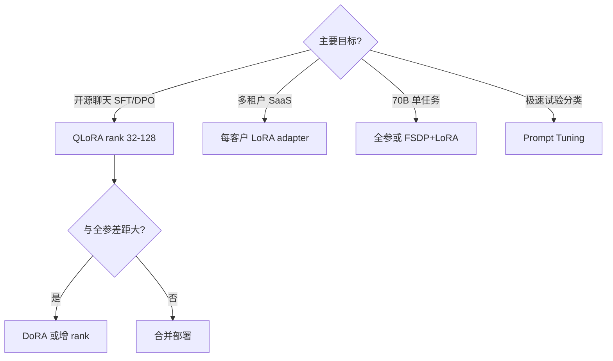

# 4.6.5 PEFT 方法的选择指南

## 要解决的问题

[Adapter](./01-adapter)、[Prefix/Prompt](./02-prefix-prompt-p-tuning)、[LoRA/QLoRA](./03-lora-qlora)、[DoRA/LoRA+](./04-dora-lora-plus) 并存，团队需在 **显存、效果、部署、对齐阶段** 间做决策。本节给出 **决策树与组合 recipe**，避免盲目上全参或误用软 prompt 做聊天对齐。

## 核心概念

| 方法 | 参数量 | 生成对话 | 多任务切换 | 与 DPO 搭配 |
| --- | --- | --- | --- | --- |
| Adapter | 低–中 | 可用 | 好 | 可行 |
| Prompt/Prefix | 极低 | 一般 | 极好 | 需注意 ref |
| LoRA/QLoRA | 低–中 | **首选** | 好（多 adapter） | **最常见** |
| DoRA/LoRA+ | 低–中+ | 略优于 LoRA | 同 LoRA | 同 LoRA |
| 全参 | 100% | 上限高 | 差 | 标准大厂 |

显存粗算（7B、4k seq、个人理解量级）：

- 全参 BF16 训练：$\gg$ 60GB 多卡。
- QLoRA：单卡 24–48GB 可训。
- Prompt Tuning：更低，但效果任务相关。

## 方法 / 决策流程

### 按后训练阶段

| 阶段 | 推荐 PEFT |
| --- | --- |
| **SFT** | QLoRA；数据不足 10k 条可 rank 32 |
| **DPO** | 同 SFT adapter；$\pi_{\text{ref}}$=无 adapter 基座 |
| **RM** | LoRA 可行；注意 reward 标度校准 |
| **PPO** | 工程复杂；大厂多全参；研究可用 LoRA policy |
| **推理** | `merge_and_unload` 或 vLLM LoRA 槽位 |

### 组合 pipeline（开源常见）

1. 基座 + **QLoRA SFT**（[4.1](../01-sft/01-sft-overview)）。
2. 同 adapter 继续 **DPO**（[4.4.1](../04-preference-optimization/01-dpo)），$\beta$ 单独调。
3. 评测 win-rate + MMLU；不足则 **增 rank** 或试 [DoRA](./04-dora-lora-plus)。
4. 合并权重 → vLLM 服务。

避免：用 Prompt Tuning 单独做 **安全对齐** 却期望 RLHF 级无害性（经验上不足）。

## 工程实践

| 检查项 | 说明 |
| --- | --- |
| **checkpoint** | 存 `adapter_config.json` + 基座 revision |
| **模板** | chat template 与训练一致 |
| **合并策略** | 生产要 latency 则合并；实验 A/B 保留 adapter |
| **许可** | 基座 license 是否允许分发 LoRA 衍生 |
| **工具** | `LLaMA-Factory` 统一 SFT/DPO/LoRA 配置 |

与 [遗忘](../01-sft/04-catastrophic-forgetting)：PEFT 减轻但 **不消除**；DPO $\beta$ 过大仍损能力。

## 代表工作

- Hu et al., 2021 — LoRA。
- Dettmers et al., 2023 — QLoRA。
- Liu et al., 2024 — DoRA。
- Hugging Face **PEFT 文档** 与 `alignment-handbook` 实践汇总。

## 局限与注意点

- PEFT **不降低** 前向 FLOPs（基座仍全量计算）；只省 **训练显存与存储**。
- 多 adapter 服务需推理框架 **LoRA 多路复用** 支持（vLLM 等）。
- 法规场景：adapter 可能 **编码客户私有数据**，需隔离存储与删除策略。
- 选型表为启发式；**必须本地 ablation**（待验证：无 universal 最优）。

## 相关章节

- [4.6.1 Adapter](./01-adapter)
- [4.6.2 Prefix / Prompt Tuning](./02-prefix-prompt-p-tuning)
- [4.6.3 LoRA 与 QLoRA](./03-lora-qlora)
- [4.6.4 DoRA、LoRA+](./04-dora-lora-plus)
- [4.4.4 偏好方法对比](../04-preference-optimization/04-methods-comparison)
- [4.1.1 SFT](../01-sft/01-sft-overview)
