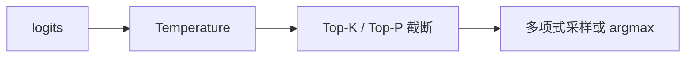

# 5.1.2 采样策略（Greedy、Beam Search、Top-K、Top-P、Temperature）

## 要解决的问题

模型每步输出的是**整个词表上的概率分布**，如何从中选取下一个 token 直接决定输出的多样性、稳定性与任务得分。聊天场景需要自然多变，代码/数学则常需更确定；采样策略是推理 API 中最常被用户调错的旋钮之一。

## 核心概念

对 logits $\mathbf{z}$ 先做温度缩放再归一化：

$$
p_i = \frac{\exp(z_i / T)}{\sum_j \exp(z_j / T)}
$$

| 策略 | 规则 | 典型场景 | 风险 |
| --- | --- | --- | --- |
| **Greedy** | $\arg\max_i p_i$ | 分类、抽取式 QA | 重复、乏味 |
| **Beam Search** | 保留 top-$B$ 条前缀，按累积 logprob 排序 | 机器翻译（传统） | 开销 $\times B$，LLM 聊天较少用 |
| **Top-K** | 仅在概率最高的 $K$ 个 token 上重归一化后采样 | 通用对话 | $K$ 过小损多样性 |
| **Top-P（Nucleus）** | 取最小集合使 $\sum p_i \ge p$ | ChatGPT 类默认 | $p$ 与 $T$ 耦合需联调 |
| **Temperature** | 缩放 $T$：$T<1$ 更尖锐，$T>1$ 更随机 | 创意写作 | 高温幻觉上升 |

Top-P 算法（概念）：按 $p_i$ 降序累加，直到累计概率 $\ge p$，丢弃其余 token 再采样。

## 方法 / 组合实践

常见 API 参数组合：`temperature` + `top_p`（或 `top_k`），二者同时极低温时近似贪心。

**任务导向建议**（经验值，需在自己 benchmark 上验证）：

| 任务 | temperature | top_p | 备注 |
| --- | --- | --- | --- |
| 代码补全 | 0–0.2 | 0.95 | 接近贪心，配合 HumanEval |
| 开放对话 | 0.7–1.0 | 0.9 | 与 [5.1.3](./03-repetition-length-control) 联用 |
| 数学推理 | 0–0.6 | 1.0 | 高温易破坏链式步骤（见第六部分） |

## 工程实践

- **可复现性**：固定 `seed` 仅在同硬件/同 kernel 下近似可复；生产 A/B 应记录完整采样参数。
- **logprob 返回**：API 暴露 `logprobs` 便于做 RLHF、拒绝采样与 [7.2.1 自动评估](../../07-evaluation/02-evaluation-methods/01-reference-based)。
- **约束解码**：JSON / 工具调用常在采样外加 grammar mask，不改变温度定义但缩小有效词表。

## 代表工作

- Holtzman et al., *The Curious Case of Neural Text Degeneration*（Top-P / Nucleus Sampling）
- Hewitt et al., beam search 在 NNMT 中的经典用法；LLM 时代见 OpenAI、Anthropic API 文档

## 实践检查清单

- [ ] 固定评测/推理配置（温度、max_tokens、parser 版本）便于回归
- [ ] 记录硬件：GPU 型号、驱动、框架 commit
- [ ] 对比基线：未优化前 TTFT/TPOT 或 Acc
- [ ] 文档化失败案例：OOM、解析失败率、拒答率
- [ ] 交叉阅读本章「相关章节」避免孤立优化

## 局限与注意点

- 评测论文分数时须**固定**采样配置，否则无法对比（见 [7.2.4 污染与可靠性](../../07-evaluation/02-evaluation-methods/04-reliability-contamination)）。
- Beam Search 在长生成 LLM 上显存与延迟陡增，默认不推荐用于 4k+ 输出。
- 「待验证」：部分推理框架对 Top-P 的实现细节（是否重归一化）存在微小差异，跨框架对比需对齐。

## 延伸阅读

- 本仓库 [LLMs 入口](/llms/intro) 可回溯全局大纲；修改单点优化前建议先读上下游章节链接。
- 技术报告精读见 `llms/08-technical-reports/` 与 [paper-reading](/paper-reading/) 专栏。
- 工程复现优先锁定：框架版本 + 量化格式 + 评测 harness commit，三者缺一即难以对齐论文数字。

## 相关章节

- 同章：[5.1.1 自回归解码](./01-autoregressive-decoding) · [5.1.3 重复与长度控制](./03-repetition-length-control)
- 推理部署：[5.6.1 推理框架](../06-inference-serving/01-inference-frameworks)
- 评估：[7.1.2 推理基准](../../07-evaluation/01-benchmarks/02-reasoning-benchmarks)
