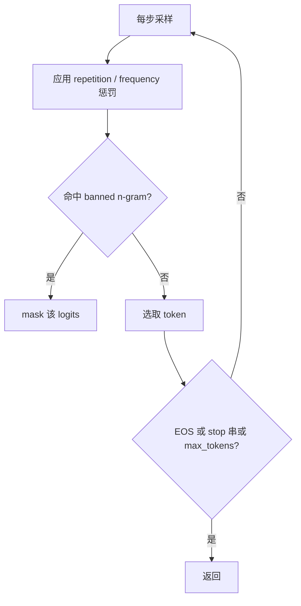

# 5.1.3 重复惩罚与长度控制

## 要解决的问题

自回归模型在贪心或高温采样下容易出现**循环重复**（同一 n-gram 反复出现），或在未达到语义完成时提前 EOS / 反之无限啰嗦。生产 API 必须通过重复惩罚、长度与停止策略，在质量、成本与用户体验之间取得平衡。

## 核心概念

**重复惩罚（Repetition Penalty）**：对已出现 token 的 logits 进行下调。常见实现（HF 风格）对出现在近期上下文中的 token $i$：

$$
z_i' = \begin{cases}
z_i / \text{penalty} & \text{if } z_i > 0 \\
z_i \times \text{penalty} & \text{if } z_i \le 0
\end{cases}
$$

$\text{penalty} > 1$ 抑制重复；过大则破坏流畅语法。

| 机制 | 作用对象 | 典型参数 |
| --- | --- | --- |
| repetition_penalty | 历史中出现过的 token | 1.0–1.2 |
| frequency_penalty | 按出现次数线性惩罚 | OpenAI 风格 API |
| presence_penalty | 出现过即惩罚一次 | 减少主题复读 |
| no_repeat_ngram_size | 禁止重复 n-gram | 翻译/摘要常用 |
| max_tokens / max_new_tokens | 硬上限 | 成本护栏 |

**长度控制**：`min_tokens` 强制最少生成长度；`stop` 字符串列表在解码时截断（需 tokenizer 对齐边界）。

## 方法 / 停止与截断流程

与 [5.1.2 采样策略](./02-sampling-strategies) 联调：高温 + 弱惩罚易复读；低温 + 强惩罚易「卡壳」换词。

## 工程实践

- **对话模板**：系统/用户/助手 role token 计入上下文；`max_tokens` 应预留 prompt 长度（总上下文窗口 − prompt）。
- **流式输出**：`stop` 在流式下需缓冲匹配，避免半个 UTF-8 截断。
- **成本**：`max_tokens` 是账单上限；Agent 多轮工具调用应设 per-step 与 session 双层限制（见 `docs/` Agent 章节）。
- **可观测**：统计「平均输出 token 数」「重复 n-gram 率」作为质量回归指标。

## 代表工作

- Keskar et al., *CTRL: A Conditional Transformer Language Model for Controllable Generation*
- OpenAI / vLLM / TGI 各参数文档中的 penalty 与 stop 语义（实现略有差异，集成时需读源码）

## 实践检查清单

- [ ] 固定评测/推理配置（温度、max_tokens、parser 版本）便于回归
- [ ] 记录硬件：GPU 型号、驱动、框架 commit
- [ ] 对比基线：未优化前 TTFT/TPOT 或 Acc
- [ ] 文档化失败案例：OOM、解析失败率、拒答率
- [ ] 交叉阅读本章「相关章节」避免孤立优化

## 局限与注意点

- 惩罚不改变模型权重，**无法**根治训练数据中的模式坍塌；需 SFT/RL 对齐（第四部分）。
- `no_repeat_ngram_size` 对中文分词边界敏感，过大可能误杀合法重复（如列表项）。
- 评测时随意改 `max_tokens` 会使 [MMLU](../../07-evaluation/01-benchmarks/01-general-benchmarks)、[HumanEval](../../07-evaluation/01-benchmarks/02-reasoning-benchmarks) 分数不可比。

## 延伸阅读

- 本仓库 [LLMs 入口](/llms/intro) 可回溯全局大纲；修改单点优化前建议先读上下游章节链接。
- 技术报告精读见 `llms/08-technical-reports/` 与 [paper-reading](/paper-reading/) 专栏。
- 工程复现优先锁定：框架版本 + 量化格式 + 评测 harness commit，三者缺一即难以对齐论文数字。

## 相关章节

- 同章：[5.1.1 自回归解码](./01-autoregressive-decoding) · [5.1.2 采样](./02-sampling-strategies) · [5.1.4 延迟](./04-latency-metrics)
- 加速：[5.5 推测解码](../05-accelerated-decoding/01-speculative-decoding)
- 对齐：[4.1 SFT](../../04-post-training-alignment/01-sft/01-sft-overview)
