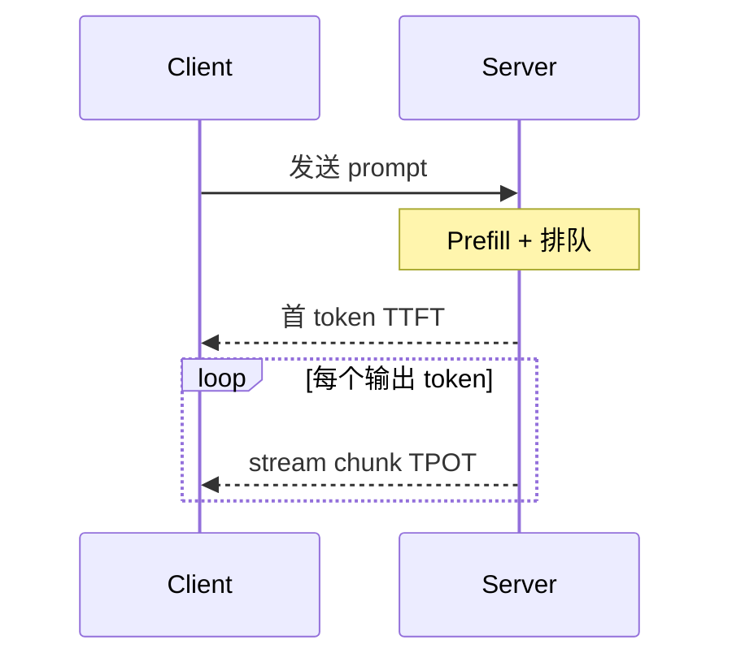

# 5.1.4 推理延迟的关键指标（TTFT、TPS、TPOT）

## 要解决的问题

业务方关心「首字多久出来」「每秒多少 token」，工程师关心 Prefill 与 Decode 谁更慢。若指标定义不一致，GPU 优化（KV、FlashAttention、量化）的效果无法在团队间对齐。本节统一 **TTFT、TPOT、TPS、ITL** 等常用口径。

## 核心概念

| 指标 | 英文 | 定义 | 主要受谁影响 |
| --- | --- | --- | --- |
| **TTFT** | Time To First Token | 请求发出 → 首个输出 token 可见 | Prompt 长度、Prefill、排队 |
| **TPOT** | Time Per Output Token | Decode 阶段平均每输出 token 耗时 | 模型大小、量化、KV、批大小 |
| **TPS** | Tokens Per Second | 系统吞吐：输出 token 数 / 墙钟时间 | 连续批处理、并行度、硬件 |
| **ITL** | Inter-Token Latency | 相邻两个输出 token 的时间间隔 | 近似 TPOT（单请求） |
| **E2E Latency** | End-to-End | 整段生成完成时间 | TTFT + (#out tokens × TPOT) |

近似关系（单请求、忽略排队）：

$$
\text{E2E} \approx \text{TTFT} + N_{\text{out}} \times \text{TPOT}
$$

$$
\text{TPS}_{\text{system}} \approx \frac{\sum_i N_{\text{out},i}}{\text{wall time}} \quad (\text{多请求并发})
$$

## 方法 / 如何测量

1. **分层 profiling**：NVIDIA Nsight、PyTorch profiler 区分 `prefill` vs `decode` kernel。
2. **负载规格**：固定 prompt 长度分布（如 p50=512, p99=8k）与输出长度；否则 TPS 无意义。
3. **并发档位**：Reporting 应注明 concurrent requests（1、8、64…）与 batch 策略（见 [5.6.2 连续批处理](../06-inference-serving/02-continuous-batching)）。

**硬件换算（粗估）**：Decode 常为 **memory-bound**；提升 TPOT 优先减 KV 体积（[5.2](../02-kv-cache-attention-optimization/01-kv-cache)）、量化（[5.3](../03-quantization/01-quantization-basics)）、Speculative（[5.5](../05-accelerated-decoding/01-speculative-decoding)）。

## 工程实践

| 场景 | 优先优化 | 目标指标 |
| --- | --- | --- |
| 聊天 UI | TTFT、ITL | TTFT < 500ms（视模型而定） |
| 批处理摘要 | 系统 TPS | $/1M tokens |
| 长文档 Agent | TTFT + 总 E2E | Prefix cache（[5.2.4](../02-kv-cache-attention-optimization/04-prefix-prompt-caching)） |

- **SLA 文档**：对外承诺写清「流式首 token」是否含 TLS/网关；对内 SLO 用服务端时间戳。
- **与质量联动**：仅压 TPOT 而提高温度/截断可能损害 [7.1 基准](../../07-evaluation/01-benchmarks/01-general-benchmarks) 分数。

## 代表工作

- vLLM 博客：PagedAttention 与吞吐基准方法
- MLPerf Inference（LLM 规则演进中）；各云厂商模型卡片中的 latency 表

## 实践检查清单

- [ ] 固定评测/推理配置（温度、max_tokens、parser 版本）便于回归
- [ ] 记录硬件：GPU 型号、驱动、框架 commit
- [ ] 对比基线：未优化前 TTFT/TPOT 或 Acc
- [ ] 文档化失败案例：OOM、解析失败率、拒答率
- [ ] 交叉阅读本章「相关章节」避免孤立优化

## 局限与注意点

- **冷启动**：容器扩缩容、CUDA graph 首次编译会抬高 TTFT，压测需 warmup。
- **Prompt caching 命中**时 TTFT 骤降，与未命中不可混报平均值。
- 个人理解：客户端「打字机效果」还受网络 chunk 大小影响，不等于服务端 TPOT。

## 相关章节

- 同章：[5.1.1 解码](./01-autoregressive-decoding) · [5.1.2 采样](./02-sampling-strategies)
- KV / 服务：[5.2](../02-kv-cache-attention-optimization/01-kv-cache) · [5.6](../06-inference-serving/01-inference-frameworks)
- 测试时计算：[6.2.5 推理 Scaling Laws](../../06-reasoning-test-time-compute/02-test-time-compute/05-inference-scaling-laws)
