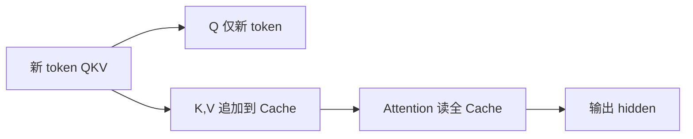

# 5.2.1 KV Cache 原理

## 要解决的问题

自回归 Decode 每步只新增一个 token，若每步对**整段历史**重算注意力，复杂度为 $O(T^2)$ 且浪费已算过的 Key/Value。**KV Cache** 缓存各层历史 $K,V$，使每步仅对最新 token 做投影并 attend 到缓存，是长上下文推理的默认标配。

## 核心概念

对第 $\ell$ 层、第 $h$ 个头，时刻 $t$ 的注意力：

$$
\text{Attention}(Q_t, K_{\le t}, V_{\le t}) = \text{softmax}\left(\frac{Q_t K_{\le t}^\top}{\sqrt{d_h}}\right) V_{\le t}
$$

**Cache 内容**：每层存储已生成位置的 $K^{(\ell)}, V^{(\ell)} \in \mathbb{R}^{T \times d}$（或 GQA 下更少的 KV 头）。

**显存估算**（单请求、FP16/BF16，忽略碎片）：

$$
\text{KV\_bytes} \approx 2 \times L \times T \times H_{\text{kv}} \times d_h \times \text{bytes\_per\_elem}
$$

其中 $L$=层数，$T$=序列长度，$H_{\text{kv}}$=KV 头数（GQA 时 $H_{\text{kv}} < H_{\text{q}}$），$d_h$=每头维度，因子 2 为 K 与 V。

| 变量 | Llama-3-8B 量级（示意） | 说明 |
| --- | --- | --- |
| $L$ | 32 | 层数 |
| $H_{\text{kv}}$ | 8（GQA） | 减少 KV 头 |
| $d_h$ | 128 | hidden/head |
| $T=8192$ | KV ≈ 32×8192×8×128×2×2B ≈ **1GB** | 随 $T$ 线性增 |

## 方法 / 与 Prefill-Decode 配合

1. **Prefill**：对 prompt 一次前向，填充全部层的 KV。
2. **Decode**：每步输入 shape `[batch, 1]`，`past_key_values` 传入 transformer；输出 logits 仅最后一位置。
3. **GQA/MQA**：Query 头数多、KV 头数少，Cache 按 KV 头存储（见 [2.3 多头注意力](../../02-transformer/01-transformer-principles/03-multi-head-attention)）。

与 [5.2.2 PagedAttention](./02-paged-attention) 结合：逻辑上仍是 KV Cache，物理上用非连续页管理显存。

## 工程实践

- **带宽瓶颈**：Decode 常 **memory-bound**（读 KV 量 $\propto T$），优化方向为 FP8 KV、量化（[5.3](../03-quantization/01-quantization-basics)）、FlashAttention（[5.2.3](./03-flash-attention)）。
- **多请求**：每会话独立 KV；连续批处理下 batch 维合并（[5.6.2](../06-inference-serving/02-continuous-batching)）。
- **可观测**：监控 `gpu_cache_usage_perc`、OOM 时优先减 `max_model_len` 或启用 paging。

## 代表工作

- Papernot 等早期 RNN cache；Transformer 时代见 Hugging Face `use_cache=True`
- Dao et al., FlashAttention（IO 感知，仍兼容 KV 语义）
- vLLM PagedAttention 论文与实现

## 实践检查清单

- [ ] 固定评测/推理配置（温度、max_tokens、parser 版本）便于回归
- [ ] 记录硬件：GPU 型号、驱动、框架 commit
- [ ] 对比基线：未优化前 TTFT/TPOT 或 Acc
- [ ] 文档化失败案例：OOM、解析失败率、拒答率
- [ ] 交叉阅读本章「相关章节」避免孤立优化

## 局限与注意点

- Cache **不共享**于不同请求（除非 Prefix 相同，见 [5.2.4](./04-prefix-prompt-caching)）。
- 极长 $T$ 时 KV 可超过权重显存，需 CPU offload 或稀疏注意力（待产品化程度因框架而异）。
- 投机解码需维护 draft/target 两套 cache（[5.5.1](../05-accelerated-decoding/01-speculative-decoding)）。

## 延伸阅读

- 本仓库 [LLMs 入口](/llms/intro) 可回溯全局大纲；修改单点优化前建议先读上下游章节链接。
- 技术报告精读见 `llms/08-technical-reports/` 与 [paper-reading](/paper-reading/) 专栏。
- 工程复现优先锁定：框架版本 + 量化格式 + 评测 harness commit，三者缺一即难以对齐论文数字。

## 相关章节

- 同章：[5.2.2 PagedAttention](./02-paged-attention) · [5.2.3 FlashAttention](./03-flash-attention) · [5.2.4 Prefix Caching](./04-prefix-prompt-caching)
- 基础：[5.1.1 自回归解码](../01-inference-basics/01-autoregressive-decoding) · [5.1.4 延迟](../01-inference-basics/04-latency-metrics)
- 架构：[2.2 Transformer 细节](../../02-transformer/02-transformer-details/01-encoder)
