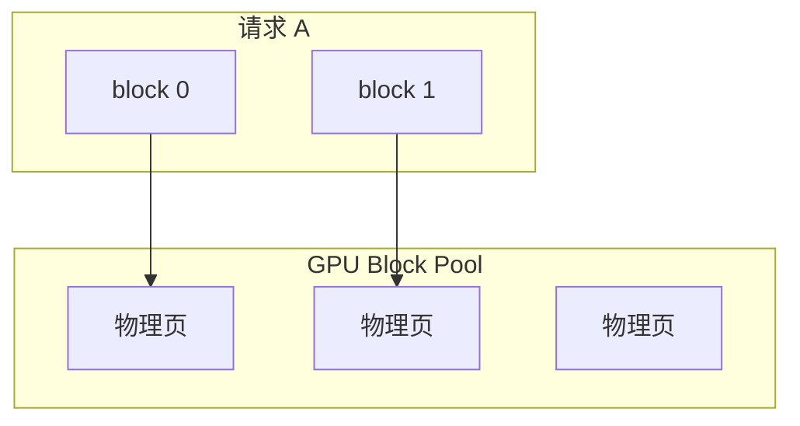

# 5.2.2 PagedAttention（vLLM）

## 要解决的问题

多用户并发时，各请求 KV Cache 长度动态变化。若预分配**连续**最大长度显存，利用率极低且易碎片；OOM 与无法批处理是早期 HF 推理服务的痛点。**PagedAttention** 将 KV 分页管理，借鉴 OS 虚拟内存思想，支撑高吞吐连续批处理。

## 核心概念

| 概念 | 传统连续 KV | PagedAttention |
| --- | --- | --- |
| 物理布局 | 每序列 `[max_len, …]` 连续块 | 固定大小 **block** 链表/表 |
| 扩展 | 常需 realloc 拷贝 | 追加新 block |
| 共享 | 难共享前缀 | 同 block 可共享（Prefix cache） |
| 碎片 | 高 | 低（按 block 回收） |

**Block 表**：每个 sequence 维护 block id 列表，注意力 kernel 按表 gather 非连续 KV。

逻辑 KV 体积公式仍同 [5.2.1](./01-kv-cache)：

$$
\text{KV\_bytes} \approx 2 L T H_{\text{kv}} d_h \cdot \text{dtype\_size}
$$

PagedAttention 改变的是**分配方式**，不减少渐近体积。

## 方法 / vLLM 调度要点

1. **Block 大小**：如 16 tokens/block，权衡元数据与碎片。
2. **Continuous batching**：新请求插入 batch；完成请求释放 block 回池（[5.6.2](../06-inference-serving/02-continuous-batching)）。
3. **Copy-on-write**：并行采样（parallel sampling）可共享 prompt blocks。
4. **与 FlashAttention**：vLLM 2.x 集成 FlashAttention-2/3 后端，Paged 负责显存管理。

## 工程实践

- **部署**：`vllm serve` 默认 PagedAttention；调 `--gpu-memory-utilization`、`--max-model-len`。
- **指标**：在固定并发下对比 **TPS** 与 **KV cache usage**（[5.1.4](../01-inference-basics/04-latency-metrics)）。
- **限制**：极小众自定义注意力算子需确认是否支持 paged 后端。

## 代表工作

- Kwon et al., *Efficient Memory Management for Large Language Model Serving with PagedAttention*（vLLM）
- 后续：SGLang RadixAttention、TensorRT-LLM KV cache manager

## 实践检查清单

- [ ] 固定评测/推理配置（温度、max_tokens、parser 版本）便于回归
- [ ] 记录硬件：GPU 型号、驱动、框架 commit
- [ ] 对比基线：未优化前 TTFT/TPOT 或 Acc
- [ ] 文档化失败案例：OOM、解析失败率、拒答率
- [ ] 交叉阅读本章「相关章节」避免孤立优化

## 局限与注意点

- Block 过小 → 表项开销大；过大 → 内部碎片上升，需压测。
- **Prefix 共享**需额外哈希/引用计数（见 [5.2.4](./04-prefix-prompt-caching)）。
- CPU offload KV 时 paging 策略与 GPU 路径不同，延迟模型更复杂。

## 延伸阅读

- 本仓库 [LLMs 入口](/llms/intro) 可回溯全局大纲；修改单点优化前建议先读上下游章节链接。
- 技术报告精读见 `llms/08-technical-reports/` 与 [paper-reading](/paper-reading/) 专栏。
- 工程复现优先锁定：框架版本 + 量化格式 + 评测 harness commit，三者缺一即难以对齐论文数字。

## 相关章节

- 同章：[5.2.1 KV Cache](./01-kv-cache) · [5.2.3 FlashAttention](./03-flash-attention) · [5.2.4 Prefix Caching](./04-prefix-prompt-caching)
- 服务：[5.6.1 框架对比](../06-inference-serving/01-inference-frameworks) · [5.6.2 连续批处理](../06-inference-serving/02-continuous-batching)
- 量化减 KV：[5.3.2 FP8/INT](../03-quantization/02-int-fp-formats)
