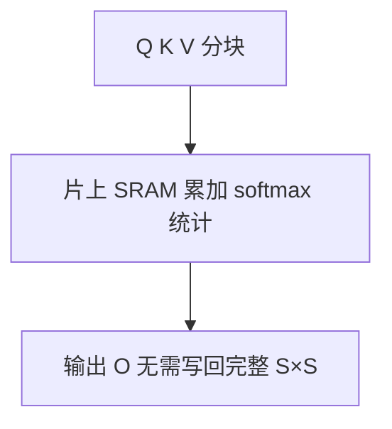

# FlashAttention 1/2/3

## 要解决的问题

标准注意力实现将 $S \times S$ 的注意力矩阵物化到 HBM，**IO 成为瓶颈**（算术强度低）。长序列 Prefill 与训练尤其明显。FlashAttention 通过分块（tiling）与在线 softmax 在 SRAM 内完成注意力，降低 HBM 读写，并与 KV Cache 推理路径融合。

## 核心概念

标准注意力 FLOPs（略）：

$$
O(T^2 d) \quad \text{但 HBM 访问可达 } O(T^2) \text{ 矩阵物化}
$$

**FlashAttention 思想**：分块计算 $Q,K,V$ 块，递推维护 softmax 的 max 与 sum，**不存完整** $\mathbf{P}=\text{softmax}(QK^\top/\sqrt{d})$。

| 版本 | 要点 | 典型收益场景 |
| --- | --- | --- |
| **FA-1** | IO 感知、精确注意力 | 训练长序列 |
| **FA-2** | 更少非 matmul、并行 seq/head | 训练 + 推理 Prefill |
| **FA-3** | Hopper FP8/Tensor Core 路径 | H100 级硬件 |

与 KV Cache：Decode 步 $T_q=1$，$T_k=T_{\text{cached}}$，FlashDecoding 类 kernel 对长 cache 仍减少带宽。

## 方法 / 使用层级

1. **训练**：`flash_attn` 替换 `nn.functional.scaled_dot_product_attention`（需 head dim / dtype 支持）。
2. **推理 Prefill**：长 prompt 一次前向加速明显，降低 **TTFT**（[5.1.4](../01-inference-basics/04-latency-metrics)）。
3. **推理 Decode**：与 PagedAttention 结合（vLLM、SGLang）；单 token 步收益小于 Prefill。
4. **变长批**：FA-2 varlen 接口处理 padding-free 训练（见 [3.5 分布式训练](../../03-pre-training/05-distributed-training/01-data-parallelism)）。

## 工程实践

- **依赖**：CUDA ≥ 11.6+、对应 GPU 架构 wheel；不支持的环境回退 math SDP。
- **数值**：与朴素注意力最大误差在 fp16/bf16 可接受范围；极端长序列需监控 inf。
- **选型**：Prefill 瓶颈 → 优先 FA；Decode 瓶颈 → 配合 KV 量化 + [5.5 推测解码](../05-accelerated-decoding/01-speculative-decoding)。

## 代表工作

- Dao et al., *FlashAttention: Fast and Memory-Efficient Exact Attention*（NeurIPS 2022）
- Dao, *FlashAttention-2*；Shah et al., *FlashAttention-3*（Hopper）

## 性能对比（Prefill vs Decode）

| 阶段 | 朴素 Attention | FlashAttention | 主要收益 |
| --- | --- | --- | --- |
| 长 Prompt Prefill | HBM 读写 $O(T^2)$ | 分块、不重写 $\mathbf{P}$ | TTFT ↓ |
| 单 token Decode | 读 KV $O(T)$ | 融合 kernel 减读写 | TPOT 小幅 ↓ |
| 训练长序列 | OOM 风险 | 可训练更长 $T$ | 与 [3.5](../../03-pre-training/05-distributed-training/01-data-parallelism) 相关 |

**启用检查清单**：GPU 架构匹配 wheel；`head_dim` 在支持列表；与 [5.2.2 PagedAttention](./02-paged-attention) 同版本 vLLM 构建。

## 实践检查清单

- [ ] 固定评测/推理配置（温度、max_tokens、parser 版本）便于回归
- [ ] 记录硬件：GPU 型号、驱动、框架 commit
- [ ] 对比基线：未优化前 TTFT/TPOT 或 Acc
- [ ] 文档化失败案例：OOM、解析失败率、拒答率
- [ ] 交叉阅读本章「相关章节」避免孤立优化

## 局限与注意点

- 不支持所有 attention 变体（如部分 sliding window 需专用 kernel）。
- **FP8** 路径依赖硬件与框架版本对齐。
- 与 [5.2.2 PagedAttention](./02-paged-attention) 集成由推理框架维护，勿手写混用除非熟悉 ABI。

## 延伸阅读

- 本仓库 [LLMs 入口](/llms/intro) 可回溯全局大纲；修改单点优化前建议先读上下游章节链接。
- 技术报告精读见 `llms/08-technical-reports/` 与 [paper-reading](/paper-reading/) 专栏。
- 工程复现优先锁定：框架版本 + 量化格式 + 评测 harness commit，三者缺一即难以对齐论文数字。

## 相关章节

- 同章：[5.2.1 KV Cache](./01-kv-cache) · [5.2.2 PagedAttention](./02-paged-attention)
- 原理：[2.2.2 缩放点积注意力](../../02-transformer/01-transformer-principles/02-scaled-dot-product-attention)
- 变体：[2.3.4 注意力变体](../../02-transformer/03-transformer-improvements/04-attention-variants)
