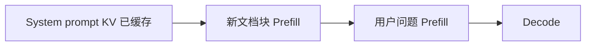

# Prefix Caching、Prompt Caching

## 要解决的问题

Agent、RAG、多轮对话中，**系统提示 + 文档 + 工具定义** 在成千上万请求间重复，却每次 Prefill 重算 KV，浪费算力与 TTFT。Prefix / Prompt Caching 对相同 token 前缀复用 KV Cache（或中间激活），使增量部分只做短 Prefill。

## 核心概念

| 术语 | 含义 |
| --- | --- |
| **Prefix Cache** | 以 token 序列为键，缓存其 KV blocks（vLLM、SGLang Radix） |
| **Prompt Caching** | 云 API（OpenAI、Anthropic）对稳定前缀计费折扣 + 低延迟 |
| **Radix Tree** | 多请求共享最长公共前缀的 KV 节点 |

命中时 TTFT 近似：

$$
\text{TTFT}_{\text{hit}} \approx \text{Prefill}(\Delta \text{ prompt}) \ll \text{Prefill}(\text{full prompt})
$$

未命中则回退完整 [5.2.1 KV Cache](./01-kv-cache) 构建。

## 方法 / 实现要点

1. **哈希键**：对 prefix token ids（或 block hash 链）索引；注意 **tokenizer 一致** 与 chat template。
2. **与 PagedAttention**：[5.2.2](./02-paged-attention) block 引用计数 + COW，释放时递减。
3. **SGLang RadixAttention**：树结构合并公共前缀；适合高 QPS 同系统提示。
4. **API 层**：客户端标记 `cache_control`（因厂商而异）；仅对静态段启用。

## 工程实践

- **适用**：固定 system prompt、重复 RAG corpus chunk、工具 schema；**不适用**每条都变的用户全文。
- **安全**：多租户缓存需隔离 namespace，防跨用户 KV 泄漏（待验证：依赖部署配置）。
- **成本模型**：按 cached token 折扣 + 存储占用；ROI 用命中率和节省的 Prefill FLOPs 估算。
- **观测**：`prefix_cache_hit_rate`、P50 TTFT 分层（hit vs miss）。

## 代表工作

- vLLM Automatic Prefix Caching 文档
- SGLang: *RadixAttention*；Anthropic/OpenAI Prompt Caching 产品说明
- 论文方向：CacheBlend、Prompt Cache 等（2024–2025）

## 实践检查清单

- [ ] 固定评测/推理配置（温度、max_tokens、parser 版本）便于回归
- [ ] 记录硬件：GPU 型号、驱动、框架 commit
- [ ] 对比基线：未优化前 TTFT/TPOT 或 Acc
- [ ] 文档化失败案例：OOM、解析失败率、拒答率
- [ ] 交叉阅读本章「相关章节」避免孤立优化

## 局限与注意点

- 模型权重更新或 **LoRA 切换** 后须失效缓存。
- 微小 prompt 改动（多一个空格）可能导致全文 cache miss。
- 与 [7.2.4 评测污染](../../07-evaluation/02-evaluation-methods/04-reliability-contamination) 无关，但压测勿把 hit 与 cold 混报。

## 术语速记

正文英文术语与开源实现（GitHub、Hugging Face）命名一致，便于检索源码与 Issue。

## 延伸阅读

- 本仓库 [LLMs 入口](/llms/intro) 可回溯全局大纲；修改单点优化前建议先读上下游章节链接。
- 技术报告精读见 `llms/08-technical-reports/` 与 [paper-reading](/paper-reading/) 专栏。
- 工程复现优先锁定：框架版本 + 量化格式 + 评测 harness commit，三者缺一即难以对齐论文数字。

## 相关章节

- 同章：[5.2.1](./01-kv-cache) · [5.2.2 PagedAttention](./02-paged-attention)
- Agent 应用：`docs/03-agent-application/` RAG 章节
- 延迟：[5.1.4 TTFT](../01-inference-basics/04-latency-metrics) · 服务 [5.6](../06-inference-serving/01-inference-frameworks)
