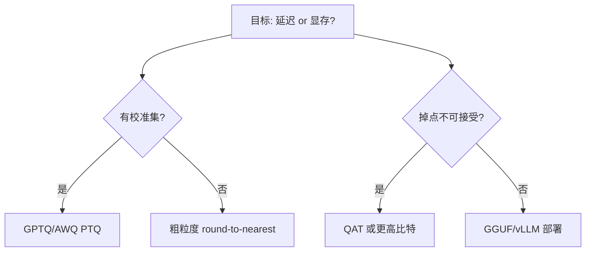

# 量化基础（PTQ vs QAT）

## 要解决的问题

FP16/BF16 权重与激活在推理时占用大量显存与带宽，限制 batch 与上下文长度。量化用低比特表示 $W$ 与（可选）激活，在精度可接受前提下提升 **TPS**、降低 **$/token**。需区分训练后量化 PTQ 与量化感知训练 QAT 两条路线。

## 核心概念

**均匀量化**（per-tensor / per-channel）：

$$
W_q = \text{clip}\left(\left\lfloor \frac{W}{s} \right\rceil + z,\, 0,\, 2^b-1\right), \quad \hat{W} = s \cdot (W_q - z)
$$

$s$ 为 scale，$z$ 为零点（对称量化常取 $z=0$），$b$ 为比特数。

| 路线 | 时机 | 优点 | 缺点 |
| --- | --- | --- | --- |
| **PTQ** | 训练完成后校准 | 快、无需重训 | 极低比特易掉点 |
| **QAT** | 训练中模拟量化 | 4bit/8bit 更稳 | 成本高、需 recipe |

| 对象 | 常见策略 | 对 LLM 影响 |
| --- | --- | --- |
| 权重 W | INT8/INT4/FP8 | 显存 ↓，decode 带宽 ↓ |
| 激活 A | 动态/静态 scale | 需 SmoothQuant 等防 outlier |
| KV Cache | FP8/INT8 | 长上下文显存关键（[5.2.1](../02-kv-cache-attention-optimization/01-kv-cache)） |

## 方法 / 选型流程

1. 选定比特与格式（[5.3.2](./02-int-fp-formats)）。
2. 选算法（[5.3.3 GPTQ/AWQ](./03-gptq-awq-smoothquant)）。
3. 在 [MMLU](../../07-evaluation/01-benchmarks/01-general-benchmarks)、业务集上回归。

## 工程实践

- **校准集**：512–2048 条代表性 prompt，覆盖领域；避免仅 Wiki 文本。
- **内核**：推理框架需 fused INT4/FP8 GEMM（Marlin、CUTLASS）。
- **与并行**：TP/PP 下各 rank 量化参数一致；加载时校验 shard。

## 代表工作

- Jacob et al., *Quantization and Training of Neural Networks for Efficient Integer-Arithmetic-Only Inference*
- GPTQ、AWQ、SmoothQuant（见 [5.3.3](./03-gptq-awq-smoothquant)）
- LLM.int8() outlier 处理

## 实践检查清单

- [ ] 固定评测/推理配置（温度、max_tokens、parser 版本）便于回归
- [ ] 记录硬件：GPU 型号、驱动、框架 commit
- [ ] 对比基线：未优化前 TTFT/TPOT 或 Acc
- [ ] 文档化失败案例：OOM、解析失败率、拒答率
- [ ] 交叉阅读本章「相关章节」避免孤立优化

## 局限与注意点

- 量化不能替代 **架构/数据** 缺陷；数学推理掉点常大于闲聊。
- 训练仍多用 BF16；量化主要面向 **推理**（[5.6](../06-inference-serving/01-inference-frameworks)）。
- 极低比特（1.58-bit）见 [5.3.5](./05-extreme-low-bit)，生态仍在演进。

## 延伸阅读

- 本仓库 [LLMs 入口](/llms/intro) 可回溯全局大纲；修改单点优化前建议先读上下游章节链接。
- 技术报告精读见 `llms/08-technical-reports/` 与 [paper-reading](/paper-reading/) 专栏。
- 工程复现优先锁定：框架版本 + 量化格式 + 评测 harness commit，三者缺一即难以对齐论文数字。

## 相关章节

- 同章：[5.3.2 格式](./02-int-fp-formats) · [5.3.3 算法](./03-gptq-awq-smoothquant) · [5.3.4 工具](./04-bitsandbytes-gguf-exl2)
- KV：[5.2.1](../02-kv-cache-attention-optimization/01-kv-cache)
- 压缩：[5.4](../04-model-compression/01-pruning)
