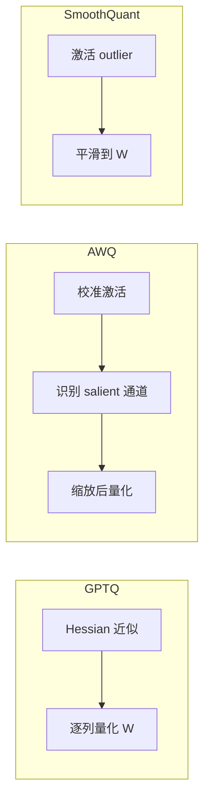

# 5.3.3 GPTQ、AWQ、SmoothQuant

## 要解决的问题

朴素 round-to-nearest 在 LLM 上常导致 perplexity 飙升。**GPTQ** 用 Hessian 近似逐层补偿误差；**AWQ** 保护 salient 权重通道；**SmoothQuant** 将激活难度迁移到权重，使 W8A8 可行。三者解决不同瓶颈，可组合理解但不宜混为一谈。

## 核心概念

| 方法 | 核心思想 | 主要对象 | 典型比特 |
| --- | --- | --- | --- |
| **GPTQ** | 按列贪心量化 + Hessian 逆补偿 | 权重 W | INT4/INT3 |
| **AWQ** | 激活感知：放大 salient 权重通道 | 权重 W | INT4 |
| **SmoothQuant** | $Y = (X/s_x)(s_x W)$ 平滑激活 outlier | W + A | INT8 W8A8 |

**SmoothQuant 迁移**（逐通道）：

$$
\hat{X} = X / s_x, \quad \hat{W} = s_x \odot W, \quad Y = \hat{X} \hat{W}
$$

$s_x$ 使 $\hat{X}$ 动态范围适合 INT8。

## 方法 / 使用流程

**GPTQ / AWQ（PTQ，推理导向）**

1. 准备校准文本（与 [5.3.1](./01-quantization-basics) 相同）。
2. `AutoGPTQ` / `llm-awq` 导出 INT4 权重。
3. vLLM、llama.cpp（AWQ/GPTQ 分支）加载 fused kernel。

**SmoothQuant（偏 W8A8）**

1. 采集激活统计得 $s_x$。
2. 融合平滑因子到 LayerNorm/Linear。
3. TensorRT-LLM、ONNX Runtime 部署 INT8 kernel。

## 工程实践

- **7B vs 70B**：大模型 INT4 掉点相对小，但需验证 [HumanEval](../../07-evaluation/01-benchmarks/02-reasoning-benchmarks)。
- **与 LoRA**：先合并 adapter 再 GPTQ，或 QLoRA 训练路径（[4.6 PEFT](../../04-post-training-alignment/06-peft/03-lora-qlora)）。
- **时间成本**：70B GPTQ 需多卡、数小时；AWQ 通常更快。

## 代表工作

- Frantar et al., *GPTQ: Accurate Post-Training Quantization for Generative Pre-trained Transformers*
- Lin et al., *AWQ: Activation-aware Weight Quantization for LLM Compression and Acceleration*
- Xiao et al., *SmoothQuant: Accurate and Efficient Post-Training Quantization for Large Language Models*

## 实践检查清单

- [ ] 固定评测/推理配置（温度、max_tokens、parser 版本）便于回归
- [ ] 记录硬件：GPU 型号、驱动、框架 commit
- [ ] 对比基线：未优化前 TTFT/TPOT 或 Acc
- [ ] 文档化失败案例：OOM、解析失败率、拒答率
- [ ] 交叉阅读本章「相关章节」避免孤立优化

## 局限与注意点

- GPTQ 对 **MoE**、特殊线性层需分支支持（待验证：随框架更新）。
- AWQ 与 GPTQ 不要重复量化同一 checkpoint。
- SmoothQuant 主要服务 INT8；INT4 仍以 GPTQ/AWQ 为主。

## 相关章节

- 同章：[5.3.1](./01-quantization-basics) · [5.3.2 格式](./02-int-fp-formats) · [5.3.4 运行时](./04-bitsandbytes-gguf-exl2)
- 部署：[5.6.1 框架](../06-inference-serving/01-inference-frameworks)
