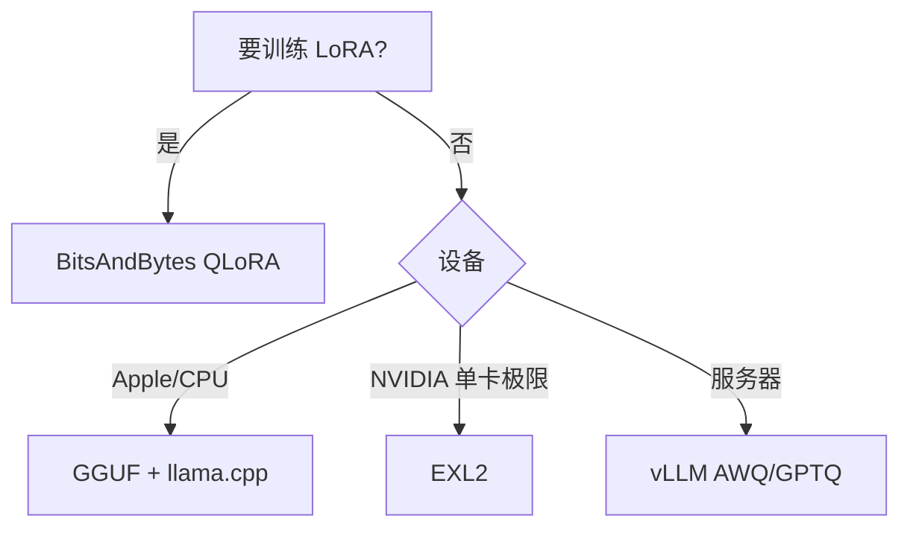

# 5.3.4 BitsAndBytes、GGUF、EXL2

## 要解决的问题

研究者在单卡上微调/推理需要 **即插即用** 的 4/8bit 加载；社区本地运行依赖 **GGUF** 单文件分发；部分消费级 GPU 追求 **EXL2** 等极端压缩。三类工具覆盖 Hugging Face、llama.cpp、ExLlama 生态，与云侧 vLLM 路径互补。

## 核心概念

| 栈 | 核心组件 | 典型场景 |
| --- | --- | --- |
| **BitsAndBytes** | `load_in_4bit/8bit`、NF4、双量化 | QLoRA 微调、单卡推理 |
| **GGUF** | llama.cpp 容器格式，多种 `Q*_K_*` | Mac/CPU/边缘 [5.6.4](../06-inference-serving/04-edge-deployment) |
| **EXL2** | 混合比特分层、ExLlamaV2 内核 | 单卡跑 70B 级（显存极限） |

**BitsAndBytes 4bit**（概念）：

- 存储 NF4 codebook + 嵌套量化 scale（double quant）。
- 计算时 dequant 到 BF16 做 matmul（或 fused）。

**GGUF 量化档位**（示意）：

| 档位 | 特点 | 相对质量 |
| --- | --- | --- |
| Q8_0 | 8bit 均匀 | 最高 |
| Q4_K_M | 4bit + 重要张量 6bit | 平衡 |
| Q3_K_S | 更激进 | 体积小、掉点大 |
| IQ 系列 | importance 加权 | 新档持续增加 |

## 方法 / 选型

1. HF Hub 下载 `*.gguf` 或自行 `convert_hf_to_gguf.py`。
2. `llama-server` / Ollama 加载；调 `ctx_size`、`n_gpu_layers`。
3. EXL2 需专用 exporter，与 GGUF 不互通。

## 工程实践

- **QLoRA**：`bnb_4bit_compute_dtype=bfloat16`，配合 [4.6.3 LoRA](../../04-post-training-alignment/06-peft/03-lora-qlora)。
- **评测对齐**：GGUF 与 FP16 分数差需在 [7.1 MMLU](../../07-evaluation/01-benchmarks/01-general-benchmarks) 上报档位名。
- **安全**：仅从可信源下载 GGUF，防篡改权重。

## 代表工作

- Dettmers et al., QLoRA（BitsAndBytes）
- llama.cpp / ggml 项目与 Gerganov 社区格式
- turboderp ExLlamaV2

## 实践检查清单

- [ ] 固定评测/推理配置（温度、max_tokens、parser 版本）便于回归
- [ ] 记录硬件：GPU 型号、驱动、框架 commit
- [ ] 对比基线：未优化前 TTFT/TPOT 或 Acc
- [ ] 文档化失败案例：OOM、解析失败率、拒答率
- [ ] 交叉阅读本章「相关章节」避免孤立优化

## 局限与注意点

- BitsAndBytes 训练速度低于全精度；大集群训练仍用 BF16+ZeRO。
- GGUF 新架构（MoE、新 rope）需等待 converter 更新。
- EXL2 生态小于 GGUF，可移植性弱。

## 延伸阅读

- 本仓库 [LLMs 入口](/llms/intro) 可回溯全局大纲；修改单点优化前建议先读上下游章节链接。
- 技术报告精读见 `llms/08-technical-reports/` 与 [paper-reading](/paper-reading/) 专栏。
- 工程复现优先锁定：框架版本 + 量化格式 + 评测 harness commit，三者缺一即难以对齐论文数字。

## 相关章节

- 同章：[5.3.1](./01-quantization-basics) · [5.3.3 GPTQ/AWQ](./03-gptq-awq-smoothquant)
- 边缘：[5.6.4 边缘部署](../06-inference-serving/04-edge-deployment)
- PEFT：[4.6.3 QLoRA](../../04-post-training-alignment/06-peft/03-lora-qlora)
