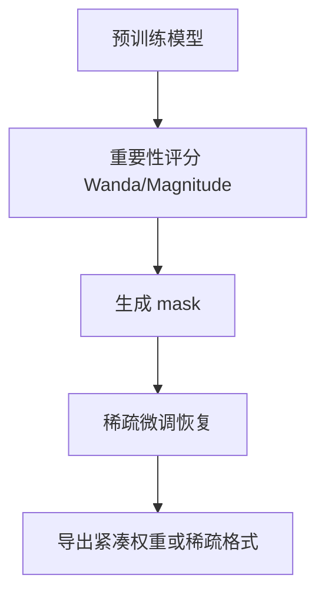

# 剪枝（结构化与非结构化）

## 要解决的问题

部署预算固定时，除 [5.3 量化](../03-quantization/01-quantization-basics) 外还可**删除冗余参数或结构**。剪枝分非结构化（稀疏权重）与结构化（整通道/层/头），后者直接缩小矩阵维度、利于真实加速，但 LLM 上大规模剪枝仍需谨慎验证 perplexity 与下游任务。

## 核心概念

| 类型 | 粒度 | 硬件友好 | LLM 典型做法 |
| --- | --- | --- | --- |
| **非结构化** | 单个权重 | 需稀疏 kernel | magnitude pruning + 微调恢复 |
| **结构化** | 通道/头/层 | 高 | 宽度剪枝、层 dropping |
| **半结构化 2:4** | NVIDIA 模式 | Ampere+ | 部分 conv/linear 可用 |

剪枝后稀疏度 $s$：

$$
\text{Params\_eff} \approx (1-s) \cdot \text{Params\_full}
$$

结构化剪枝第 $l$ 层 FFN 中间维 $d_{\text{ff}}' = (1-s) d_{\text{ff}}$ 时，该层 FLOPs 近似同比下降。

## 方法 / 流程

1. **One-shot**：按 $|w|$ 或激活统计（Wanda）剪枝，再短期 SFT 恢复。
2. **迭代**：剪枝 → 微调 → 再剪枝，逐步提稀疏度。
3. **与蒸馏结合**：剪枝学生 + 大模型教师（[5.4.2](./02-knowledge-distillation)）。
4. **与量化叠加**：先结构化剪枝再 INT4（注意 kernel 是否支持该形状）。

## 工程实践

- **加速现实**：非结构化 50% 稀疏若无专用 kernel，端到端可能**无加速**。
- **评测**：除 ppl 外必跑 [MMLU](../../07-evaluation/01-benchmarks/01-general-benchmarks)、[HumanEval](../../07-evaluation/01-benchmarks/02-reasoning-benchmarks)。
- **工具**：`torch-pruning`、NVIDIA Model Optimizer；MoE 专家剪枝为活跃研究方向。

## 代表工作

- Han et al., *Learning both Weights and Connections for Efficient Neural Networks*
- Sun et al., *A Simple and Effective Pruning Approach for Large Language Models*（Wanda）
- Frantar & Alistarh, SparseGPT（一次性稀疏化）

## 剪枝率与加速对照（经验）

| 稀疏度 | 需专用 kernel | ppl 影响 | 建议 |
| --- | --- | --- | --- |
| 非结构化 50% | 是 | 中–高 | 研究向 |
| 结构化 20% 宽度 | 较易 | 中 | 配合微调 |
| 2:4 半结构化 | NVIDIA | 低–中 | 推理栈支持时优先 |

剪枝后务必在目标推理框架上实测 **TPS**，勿只看参数量减少比例。

## 局限与注意点

- LLM **大矩阵** 对剪枝敏感，10%+ 非结构化常需长恢复训练。
- 结构化剪枝改变 checkpoint，与标准 HF config 可能不兼容。
- 个人理解：生产首选仍是量化 + 小模型，剪枝更多用于研究与专用芯片。

## 术语对照（中英）

本节英文关键词：**结构化与非结构化**（与社区论文、API 文档检索一致）。

## 延伸阅读

- 本仓库 [LLMs 入口](/llms/intro) 可回溯全局大纲；修改单点优化前建议先读上下游章节链接。
- 技术报告精读见 `llms/08-technical-reports/` 与 [paper-reading](/paper-reading/) 专栏。
- 工程复现优先锁定：框架版本 + 量化格式 + 评测 harness commit，三者缺一即难以对齐论文数字。

## 相关章节

- 同章：[5.4.2 蒸馏](./02-knowledge-distillation) · [5.4.3 小模型](./03-small-model-design)
- 量化：[5.3](../03-quantization/01-quantization-basics)
- 预训练规模：[3.4 Scaling Laws](../../03-pre-training/04-scaling-laws/01-kaplan-scaling-laws)
