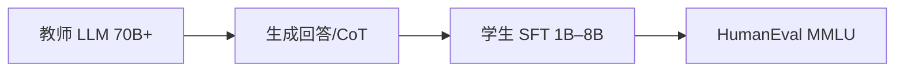

# 5.4.2 知识蒸馏（Hinton 蒸馏、序列级蒸馏）

## 要解决的问题

大模型能力强但推理贵；**蒸馏**将教师 $T$ 的行为迁移到学生 $S$（更小参数或更浅层），在固定延迟预算下保留尽可能多的任务性能。LLM 时代从 logits 匹配扩展到**序列级、思维链、工具轨迹**蒸馏。

## 核心概念

经典 **KL 蒸馏**（温度 $\tau$）：

$$
\mathcal{L}_{\text{KD}} = \tau^2 \cdot \text{KL}\left( \sigma(z^T/\tau) \,\|\, \sigma(z^S/\tau) \right)
$$

常与学生交叉熵 $\mathcal{L}_{\text{CE}}$ 加权：$\mathcal{L} = \alpha \mathcal{L}_{\text{KD}} + (1-\alpha)\mathcal{L}_{\text{CE}}$。

| 蒸馏类型 | 监督信号 | 代表场景 |
| --- | --- | --- |
| Logit / token 级 | 教师 softmax | 小模型预训练续训 |
| **序列级** | 教师整段输出作 label | Alpaca 类指令数据 |
| **CoT 蒸馏** | 长推理链 | 推理小模型（第六部分） |
| **黑盒** | 仅文本 API | 无 logits，纯 SFT on 教师输出 |

## 方法 / LLM 实践配方

1. **数据**：教师在高质 prompt 上采样；过滤拒答、幻觉（可用 RM，见 [4.3 RLHF](../../04-post-training-alignment/03-rlhf/02-reward-model)）。
2. **训练**：学生因果 LM + 可选 KL（若可访问教师 logits）。
3. **对齐链**：蒸馏常替代或补充 RLHF 前的 SFT（[4.1 SFT](../../04-post-training-alignment/01-sft/01-sft-overview)）。
4. **与量化**：先蒸馏 FP 学生，再 [5.3 GPTQ](../03-quantization/03-gptq-awq-smoothquant)。

## 工程实践

- **成本**：教师推理账单可能高于学生训练；用 batch API、缓存 prompt（[5.2.4](../02-kv-cache-attention-optimization/04-prefix-prompt-caching)）。
- **代表学生**：Phi、Gemma、Qwen2.5-1.5B 等均披露蒸馏或合成数据成分（[5.4.3](./03-small-model-design)）。
- **评测**：[MMLU](../../07-evaluation/01-benchmarks/01-general-benchmarks)、领域集；报告教师→学生掉点。

## 代表工作

- Hinton et al., *Distilling the Knowledge in a Neural Network*
- Gu et al., *MiniLLM: Knowledge Distillation of Large Language Models*
- 工业：Phi 技术报告、Gemini Nano 蒸馏叙述

## 实践检查清单

- [ ] 固定评测/推理配置（温度、max_tokens、parser 版本）便于回归
- [ ] 记录硬件：GPU 型号、驱动、框架 commit
- [ ] 对比基线：未优化前 TTFT/TPOT 或 Acc
- [ ] 文档化失败案例：OOM、解析失败率、拒答率
- [ ] 交叉阅读本章「相关章节」避免孤立优化

## 局限与注意点

- 学生容量不足时，复杂推理（[6.1 数学推理](../../06-reasoning-test-time-compute/01-complex-reasoning/01-mathematical-reasoning)）掉点显著。
- 教师偏见/幻觉会**原样继承**；需数据清洗。
- 黑盒蒸馏无法匹配中间层表示，上限低于白盒 KL。

## 术语对照（中英）

本节英文关键词：**Hinton 蒸馏、序列级蒸馏**（与社区论文、API 文档检索一致）。

## 延伸阅读

- 本仓库 [LLMs 入口](/llms/intro) 可回溯全局大纲；修改单点优化前建议先读上下游章节链接。
- 技术报告精读见 `llms/08-technical-reports/` 与 [paper-reading](/paper-reading/) 专栏。
- 工程复现优先锁定：框架版本 + 量化格式 + 评测 harness commit，三者缺一即难以对齐论文数字。

## 相关章节

- 同章：[5.4.1 剪枝](./01-pruning) · [5.4.3 小模型](./03-small-model-design)
- 对齐：[4.1 SFT](../../04-post-training-alignment/01-sft/02-data-construction)
- 推理模型：[6.3.3 长 CoT 训练](../../06-reasoning-test-time-compute/03-rl-reasoning/03-long-cot-training)
