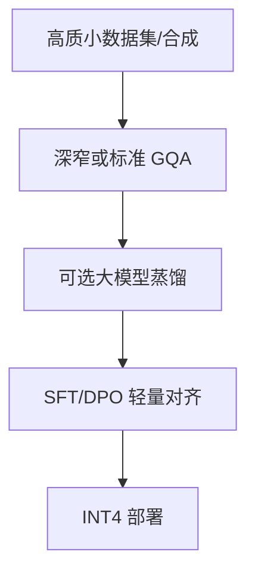

# 小模型设计（Phi、Gemma Nano、MobileLLM）

## 要解决的问题

端侧、低延迟 API、嵌入流水线需要 **不足 10B 甚至不足 3B** 的强基座。小模型不是简单缩小层数，而是 **数据质量、架构效率、蒸馏与训练步数** 共同决定是否在 MMLU/HumanEval 上「以小博大」。

## 核心概念

| 系列 | 参数量级 | 设计亮点 | 部署 |
| --- | --- | --- | --- |
| **Phi-3/4** | 3.8B–14B | 教科书级合成数据、深度缩放 | ONNX、移动 |
| **Gemma 2/3** | 1B–27B | Google 数据配方、多模态扩展 | Keras、TPU |
| **MobileLLM** | 不足 1B | 深窄架构、embedding 占比高 | 手机 on-device |
| **Qwen2.5-0.5B/1.5B** | 亚 2B | 多语言、开源全栈 | vLLM、GGUF |

**Chinchilla 视角**（[3.4.2](../../03-pre-training/04-scaling-laws/02-chinchilla-scaling-laws)）：小模型应在**更多 token/更好数据**上训练至 compute-optimal，而非盲目减层。

$$
N_{\text{opt}} \propto C^{0.5},\quad D_{\text{opt}} \propto C^{0.5}
$$

固定算力 $C$ 下，减 $N$ 应增 $D$（数据 token 数）。

## 方法 / 架构取舍

1. **深 vs 宽**：MobileLLM 主张少层窄 hidden 改为多层，提升表示力/参数比。
2. **GQA**：减 KV 头降推理显存（[5.2.1](../02-kv-cache-attention-optimization/01-kv-cache)）。
3. **词表**：多语言大词表对小模型不利，区域化可缩小 $|V|$。
4. **后训练**：小模型 RLHF 收益有限，高质量 SFT 往往性价比更高。

## 工程实践

- **本地**：1.5B Q4 GGUF 可在笔记本流畅运行（[5.6.4](../06-inference-serving/04-edge-deployment)）。
- **路由**：大小模型 cascade——易题小模型，难题调大模型（省成本，待验证路由策略）。
- **基准**：[MMLU](../../07-evaluation/01-benchmarks/01-general-benchmarks)、[HumanEval](../../07-evaluation/01-benchmarks/02-reasoning-benchmarks)、[SuperCLUE](../../07-evaluation/01-benchmarks/03-multilingual-chinese-benchmarks) 小模型榜。

## 代表工作

- Abdin et al., *Phi-3 Technical Report*
- Google Gemma 2/3；Liu et al., *MobileLLM: Optimizing Sub-billion Parameter Language Models for On-Device Use*

## 实践检查清单

- [ ] 固定评测/推理配置（温度、max_tokens、parser 版本）便于回归
- [ ] 记录硬件：GPU 型号、驱动、框架 commit
- [ ] 对比基线：未优化前 TTFT/TPOT 或 Acc
- [ ] 文档化失败案例：OOM、解析失败率、拒答率
- [ ] 交叉阅读本章「相关章节」避免孤立优化

## 局限与注意点

- 小模型 **不宜** 承担长链数学 Agent 主脑（见 [6.1.4 多步瓶颈](../../06-reasoning-test-time-compute/01-complex-reasoning/04-multi-step-bottleneck)）。
- 合成数据比例过高可能损害多样性（个人理解，需 ablation）。
- 多模态小模型额外占视觉 encoder 显存。

## 术语对照（中英）

本节英文关键词：**Phi、Gemma Nano、MobileLLM**（与社区论文、API 文档检索一致）。

## 延伸阅读

- 本仓库 [LLMs 入口](/llms/intro) 可回溯全局大纲；修改单点优化前建议先读上下游章节链接。
- 技术报告精读见 `llms/08-technical-reports/` 与 [paper-reading](/paper-reading/) 专栏。
- 工程复现优先锁定：框架版本 + 量化格式 + 评测 harness commit，三者缺一即难以对齐论文数字。

## 相关章节

- 同章：[5.4.2 蒸馏](./02-knowledge-distillation) · [5.4.1 剪枝](./01-pruning)
- Scaling：[3.4.2 Chinchilla](../../03-pre-training/04-scaling-laws/02-chinchilla-scaling-laws)
- 量化：[5.3.4 GGUF](../03-quantization/04-bitsandbytes-gguf-exl2)
