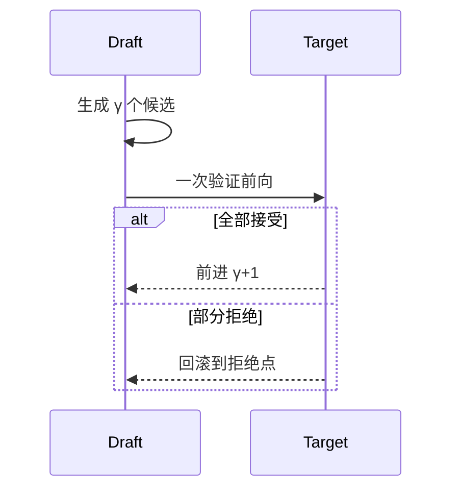

# 5.5.1 推测解码（Speculative Decoding）

## 要解决的问题

自回归 Decode 每步一次大模型前向，**TPOT** 高。推测解码用**小 draft 模型**（或 n-gram）一次提出 $\gamma$ 个候选 token，大 **target 模型** 并行验证，接受则一步前进多 token，拒绝则回滚，在分布不变前提下加速（无损 speculative sampling）。

## 核心概念

设 draft 提出候选 $x_{t+1:t+\gamma}$，target 计算一次前向得各位置概率。

**朴素接受规则**（示意）：从 $i=1$ 起，若

$$
r_i < \frac{p_{\text{target}}(x_{t+i} \mid x_{<t+i})}{p_{\text{draft}}(x_{t+i} \mid x_{<t+i})}
$$

（$r_i \sim U(0,1)$）则接受，否则在 $i$ 处修正并丢弃后续。

期望每步接受长度 $E[\text{accepted}]$ 越大，加速比越高：

$$
\text{Speedup} \approx \frac{E[\text{accepted}] + 1}{1 + \frac{T_{\text{draft}}}{T_{\text{target}}} \cdot \gamma}
$$

（粗估，依赖实现与 $\gamma$。）

| 组件 | 角色 | 要求 |
| --- | --- | --- |
| Draft | 提议 | 快、与 target 分布接近 |
| Target | 验证 | 原模型质量 |
| KV | 两套 cache | 接受/拒绝时同步 |

## 方法 / 部署变体

1. **独立小模型**：如 Llama-70B + 7B draft（同族 tokenizer）。
2. **Medusa/EAGLE**：/heads 附加于 target，见 [5.5.2](./02-medusa-eagle-lookahead)。
3. **vLLM**：`--speculative-model`；调 `num_speculative_tokens`。
4. **与量化**：draft INT4、target FP8 常见组合。

## 工程实践

- **接受率**监控：低于 ~60% 时加速有限，应换 draft 或减 $\gamma$。
- **延迟**：短输出场景 draft 开销占比大，收益弱。
- **评测**：加速不改变分布时 [MMLU](../../07-evaluation/01-benchmarks/01-general-benchmarks) 应与基线一致；有损变体需单独标注。

## 代表工作

- Leviathan et al., *Fast Inference from Transformers via Speculative Decoding*
- Chen et al., *Accelerating Large Language Model Decoding with Speculative Sampling*

## 实践检查清单

- [ ] 固定评测/推理配置（温度、max_tokens、parser 版本）便于回归
- [ ] 记录硬件：GPU 型号、驱动、框架 commit
- [ ] 对比基线：未优化前 TTFT/TPOT 或 Acc
- [ ] 文档化失败案例：OOM、解析失败率、拒答率
- [ ] 交叉阅读本章「相关章节」避免孤立优化

## 局限与注意点

- Draft/target **词表与模板** 必须一致。
- 批处理下各请求接受长度不同，调度复杂（vLLM 持续优化中）。
- 与 [5.5.3 并行解码](./03-parallel-decoding-skip) 不同路径，不宜混用同一 forward。

## 相关章节

- 同章：[5.5.2 Medusa/EAGLE](./02-medusa-eagle-lookahead) · [5.5.3 并行解码](./03-parallel-decoding-skip)
- 基础：[5.1.1 自回归](../01-inference-basics/01-autoregressive-decoding) · [5.1.4 TPOT](../01-inference-basics/04-latency-metrics)
- KV：[5.2.1](../02-kv-cache-attention-optimization/01-kv-cache)
