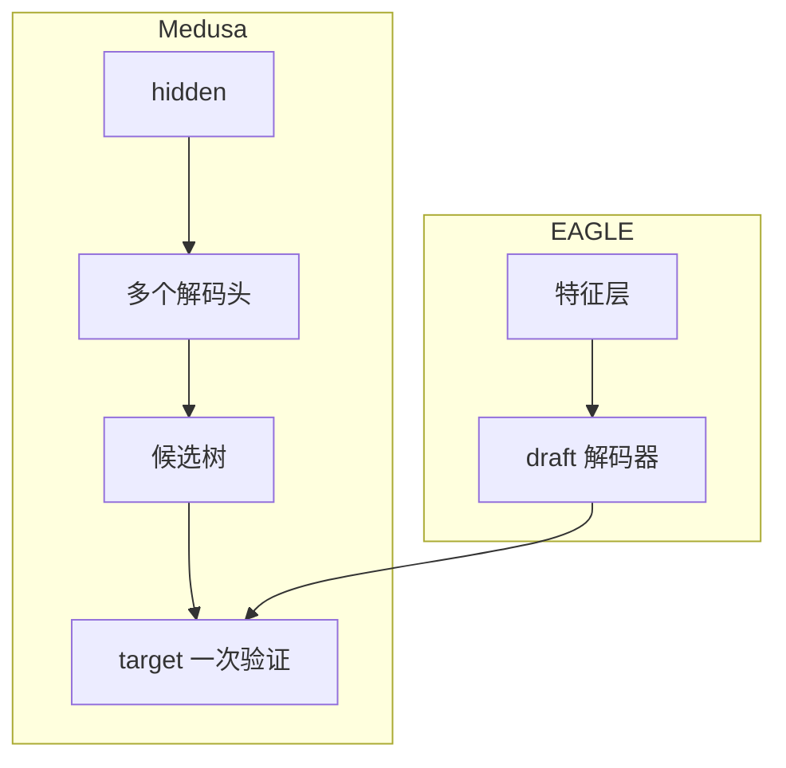

# Medusa、EAGLE、Lookahead Decoding

## 要解决的问题

独立 draft 模型增加显存与维护成本。**Medusa** 在 target 上加多个解码头并行猜 token；**EAGLE** 用特征层 draft 并自回归 draft 链；**Lookahead** 用 Jacobi 式并行迭代在单模型内试探。三者都在 [5.5.1 推测](./01-speculative-decoding) 框架下减少 target 步数。

## 核心概念

| 方法 | Draft 来源 | 训练 | 特点 |
| --- | --- | --- | --- |
| **Medusa** | 额外 LM heads on 顶层 hidden | 需 Medusa heads 微调 | 多候选树，一次验证 |
| **EAGLE** | 浅层特征 + 小 decoder | 特征空间 draft | 接受率高，vLLM 集成 |
| **Lookahead (Jacobi)** | 同模型固定点迭代 | 无需第二模型 | 实现简单，依赖收敛 |

**Medusa 树验证**：对 $k$ 个 head 提出的分支做 target 前向，选最长一致前缀（与 speculative 接受规则类似）。

**EAGLE 思想**：在 $h_{t}$ 特征上预测 $x_{t+1}$ 分布，比纯 token draft 更贴近 target 表示。

## 方法 / 集成

1. **Medusa**：训练 heads（冻结 backbone 或联合）；推理时 `medusa_num_heads` 配置。
2. **EAGLE-2/3**：改进 draft 训练与缓存；Hugging Face / vLLM 插件加载。
3. **Lookahead**：设置 `lookahead_slots`；适合无第二 GPU 显存场景。
4. 与 [5.2 KV](../02-kv-cache-attention-optimization/01-kv-cache) 联动：验证步需维护 speculative cache 槽位。

## 工程实践

- **显存**：Medusa heads 增量小；EAGLE draft 模块 + KV 仍占显存。
- **吞吐**：报告 tokens/s 时注明是否含 draft 训练后 checkpoint。
- **质量**：EAGLE 论文在 MT-bench、推理集上报告近无损；部署需版本对齐。

## 代表工作

- Cai et al., *Medusa: Simple LLM Inference Acceleration Framework with Multiple Decoding Heads*
- Li et al., *EAGLE: Speculative Sampling Requires Rethinking Feature Uncertainty*
- Fu et al., *Breaking the Sequential Dependency of LLM Inference Using Lookahead Decoding*

## 实践检查清单

- [ ] 固定评测/推理配置（温度、max_tokens、parser 版本）便于回归
- [ ] 记录硬件：GPU 型号、驱动、框架 commit
- [ ] 对比基线：未优化前 TTFT/TPOT 或 Acc
- [ ] 文档化失败案例：OOM、解析失败率、拒答率
- [ ] 交叉阅读本章「相关章节」避免孤立优化

## 局限与注意点

- Medusa/EAGLE 需**额外训练**，非任意 checkpoint 即插即用。
- 与 MoE、新架构（DeepSeek-V3）集成进度因版本而异（待验证）。
- Lookahead 对长程依赖任务接受率波动大。

## 术语速记

正文英文术语与开源实现（GitHub、Hugging Face）命名一致，便于检索源码与 Issue。

## 延伸阅读

- 本仓库 [LLMs 入口](/llms/intro) 可回溯全局大纲；修改单点优化前建议先读上下游章节链接。
- 技术报告精读见 `llms/08-technical-reports/` 与 [paper-reading](/paper-reading/) 专栏。
- 工程复现优先锁定：框架版本 + 量化格式 + 评测 harness commit，三者缺一即难以对齐论文数字。

## 相关章节

- 同章：[5.5.1 推测解码](./01-speculative-decoding) · [5.5.3 并行与跳层](./03-parallel-decoding-skip)
- 服务：[5.6.1 vLLM/SGLang](../06-inference-serving/01-inference-frameworks)
- 推理模型长输出：[6.2.1 o1 范式](../../06-reasoning-test-time-compute/02-test-time-compute/01-o1-o3-paradigm)
