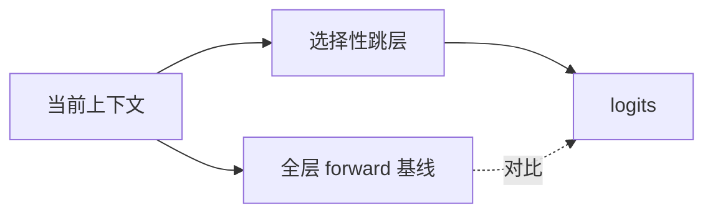

# 并行解码与跳层

## 要解决的问题

推测解码仍依赖串行验证步；**并行解码**尝试一次前向产生多个 token（非自回归或块自回归），或 **Skip Decode / 层跳过** 在置信度高时省略部分层计算，进一步压低 TPOT。路线更激进，质量与加速的权衡需严格评测。

## 核心概念

| 路线 | 机制 | 质量 | 成熟度 |
| --- | --- | --- | --- |
| **非自回归 NAT** | 整句并行生成 | 易损流畅度 | 研究为主 |
| **块并行 / Medusa 类** | 块内多 token | 近无损 | 产品化中 |
| **Skip Layer** | 早停/跳层 FFN-Attn | 依任务 | 实验性 |
| **Parallel Decoding (Stern et al.)** | 多 token 同步预测 | 中 | 2024+ 论文 |

**跳层直觉**：若中间层 hidden 变化 $\|\Delta h\|$ 小，则跳过该层：

$$
\text{skip layer } \ell \text{ if } \|\Delta h^{(\ell)}\| < \epsilon
$$

（个人理解：生产慎用，需任务级校准。）

## 方法 / 与推测解码关系

- [5.5.1 Speculative](./01-speculative-decoding)：**分布保持**的加速金标准。
- [5.5.2 Medusa/EAGLE](./02-medusa-eagle-lookahead)：结构化 draft + 验证。
- **本节跳层/并行**：可能改变输出分布，适合延迟敏感、质量容忍场景（草稿、代码补全首屏）。

## 工程实践

- **A/B**：对比 [5.1.4 TPOT](../01-inference-basics/04-latency-metrics) 与业务指标（点击率、人工评分 [7.2.3](../../07-evaluation/02-evaluation-methods/03-human-evaluation)）。
- **硬件**：跳层减少计算但不减 KV 读（[5.2.1](../02-kv-cache-attention-optimization/01-kv-cache)），长上下文仍带宽受限。
- **框架**：关注 SGLang、TensorRT-LLM 的 speculative + cuda graph 组合。

## 代表工作

- Stern et al., *Blockwise Parallel Decoding for Deep Autoregressive Models*
- Elhoushi et al., *Layer Skip* 类工作（2024）
- 非自回归：Gu et al., NAT 系列（背景）

## 实践检查清单

- [ ] 固定评测/推理配置（温度、max_tokens、parser 版本）便于回归
- [ ] 记录硬件：GPU 型号、驱动、框架 commit
- [ ] 对比基线：未优化前 TTFT/TPOT 或 Acc
- [ ] 文档化失败案例：OOM、解析失败率、拒答率
- [ ] 交叉阅读本章「相关章节」避免孤立优化

## 局限与注意点

- 并行生成对 **数学/代码**（[6.1](../../06-reasoning-test-time-compute/01-complex-reasoning/01-mathematical-reasoning)）错误率上升明显。
- 跳层与 **量化**（[5.3](../03-quantization/01-quantization-basics)）叠加时误差累积待验证。
- 评测必须固定 temperature，见 [7.2.4](../../07-evaluation/02-evaluation-methods/04-reliability-contamination)。

## 术语速记

正文英文术语与开源实现（GitHub、Hugging Face）命名一致，便于检索源码与 Issue。

## 延伸阅读

- 本仓库 [LLMs 入口](/llms/intro) 可回溯全局大纲；修改单点优化前建议先读上下游章节链接。
- 技术报告精读见 `llms/08-technical-reports/` 与 [paper-reading](/paper-reading/) 专栏。
- 工程复现优先锁定：框架版本 + 量化格式 + 评测 harness commit，三者缺一即难以对齐论文数字。

## 相关章节

- 同章：[5.5.1](./01-speculative-decoding) · [5.5.2 Medusa/EAGLE](./02-medusa-eagle-lookahead)
- Transformer：[2.3.4 注意力变体](../../02-transformer/03-transformer-improvements/04-attention-variants)
- 测试时计算：[6.2.5 推理 Scaling](../../06-reasoning-test-time-compute/02-test-time-compute/05-inference-scaling-laws)
