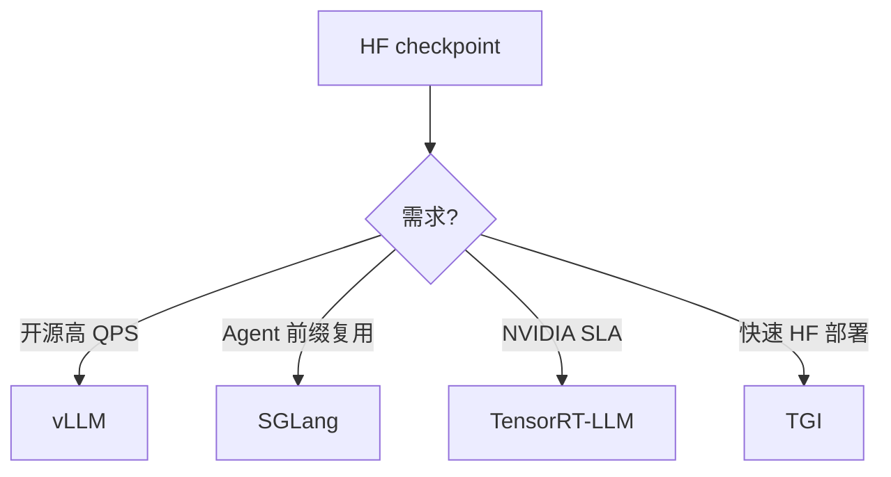

# 推理框架对比（vLLM、TGI、TensorRT-LLM、SGLang、LMDeploy）

## 要解决的问题

同一 Hugging Face checkpoint 在不同 serving 栈上 **TPS、TTFT、功能** 可差数倍。选型需对齐业务：高 QPS API、长上下文 Agent、单卡边缘、还是 NVIDIA 全家桶 TensorRT。

## 核心概念

| 框架 | 强项 | KV/注意力 | 典型用户 |
| --- | --- | --- | --- |
| **vLLM** | 连续批处理、PagedAttention、生态 | Paged + FA | 云 API、开源首选 |
| **TGI (HF)** | Hub 集成、生产成熟 | Paged、多硬件 | 企业 HF 栈 |
| **TensorRT-LLM** | NVIDIA 最优 kernel、FP8 | TRT engine | H100 数据中心 |
| **SGLang** | RadixAttention、前端语言、结构化输出 | Radix + FA | Agent、复杂 prompt |
| **LMDeploy** | 中文社区、TurboMind | Cache + FA | 昇腾/英伟达混合 |

**功能对比（2025–2026 概览，细节以官方文档为准）**

| 能力 | vLLM | SGLang | TRT-LLM | TGI |
| --- | --- | --- | --- | --- |
| OpenAI API 兼容 | ✓ | ✓ | ✓ | ✓ |
| Speculative | ✓ | ✓ | ✓ | 部分 |
| FP8/AWQ/GPTQ | ✓ | ✓ | ✓ | ✓ |
| Prefix cache | ✓ | Radix | ✓ | 部分 |
| 多模态 | 演进中 | ✓ | ✓ | ✓ |

## 方法 / 选型清单

1. 硬件：仅 NVIDIA → TRT-LLM/vLLM；含 AMD/昇腾 → 查各框架 backend。
2. 工作负载：高前缀重复 → SGLang（[5.2.4](../02-kv-cache-attention-optimization/04-prefix-prompt-caching)）。
3. 量化格式：与 [5.3](../03-quantization/03-gptq-awq-smoothquant) 导出格式匹配。
4. 压测：固定并发下测 [5.1.4](../01-inference-basics/04-latency-metrics) + [7.1 基准](../../07-evaluation/01-benchmarks/01-general-benchmarks) 抽检。

## 工程实践

- **版本锁定**：推理 kernel 与 `transformers`、CUDA 强绑定，Docker 镜像固化。
- **可观测**：Prometheus + Grafana：TTFT p99、TPS、KV usage、queue depth。
- **多模型**：路由层 + 独立 replica，避免单进程加载多 giant 模型 OOM。

## 代表工作

- vLLM 项目（PagedAttention）
- SGLang: *Efficiently Programming Large Language Models with SGLang*
- NVIDIA TensorRT-LLM 文档

## 实践检查清单

- [ ] 固定评测/推理配置（温度、max_tokens、parser 版本）便于回归
- [ ] 记录硬件：GPU 型号、驱动、框架 commit
- [ ] 对比基线：未优化前 TTFT/TPOT 或 Acc
- [ ] 文档化失败案例：OOM、解析失败率、拒答率
- [ ] 交叉阅读本章「相关章节」避免孤立优化

## 局限与注意点

- 框架间 **数值微差** 导致评测分数波动（见 [7.2.4](../../07-evaluation/02-evaluation-methods/04-reliability-contamination)）。
- TRT-LLM 编译 engine 耗时，不适合频繁换 checkpoint 的研究迭代。
- 个人理解：中小团队默认 vLLM；Agent 重前缀场景试 SGLang。

## 延伸阅读

- 本仓库 [LLMs 入口](/llms/intro) 可回溯全局大纲；修改单点优化前建议先读上下游章节链接。
- 技术报告精读见 `llms/08-technical-reports/` 与 [paper-reading](/paper-reading/) 专栏。
- 工程复现优先锁定：框架版本 + 量化格式 + 评测 harness commit，三者缺一即难以对齐论文数字。

## 相关章节

- 同章：[5.6.2 连续批处理](./02-continuous-batching) · [5.6.3 调度](./03-scheduling-load-balancing) · [5.6.4 边缘](./04-edge-deployment)
- KV：[5.2](../02-kv-cache-attention-optimization/02-paged-attention)
- 加速：[5.5](../05-accelerated-decoding/01-speculative-decoding)
