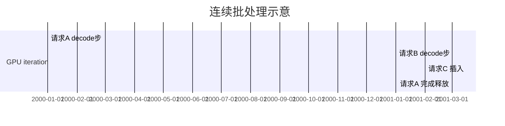

# 连续批处理（Continuous Batching）

## 要解决的问题

静态 batching 需等 batch 内**最长序列**完成才释放 slot，GPU 在 decode 阶段大量空转。**Continuous batching**（iteration-level scheduling）在每个 decode 步动态插入新请求、移除已完成请求，使 GPU 利用率接近饱和，是 vLLM/TGI 高 TPS 的核心。

## 核心概念

| 模式 | 调度时机 | GPU 利用率 | 尾延迟 |
| --- | --- | --- | --- |
| Static batch | 整批同时结束 | 低（长短不一） | 受最长序列拖累 |
| **Continuous** | 每 iteration | 高 | 更公平 |

与 [5.2.2 PagedAttention](../02-kv-cache-attention-optimization/02-paged-attention) 结合：不同序列 KV 占不同 block 数，可在 batch 维拼接前向。

**吞吐粗模**（$B$ 为并发序列数，$T_{\text{step}}$ 为单步时间）：

$$
\text{TPS} \approx \frac{B}{T_{\text{step}}} \quad (\text{decode 饱和时})
$$

$B$ 受显存与 `max_num_seqs` 限制。

## 方法 / 调度策略

1. **FCFS**：先到先服务，简单。
2. **Preempt / Priority**：VIP 队列；注意饿死普通用户。
3. **Chunked Prefill**：长 prompt 分块 prefill，与 decode 交错，降低 TTFT 排队（[5.1.4](../01-inference-basics/04-latency-metrics)）。
4. **Prefill-decode 分离**：部分集群拆 PD 节点（2025 云厂商趋势）。

## 工程实践

- 调参：`max_num_batched_tokens`、`max_num_seqs`——过大 OOM，过小 TPS 低。
- **SLA**：高并发下 TTFT 上升，需限流或扩容。
- 压测：用 Poisson 到达的真实 trace，而非恒定 batch。

## 代表工作

- Yu et al., Orca: *A Distributed Serving System for Transformer-Based Generative Models*（iteration-level）
- vLLM continuous batching 实现与博客

## 实践检查清单

- [ ] 固定评测/推理配置（温度、max_tokens、parser 版本）便于回归
- [ ] 记录硬件：GPU 型号、驱动、框架 commit
- [ ] 对比基线：未优化前 TTFT/TPOT 或 Acc
- [ ] 文档化失败案例：OOM、解析失败率、拒答率
- [ ] 交叉阅读本章「相关章节」避免孤立优化

## 局限与注意点

- 单请求 **ITL** 在极高并发时可能抖动（排队效应）。
- Speculative decoding（[5.5](../05-accelerated-decoding/01-speculative-decoding)）使每步耗时不均，调度器需适配。
- 多模态请求 prefill 更重，batch token 上限需下调。

## 术语对照（中英）

本节英文关键词：**Continuous Batching**（与社区论文、API 文档检索一致）。

## 延伸阅读

- 本仓库 [LLMs 入口](/llms/intro) 可回溯全局大纲；修改单点优化前建议先读上下游章节链接。
- 技术报告精读见 `llms/08-technical-reports/` 与 [paper-reading](/paper-reading/) 专栏。
- 工程复现优先锁定：框架版本 + 量化格式 + 评测 harness commit，三者缺一即难以对齐论文数字。

## 相关章节

- 同章：[5.6.1 框架](./01-inference-frameworks) · [5.6.3 调度](./03-scheduling-load-balancing)
- PagedAttention：[5.2.2](../02-kv-cache-attention-optimization/02-paged-attention)
- 指标：[5.1.4 延迟](../01-inference-basics/04-latency-metrics)
