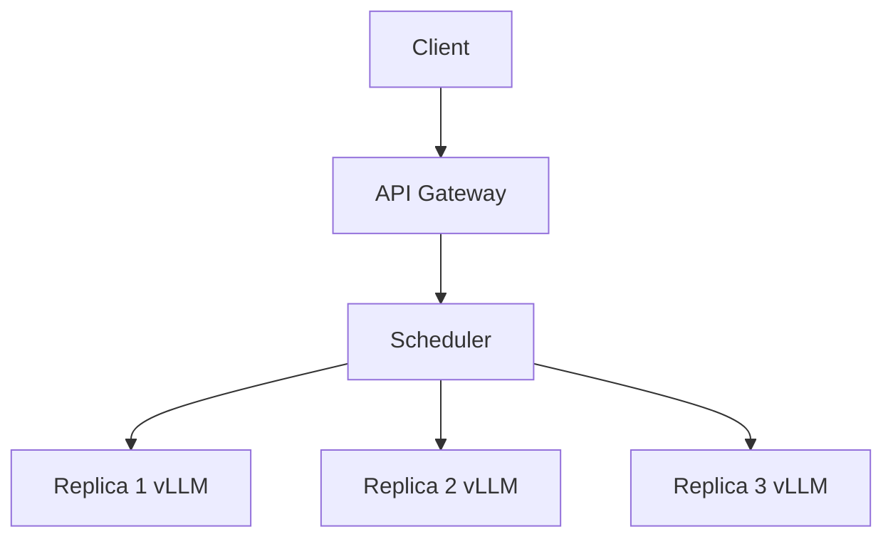

# 调度与负载均衡

## 要解决的问题

单卡 vLLM 实例有 **max concurrency** 上限；多副本、多机、多区域部署时需网关调度、负载均衡与健康检查，避免热点 GPU、KV OOM 与级联超时。本节覆盖请求路由、模型副本与弹性扩缩。

## 核心概念

| 层级 | 组件 | 决策依据 |
| --- | --- | --- |
| **L7 网关** | Envoy、nginx、专用 AI gateway | 路径、鉴权、限流 |
| **调度器** | 最小队列、最短预期完成 | 队列深度、GPU cache |
| **副本 LB** | K8s Service、云 LB | round-robin / least-conn |
| **模型路由** | 大小模型、多 LoRA | prompt 分类、成本 |

**负载指标**（除 CPU/GPU util 外）：

- `num_waiting_requests`：排队长度 → TTFT 恶化
- `gpu_cache_usage_perc`：KV 压力
- `tokens_per_second_per_replica`

## 方法 / 常见模式

1. **Round-robin**：简单；忽略副本负载差异。
2. **Least outstanding requests**：选排队最短实例（推荐 baseline）。
3. **Session affinity**：多轮对话粘滞副本，利于 **Prefix cache**（[5.2.4](../02-kv-cache-attention-optimization/04-prefix-prompt-caching)）——与无状态扩缩容冲突，需 TTL。
4. **Disaggregated PD**：Prefill 池 + Decode 池，KV 跨节点传输（网络带宽成为新瓶颈）。
5. **优先级队列**：企业 SLA 分层；配合 token bucket 限流。

## 工程实践

- **超时**：`streaming` 需大于最长生成时间；区分 connect vs read timeout。
- **熔断**：副本 p99 TTFT 超标时摘除，避免雪崩。
- **自动扩缩**：HPA 基于 GPU 显存或自定义 `waiting_requests`（K8s + Prometheus）。
- **多模型**：同一 GPU 跑多 LoRA 用 vLLM LoRA slot；调度器传 `lora_id`。

## 代表工作

- 云厂商：Vertex、SageMaker、Azure ML batch/online 调度
- 开源：KServe、Ray Serve、LiteLLM proxy

## 实践检查清单

- [ ] 固定评测/推理配置（温度、max_tokens、parser 版本）便于回归
- [ ] 记录硬件：GPU 型号、驱动、框架 commit
- [ ] 对比基线：未优化前 TTFT/TPOT 或 Acc
- [ ] 文档化失败案例：OOM、解析失败率、拒答率
- [ ] 交叉阅读本章「相关章节」避免孤立优化

## 局限与注意点

- 粘滞会话降低 **弹性**，滚动发布需 drain。
- 跨 AZ 调度增加 RTT，流式体验变差。
- 评测压测单副本 vs 生产多副本 **TPS 不可直接对比**（[7.2.4](../../07-evaluation/02-evaluation-methods/04-reliability-contamination)）。

## 术语速记

正文英文术语与开源实现（GitHub、Hugging Face）命名一致，便于检索源码与 Issue。

## 延伸阅读

- 本仓库 [LLMs 入口](/llms/intro) 可回溯全局大纲；修改单点优化前建议先读上下游章节链接。
- 技术报告精读见 `llms/08-technical-reports/` 与 [paper-reading](/paper-reading/) 专栏。
- 工程复现优先锁定：框架版本 + 量化格式 + 评测 harness commit，三者缺一即难以对齐论文数字。

## 相关章节

- 同章：[5.6.2 连续批处理](./02-continuous-batching) · [5.6.4 边缘](./04-edge-deployment)
- 延迟：[5.1.4](../01-inference-basics/04-latency-metrics)
- Agent 负载：`docs/03-agent-application/`
